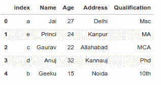

# 重置熊猫数据框中的索引

> 原文:[https://www . geesforgeks . org/reset-index-in-pandas-data frame/](https://www.geeksforgeeks.org/reset-index-in-pandas-dataframe/)

让我们讨论如何在熊猫数据框中重置索引。通常，我们从熊猫中的一个巨大的数据帧开始，在处理/过滤数据帧后，我们最终得到一个小得多的数据帧。

当我们查看较小的数据帧时，它可能仍然带有原始数据帧的行索引。如果原来的指数是*数字*，现在我们有了不连续的指数。嗯，熊猫有`[reset_index()](https://www.geeksforgeeks.org/python-pandas-dataframe-reset_index/)`功能。因此，要将索引重置为从 0 开始的默认整数索引，我们可以简单地使用`reset_index()`函数。

让我们看看重置数据帧索引的不同方法。

**先看原始数据帧。**

```
# Import pandas package
import pandas as pd

# Define a dictionary containing employee data
data = {'Name':['Jai', 'Princi', 'Gaurav', 'Anuj', 'Geeku'],
        'Age':[27, 24, 22, 32, 15],
        'Address':['Delhi', 'Kanpur', 'Allahabad', 'Kannauj', 'Noida'],
        'Qualification':['Msc', 'MA', 'MCA', 'Phd', '10th'] }

# Convert the dictionary into DataFrame 
df = pd.DataFrame(data)

df
```

**输出:**


**示例#1:** 在不删除默认索引的情况下创建自己的索引。

```
# Import pandas package
import pandas as pd

# Define a dictionary containing employee data
data = {'Name':['Jai', 'Princi', 'Gaurav', 'Anuj', 'Geeku'],
        'Age':[27, 24, 22, 32, 15],
        'Address':['Delhi', 'Kanpur', 'Allahabad', 'Kannauj', 'Noida'],
        'Qualification':['Msc', 'MA', 'MCA', 'Phd', '10th'] }

index = {'a', 'b', 'c', 'd', 'e'}

# Convert the dictionary into DataFrame 
df = pd.DataFrame(data, index)

# Make Own Index as index
# In this case default index is exist 
df.reset_index(inplace = True)

df
```

**输出:**


**示例 2:** 创建自己的索引并删除默认索引。

```
# Import pandas package
import pandas as pd

# Define a dictionary containing employee data
data = {'Name':['Jai', 'Princi', 'Gaurav', 'Anuj', 'Geeku'],
        'Age':[27, 24, 22, 32, 15],
        'Address':['Delhi', 'Kanpur', 'Allahabad', 'Kannauj', 'Noida'],
        'Qualification':['Msc', 'MA', 'MCA', 'Phd', '10th'] }

# Create own index
index = {'a', 'b', 'c', 'd', 'e'}

# Convert the dictionary into DataFrame 
# Make Own Index and Removing Default index
df = pd.DataFrame(data, index)

df
```

**输出:**


**例 3:** 重置自己的索引，将默认索引作为索引。

```
# Import pandas package
import pandas as pd

# Define a dictionary containing employee data
data = {'Name':['Jai', 'Princi', 'Gaurav', 'Anuj', 'Geeku'],
        'Age':[27, 24, 22, 32, 15],
        'Address':['Delhi', 'Kanpur', 'Allahabad', 'Kannauj', 'Noida'],
        'Qualification':['Msc', 'MA', 'MCA', 'Phd', '10th'] }

# Create own index
index = {'a', 'b', 'c', 'd', 'e'}

# Convert the dictionary into DataFrame 
df = pd.DataFrame(data, index)

# remove own index with default index
df.reset_index(inplace = True, drop = True)

df
```

**输出:**


**示例#4:** 创建一列数据帧作为索引，并删除默认索引。

```
# Import pandas package
import pandas as pd

# Define a dictionary containing employee data
data = {'Name':['Jai', 'Princi', 'Gaurav', 'Anuj', 'Geeku'],
        'Age':[27, 24, 22, 32, 15],
        'Address':['Delhi', 'Kanpur', 'Allahabad', 'Kannauj', 'Noida'],
        'Qualification':['Msc', 'MA', 'MCA', 'Phd', '10th'] }

# Create own index
index = {'a', 'b', 'c', 'd', 'e'}

# Convert the dictionary into DataFrame 
df = pd.DataFrame(data, index)

# set index any column of our DF and
# remove default index
df.set_index(['Age'], inplace = True)

df
```

**输出:**


**示例 5:** 将一列数据帧作为索引，而不移除默认索引。

```
# Import pandas package
import pandas as pd

# Define a dictionary containing employee data
data = {'Name':['Jai', 'Princi', 'Gaurav', 'Anuj', 'Geeku'],
        'Age':[27, 24, 22, 32, 15],
        'Address':['Delhi', 'Kanpur', 'Allahabad', 'Kannauj', 'Noida'],
        'Qualification':['Msc', 'MA', 'MCA', 'Phd', '10th'] }

# Create own index
index = {'a', 'b', 'c', 'd', 'e'}

# Convert the dictionary into DataFrame 
df = pd.DataFrame(data, index)

# set any column as index
# Here we set age column as index
df.set_index(['Age'], inplace = True)

# reset index without removing default index
df.reset_index(level =['Age'], inplace = True)

df
```

**输出:**
