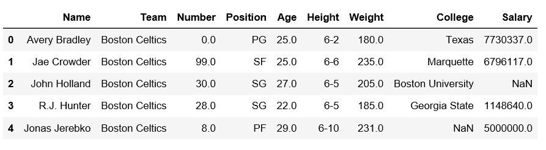
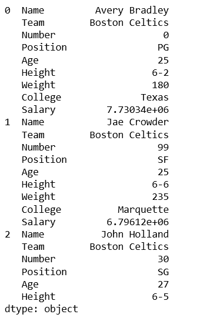
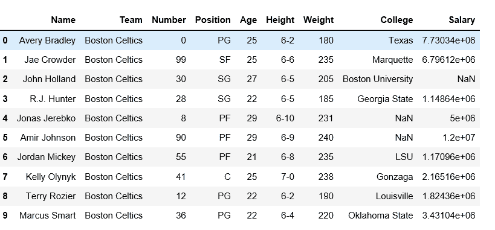
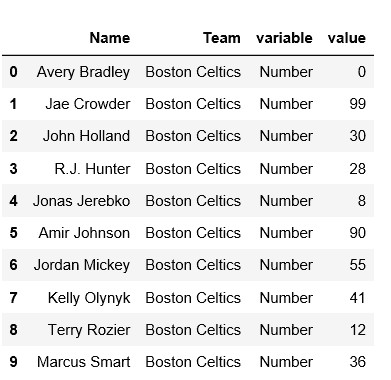

# 使用堆叠、拆堆和融化方法重塑熊猫数据框

> 原文:[https://www . geesforgeks . org/resform-a-pandas-data frame-using-stack unstack-and-melt-method/](https://www.geeksforgeeks.org/reshape-a-pandas-dataframe-using-stackunstack-and-melt-method/)

熊猫用各种方法重塑数据框架和系列。让我们来看看一些重塑的方法。

**我们先导入一个数据帧。**

```py
# import pandas module
import pandas as pd

# making dataframe
df = pd.read_csv("https://media.geeksforgeeks.org/wp-content/uploads/nba.csv")

# it was print the first 5-rows
print(df.head()) 
```

**输出:**


**使用叠加()方法:**

Stack 方法与 DataFrame 中的 MultiIndex 对象一起工作，它返回一个 DataFrame，该 data frame 的索引具有新的最内层行标签。它把宽桌子变成了长桌子。

```py
# import pandas module
import pandas as pd

# making dataframe
df = pd.read_csv("nba.csv")

# reshape the dataframe using stack() method
df_stacked = df.stack()

print(df_stacked.head(26))
```

**输出:**


**使用 unstack()方法:**
`unstack` 与 stack 方法类似，它也适用于 dataframe 中的多索引对象，产生具有新的最内层列标签的重新整形的 DataFrame。

```py
# import pandas module
import pandas as pd

# making dataframe
df = pd.read_csv("nba.csv")

# unstack() method
df_unstacked = df_stacked.unstack()
print(df_unstacked.head(10))
```



**使用`melt()`方法:**
融入熊猫将数据帧从宽格式重塑为长格式。它使用“id _ vars[' col _ name ']”按列名熔化数据帧。

```py
# import pandas module
import pandas as pd

# making dataframe
df = pd.read_csv("nba.csv")

# it takes two columns "Name" and "Team"
df_melt = df.melt(id_vars =['Name', 'Team']) 
print(df_melt.head(10))
```

**输出:**
