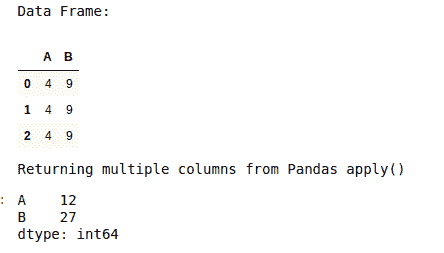
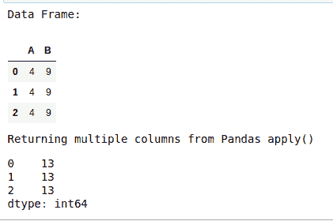
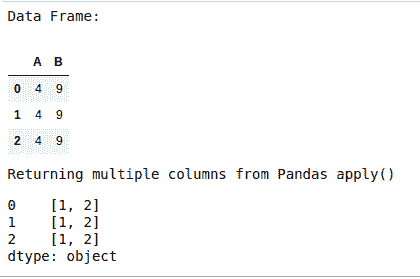
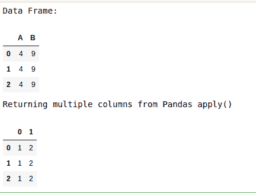
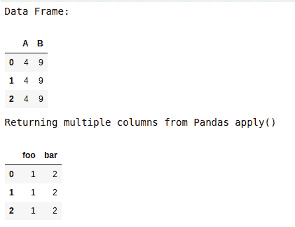
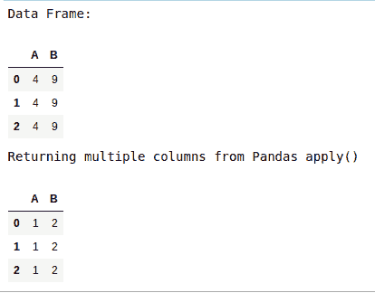

# 使用 Pandas apply()方法返回多列

> 原文:[https://www . geesforgeks . org/return-multi-columns-use-pandas-apply-method/](https://www.geeksforgeeks.org/return-multiple-columns-using-pandas-apply-method/)

传递给[pants . apply()](https://www.geeksforgeeks.org/python-pandas-apply/)的对象是系列对象，其索引是数据框的索引(轴=0)或数据框的列(轴=1)。默认情况下(result_type=None)，最终的返回类型是从应用的函数的返回类型推断出来的。否则，它取决于 result_type 参数。

> **语法:** DataFrame.apply(func，axis=0，broadcast=None，raw=False，reduce=None，result_type=None，args=()，**kwds)

以下是一些描述使用`pandas.DataFrame.apply()`的程序

**例 1:**

```
# Program to illustrate the use of 
# pandas.DataFrame.apply() method

# Importing required Libraries
import pandas
import numpy

# Creating dataframe
dataFrame = pandas.DataFrame([[4, 9], ] * 3, columns =['A', 'B'])
print('Data Frame:')
display(dataFrame)

# Using pandas.DataFrame.apply() on the data frame
print('Returning multiple columns from Pandas apply()')
dataFrame.apply(numpy.sqrt)
```

**输出:**


使用 numpy 通用函数(在这种情况下与 numpy.sqrt(dataFrame)相同)。

**例 2:**

```
# Program to illustrate the use of 
# pandas.DataFrame.apply() method

# Importing required Libraries
import pandas
import numpy

# Creating dataframe
dataFrame = pandas.DataFrame([[4, 9], ] * 3, columns =['A', 'B'])
print('Data Frame:')
display(dataFrame)

# Using pandas.DataFrame.apply() on the data frame
print('Returning multiple columns from Pandas apply()')
dataFrame.apply(numpy.sum, axis = 0)
```

**输出:**


在列上使用缩减函数。

**例 3:**

```
# Program to illustrate the use of 
# pandas.DataFrame.apply() method

# Importing required Libraries
import pandas
import numpy

# Creating dataframe
dataFrame = pandas.DataFrame([[4, 9], ] * 3, columns =['A', 'B'])
print('Data Frame:')
display(dataFrame)

# Using pandas.DataFrame.apply() on the data frame
print('Returning multiple columns from Pandas apply()')
dataFrame.apply(numpy.sum, axis = 1)
```

**输出:**



在行上使用缩减函数。

**例 4:**

```
# Program to illustrate the use of 
# pandas.DataFrame.apply() method

# Importing required Libraries
import pandas
import numpy

# Creating dataframe
dataFrame = pandas.DataFrame([[4, 9], ] * 3, columns =['A', 'B'])
print('Data Frame:')
display(dataFrame)

# Using pandas.DataFrame.apply() on the data frame
print('Returning multiple columns from Pandas apply()')
dataFrame.apply(lambda x: [1, 2], axis = 1)
```

**输出:**



返回类似列表的结果将是一个系列。

**例 5:**

```
# Program to illustrate the use of 
# pandas.DataFrame.apply() method

# Importing required Libraries
import pandas
import numpy

# Creating dataframe
dataFrame = pandas.DataFrame([[4, 9], ] * 3, columns =['A', 'B'])
print('Data Frame:')
display(dataFrame)

# Using pandas.DataFrame.apply() on the data frame
print('Returning multiple columns from Pandas apply()')
dataFrame.apply(lambda x: [1, 2], axis = 1, result_type ='expand')
```

**输出:**



传递 result_type='expand '会将类似列表的结果扩展到 Dataframe 的列。

**例 6:**

```
# Program to illustrate the use of 
# pandas.DataFrame.apply() method

# Importing required Libraries
import pandas
import numpy

# Creating dataframe
dataFrame = pandas.DataFrame([[4, 9], ] * 3, columns =['A', 'B'])
print('Data Frame:')
display(dataFrame)

# Using pandas.DataFrame.apply() on the data frame
print('Returning multiple columns from Pandas apply()')
dataFrame.apply(lambda x: pandas.Series(
    [1, 2], index =['foo', 'bar']), axis = 1)
```

**输出:**



在函数内部返回 Series 类似于传递 result _ type =“expand”。产生的列名将是系列索引。

**例 7:**

```
# Program to illustrate the use of 
# pandas.DataFrame.apply() method

# Importing required Libraries
import pandas
import numpy

# Creating dataframe
dataFrame = pandas.DataFrame([[4, 9], ] * 3, columns =['A', 'B'])
print('Data Frame:')
display(dataFrame)

# Using pandas.DataFrame.apply() on the data frame
print('Returning multiple columns from Pandas apply()')
dataFrame.apply(lambda x: [1, 2], axis = 1, result_type ='broadcast')
```

**输出:**


传递 result_type='broadcast '将保证相同的形状结果，无论是列表式还是标量由函数返回，并沿轴广播。生成的列名将是原件。