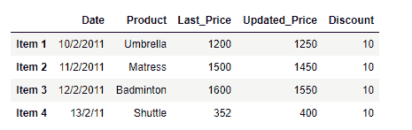
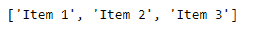

# 如果熊猫数据框中的某一列满足某个条件，则返回索引标签

> 原文:[https://www . geesforgeks . org/return-the-index-label-if-some-condition-over-column-in-pandas-data frame/](https://www.geeksforgeeks.org/return-the-index-label-if-some-condition-is-satisfied-over-a-column-in-pandas-dataframe/)

给定一个数据框，返回特定列上满足某些条件的所有索引标签。

**解决方案#1:** 我们可以使用简单的索引操作来选择列中满足给定条件的所有值。

```py
# importing pandas as pd
import pandas as pd

# Create the dataframe
df = pd.DataFrame({'Date':['10/2/2011', '11/2/2011', '12/2/2011', '13/2/2011'],
                   'Product':['Umbrella', 'Matress', 'Badminton', 'Shuttle'],
                   'Last_Price':[1200, 1500, 1600, 352],
                   'Updated_Price':[1250, 1450, 1550, 400],
                   'Discount':[10, 10, 10, 10]})

# Create the indexes
df.index =['Item 1', 'Item 2', 'Item 3', 'Item 4']

# Print the dataframe
print(df)
```

**输出:**



现在，我们要找出所有‘Updated _ Price’大于 1000 的项目的索引标签。

```py
# Select all the rows which satisfies the criteria
# convert the collection of index labels to list.
Index_label = df[df['Updated Price']>1000].index.tolist()

# Print all the labels
print(Index_label)
```

**输出:**

正如我们在输出中看到的，上面的操作已经成功地评估了所有的值，并返回了一个包含索引标签的列表。

**解决方案#2:** 我们可以使用 Pandas `Dataframe.query()`函数来选择给定列上满足某个条件的所有行。

```py
# importing pandas as pd
import pandas as pd

# Create the dataframe
df = pd.DataFrame({'Date':['10/2/2011', '11/2/2011', '12/2/2011', '13/2/2011'],
                   'Product':['Umbrella', 'Matress', 'Badminton', 'Shuttle'],
                   'Last_Price':[1200, 1500, 1600, 352],
                   'Updated_Price':[1250, 1450, 1550, 400],
                   'Discount':[10, 10, 10, 10]})

# Create the indexes
df.index =['Item 1', 'Item 2', 'Item 3', 'Item 4']

# Print the dataframe
print(df)
```

**输出:**


现在，我们要找出所有‘Updated _ Price’大于 1000 的项目的索引标签。

```py
# Select all the rows which satisfies the criteria
# convert the collection of index labels to list.
Index_label = df.query('Updated_Price > 1000').index.tolist()

# Print all the labels
print(Index_label)
```

**输出:**
