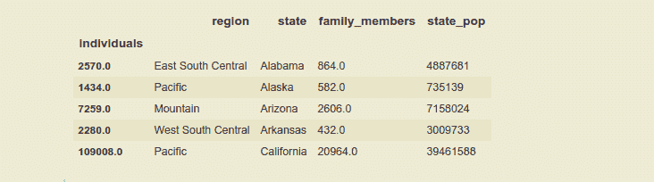

# 大熊猫从多索引数据帧恢复到单索引数据帧

> 原文:[https://www . geesforgeks . org/从多索引恢复到单索引熊猫数据框/](https://www.geeksforgeeks.org/reverting-from-multiindex-to-single-index-dataframe-in-pandas/)

在本文中，我们将从熊猫数据框中的多索引恢复到单索引。有时，当我们进行探索性数据分析或数据操作时，我们必须在数据框架中进行多重索引，以提取有意义的见解或高效轻松地使用列。在进行数据操作之后，如果我们想将我们的数据帧从多索引更改为单索引，这样看起来会更好，建议将数据帧更改为单索引。

索引就像一个地址，这就是如何访问数据帧或系列中的任何数据点。行和列都有索引，行索引称为索引，而对于列来说则称为索引。

在本文中，我们将使用[无家可归. csv](https://media.geeksforgeeks.org/wp-content/cdn-uploads/20210419143832/homelessness-1.csv) 文件作为 dataframe，并对其应用方法。

## 蟒蛇 3

```py
# importing pandas library as alias pd.
import pandas as pd

# using pandas read_csv().
df = pd.read_csv('homelessness.csv')
df.head()
```

**输出:**


我们可以看到，这个数据帧没有索引。因此，我们使用熊猫 **set_index()** 创建一个多索引的索引，将列名的名称作为列表传递。

## 蟒蛇 3

```py
# making the 'region' and 'state' column as index.
df_mi = df.set_index(['region' , 'state' , 'individuals'])

print(df_mi.head())
```

**输出:**


现在，数据帧具有分级索引或多重索引。使用熊猫内置函数 **reset_index()** 将数据帧的索引从多索引恢复为单索引。

> **语法:***data frame . reset _ index(level = None，drop=False，inplace=False，col_level=0，col _ fill =)*
> 
> **返回**:(数据框或无)带有新索引的数据框，如果**在原位=真**，则返回无。

使用上述方法恢复多索引，即:使用 reset_index()，我们可以如下所示:

1.  通过使用索引的级别。
2.  通过使用索引的名称。

### **通过使用等级指数**

使用 **level** 关键字将值传递给函数，该关键字接受级别列表，我们希望从索引位置恢复该列表。正如我们所知，多索引形成了索引的层次结构，这就是为什么它们也被称为层次索引。在本数据框中，“地区”是**级(0)** 指数或主要指数，“州”是**级(1)** 指数，“个人”是**级(2)** 指数。仅通过保留“状态”索引并恢复“区域”和“个人”索引，将数据框转换为**单一索引**。

## 蟒蛇 3

```py
# using the reset_index(), reverting the
# level 0 and level 2 indexes.
df_si_level = df_mi.reset_index( level = [0 , 2] )

print(df_si_level.head())
```

#### 输出:


### 通过使用索引的名称

在这个方法中，只需将列表中索引的名称传递给 reset_index()。通过保留“**个人**”索引并恢复“**地区**”和“**州**索引，将数据框仅转换为单个索引，只是在列表中绕过他们的姓名。

## 蟒蛇 3

```py
# using the reset_index(), reverting 
# the 'region' and 'state' indexes.
df_si_name = df_mi.reset_index([ 'region' , 'state' ])

print(df_si_name.head())
```

#### **输出**:



**注意**:如果我们希望让 Dataframe 无索引，或者我们不想让任何列作为索引，那么在这种情况下，我们可以在 <u>reset_index()</u> 中传递所有索引或级别的名称，让 Dataframe 无索引。