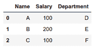
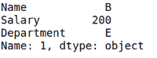
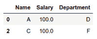

# 在熊猫栏中搜索一个值

> 原文:[https://www . geesforgeks . org/search-a-pandas-column-for-a-value/](https://www.geeksforgeeks.org/search-a-pandas-column-for-a-value/)

**先决条件:**T2】熊猫

在本文中，让我们讨论如何使用 pandas 来搜索给定特定值的数据框。

### 使用的功能

*   [其中()](https://www.geeksforgeeks.org/python-pandas-dataframe-where/#:~:text=Pandas%20where()%20method%20is,are%20filled%20with%20NaN%20value.)-用于检查数据帧的一个或多个条件，并相应地返回结果。默认情况下，不满足条件的行用 NaN 值填充。
*   [dropna()](https://www.geeksforgeeks.org/python-pandas-dataframe-dropna/)-该方法允许用户分析和删除空值的行/列。在本文中，它用于处理这样的情况，即具有 NaN 值的行，因为它们不满足某个条件。

### 方法

*   导入模块
*   创建数据
*   遍历列寻找特定的值
*   如果匹配，请选择

选择特定值和选择具有特定值的行之间存在基本区别。对于后一种情况，要检索的索引必须存储在一个列表中。这两种情况的实现都包含在本文中:

**正在使用的数据框:**



**示例 1:** 选择包含薪资为 200 的元组

## 蟒蛇 3

```py
import pandas as pd
x = pd.DataFrame([["A", 100, "D"], ["B", 200, "E"], ["C", 100, "F"]],
                 columns=["Name", "Salary", "Department"])

# Searching in whole column
for i in range(len(x.Name)):
    if 200 == x.Salary[i]:

        # indx will store the tuple having that 
        # particular value in column.
        indx = i

# below line will print that tuple
x.iloc[indx]
```

**输出:**



**示例 2:** 搜索薪资为 100 的人员，并将输出再次存储在数据框中。

## 蟒蛇 3

```py
import pandas as pd
x = pd.DataFrame([["A", 100, "D"], ["B", 200, "E"], ["C", 100, "F"]], 
                 columns=[ "Name", "Salary", "Department"])

# initialize the indx as a list
indx = []

# Searching in whole column
for i in range(len(x.Name)):
    if 100 == x.Salary[i]:

        # indx will store all the tuples having 
        # that particular value in column.
        indx.append(i)

# Final Dataframe having tuples
df = pd.DataFrame()

# this will append all tuples to the final
# dataframe.
for indexes in indx:
    df = df.append(x.iloc[indexes])

df = x.where(x.Salary == 100)

# It will remove NaN rows.
df.dropna()
```

**输出:**

