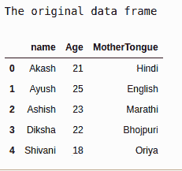
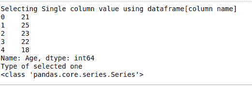

# 在熊猫中选择一列数据作为系列

> 原文:[https://www . geeksforgeeks . org/select-单列数据作为熊猫系列/](https://www.geeksforgeeks.org/select-a-single-column-of-data-as-a-series-in-pandas/)

在本文中，我们将讨论如何在 Pandas 中选择单个数据列作为系列。

```
For example, Suppose we have a data frame :
Name Age  MotherTongue
Akash 21   Hindi
Ashish 23  Marathi
Diksha 21  Bhojpuri
Radhika 20 Nepali
Ayush   21 Punjabi

```

现在，当我们选择“母语”列作为系列时，我们会得到以下输出:

```
Hindi Marathi Bhojpuri Nepali Punjabi

```

现在让我们尝试使用 Python 来实现这一点:

**步骤 1:** 创建数据帧:

```
# importing pandas as library
import pandas as pd

# creating data frame:
df = pd.DataFrame({'name': ['Akash', 'Ayush', 'Ashish',
                            'Diksha', 'Shivani'],

                   'Age': [21, 25, 23, 22, 18],

                   'MotherTongue': ['Hindi', 'English', 'Marathi',
                                    'Bhojpuri', 'Oriya']})

print("The original data frame")
df
```

**输出:**



**步骤 2:** 使用数据框选择列。列名:

```
print("Selecting Single column value using dataframe.column name")
series_one = pd.Series(df.Age)
print(series_one)

print("Type of selected one")
print(type(series_one))
```

**输出:**


**步骤 3:** 使用数据框[列名]选择列

```
# using [] method
print("Selecting Single column value using dataframe[column name]")
series_one = pd.Series(df['Age'])
print(series_one)

print("Type of selected one")
print(type(series_one))
```

**输出:**



在上面两个例子中，我们使用了 [pd。Series()](https://www.geeksforgeeks.org/python-pandas-series/) 选择数据框中的一列作为一个系列。