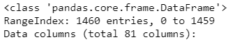
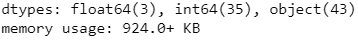
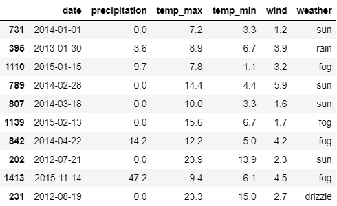
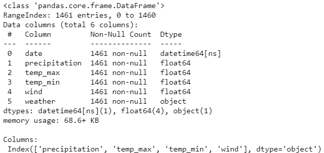

# 在熊猫数据框中选择特定数据类型的列

> 原文:[https://www . geesforgeks . org/select-columns-with-specific-data-type-in-pandas-data frame/](https://www.geeksforgeeks.org/select-columns-with-specific-data-types-in-pandas-dataframe/)

在本文中，我们将看到如何从 dataframe 中选择具有特定数据类型的列。可以使用*熊猫*模块中的[*data frame . select _ dtypes()*](https://www.geeksforgeeks.org/python-pandas-dataframe-select_dtypes/)*方法执行该操作。*

> ***语法:**data frame . select _ dtypes(include = None，exclude=None)
> **参数:**
> **include，exclude :** 要包含/排除的数据类型或字符串的选择。必须至少提供其中一个参数。
> **返回:**包含包含中的数据类型和排除排除中的数据类型的帧子集。*

***分步方法:***

*   *首先导入模块，然后加载[数据集](https://www.kaggle.com/c/house-prices-advanced-regression-techniques)。*

## *蟒蛇 3*

```py
*# import required module
import pandas as pd

# assign dataset
df = pd.read_csv("train.csv")*
```

*   *然后我们将使用 *dataframe.info()* 方法**找到数据集中存在的数据类型。***

## *蟒蛇 3*

```py
*# display description
# of the dataset
df.info()*
```

***输出:***

*  *

*   *现在，我们将使用*data frame . select _ dt types()*来选择特定的数据类型。*

## *蟒蛇 3*

```py
*# store columns with specific data type
integer_columns = df.select_dtypes(include=['int64']).columns
float_columns = df.select_dtypes(include=['float64']).columns
object_columns = df.select_dtypes(include=['object']).columns*
```

*   *最后，显示具有特定数据类型的列。*

## *蟒蛇 3*

```py
*# display columns
print('\nint64 columns:\n', integer_columns)
print('\nfloat64 columns:\n', float_columns)
print('\nobject columns:\n', object_columns)*
```

***输出:***

**

***以下是基于上述方法的完整程序:***

## *蟒蛇 3*

```py
*# import required module
import pandas as pd

# assign dataset
df = pd.read_csv("train.csv")

# store columns with specific data type
integer_columns = df.select_dtypes(include=['int64']).columns
float_columns = df.select_dtypes(include=['float64']).columns
object_columns = df.select_dtypes(include=['object']).columns

# display columns
print('\nint64 columns:\n',integer_columns)
print('\nfloat64 columns:\n',float_columns)
print('\nobject columns:\n',object_columns)*
```

***输出:***

**

***示例:***

*在这里，我们将提取以下数据集的列:*

## *蟒蛇 3*

```py
*# import required module
import pandas as pd
from vega_datasets import data

# assign dataset
df = data.seattle_weather()

# display dataset
df.sample(10)*
```

***输出:***

**

*现在，我们将显示所有以 *float64* 为数据类型的列。*

## *蟒蛇 3*

```py
*# import required module
import pandas as pd
from vega_datasets import data

# assign dataset
df = data.seattle_weather()

# display description
# of dataset
df.info()

# store columns with specific data type
columns = df.select_dtypes(include=['float64']).columns

# display columns
print('\nColumns:\n', columns)*
```

***输出:***

**