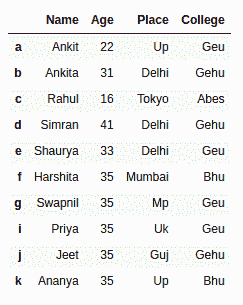
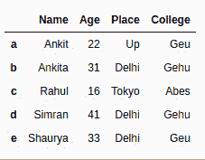
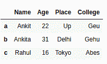
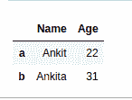
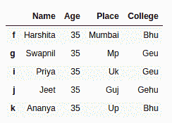
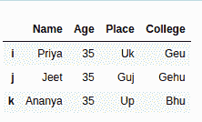
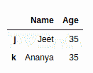

# 使用 Python-Pandas 中的 head()和 tail()方法选择数据框中的第一行或最后 N 行

> 原文:[https://www . geeksforgeeks . org/select-first-or-last-n-row-in-a-data frame-使用 python 中的头尾方法-pandas/](https://www.geeksforgeeks.org/select-first-or-last-n-rows-in-a-dataframe-using-head-and-tail-method-in-python-pandas/)

让我们讨论如何使用 head() & tail()方法从数据框中选择顶部或底部的 N 行。

**1)使用熊猫数据框的`[head()](https://www.geeksforgeeks.org/python-pandas-dataframe-series-head-method/)`方法从数据框中选择前 N 行:**

Pandas `head()`方法用于返回数据帧或序列的前 n 行(默认为 5 行)

> **语法:** Dataframe.head(n)。
> 
> **参数:**(可选)n 为整数值，返回行数。
> 
> **返回:**前 n 行的数据框。

**让我们创建一个数据框**

```
# import pandas library as pd
import pandas as pd

# List of Tuples
students = [('Ankit', 22, 'Up', 'Geu'),
           ('Ankita', 31, 'Delhi', 'Gehu'),
           ('Rahul', 16, 'Tokyo', 'Abes'),
           ('Simran', 41, 'Delhi', 'Gehu'),
           ('Shaurya', 33, 'Delhi', 'Geu'),
           ('Harshita', 35, 'Mumbai', 'Bhu' ),
           ('Swapnil', 35, 'Mp', 'Geu'),
           ('Priya', 35, 'Uk', 'Geu'),
           ('Jeet', 35, 'Guj', 'Gehu'),
           ('Ananya', 35, 'Up', 'Bhu')
            ]

# Create a DataFrame object from
# list of tuples along with columns
# and indices.
details = pd.DataFrame(students, columns =['Name', 'Age',
                                           'Place', 'College'],
                        index =['a', 'b', 'c', 'd', 'e',
                                'f', 'g', 'i', 'j', 'k'])

details
```

**输出:**



**例 1:**

```
# Show first 5 rows of the details dataframe
# from top
details.head()
```

**输出:**



**例 2:**

```
# display top 3 rows of the dataframe
details.head(3)
```

**输出:**



**例 3:**

```
# display top 2 rows of the specific columns
details[['Name', 'Age']].head(2)
```

**输出:**



**2)使用熊猫数据框的[尾()](https://www.geeksforgeeks.org/python-pandas-dataframe-series-tail-method/)方法从数据框中选择最后 N 行:**

Pandas `tail()`方法用于返回数据帧或序列的底部 n 行(默认为 5 行)。

> **语法:**数据帧尾(n)
> 
> **参数:**(可选)n 为整数值，返回行数。
> 
> **返回:**底部有 n 行的数据框。

**例 1:**

```
# Show bottom 5 rows of the dataframe
details.tail()
```

**输出:**



**例 2:**

```
# Show bottom 3 rows of the dataframe
details.tail(3)
```

**输出:**



**例 3:**

```
# Show bottom 2 rows of the specific
# columns from dataframe
details[['Name', 'Age']].tail(2)
```

**输出:**

