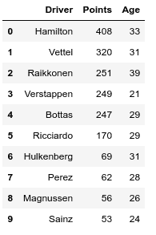
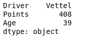
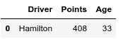
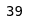
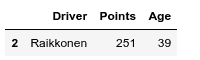
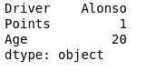
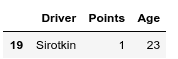
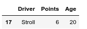

# 在熊猫数据框中选择最大值和最小值的行

> 原文:[https://www . geeksforgeeks . org/select-带最大和最小熊猫值的行-dataframe/](https://www.geeksforgeeks.org/select-row-with-maximum-and-minimum-value-in-pandas-dataframe/)

让我们看看如何通过不同的例子来选择熊猫数据框中具有最大值和最小值的行。

考虑这个数据集。

```
# importing pandas and numpy
import pandas as pd
import numpy as np

# data of 2018 drivers world championship
dict1 ={'Driver':['Hamilton', 'Vettel', 'Raikkonen',
                  'Verstappen', 'Bottas', 'Ricciardo',
                  'Hulkenberg', 'Perez', 'Magnussen', 
                  'Sainz', 'Alonso', 'Ocon', 'Leclerc',
                  'Grosjean', 'Gasly', 'Vandoorne',
                  'Ericsson', 'Stroll', 'Hartley', 'Sirotkin'],

        'Points':[408, 320, 251, 249, 247, 170, 69, 62, 56,
                   53, 50, 49, 39, 37, 29, 12, 9, 6, 4, 1],

        'Age':[33, 31, 39, 21, 29, 29, 31, 28, 26, 24, 37,
                      22, 21, 32, 22, 26, 28, 20, 29, 23]}

# creating dataframe using DataFrame constructor
df = pd.DataFrame(dict1)
print(df.head(10))
```

**输出:**


### 在数据帧上使用最大值–

**代码#1:** 显示驾驶员、积分、年龄列中的最大值。

```
# importing pandas and numpy
import pandas as pd
import numpy as np

# data of 2018 drivers world championship
dict1 ={'Driver':['Hamilton', 'Vettel', 'Raikkonen',
                  'Verstappen', 'Bottas', 'Ricciardo',
                  'Hulkenberg', 'Perez', 'Magnussen', 
                  'Sainz', 'Alonso', 'Ocon', 'Leclerc',
                  'Grosjean', 'Gasly', 'Vandoorne',
                  'Ericsson', 'Stroll', 'Hartley', 'Sirotkin'],

        'Points':[408, 320, 251, 249, 247, 170, 69, 62, 56,
                   53, 50, 49, 39, 37, 29, 12, 9, 6, 4, 1],

        'Age':[33, 31, 39, 21, 29, 29, 31, 28, 26, 24, 37,
                      22, 21, 32, 22, 26, 28, 20, 29, 23]}

# creating dataframe using DataFrame constructor
df = pd.DataFrame(dict1)

# the result shows max on
# Driver, Points, Age columns.
print(df.max())
```

**输出:**


**代码#2:** 谁得分最高

```
# importing pandas and numpy
import pandas as pd
import numpy as np

# data of 2018 drivers world championship
dict1 ={'Driver':['Hamilton', 'Vettel', 'Raikkonen',
                  'Verstappen', 'Bottas', 'Ricciardo',
                  'Hulkenberg', 'Perez', 'Magnussen', 
                  'Sainz', 'Alonso', 'Ocon', 'Leclerc',
                  'Grosjean', 'Gasly', 'Vandoorne',
                  'Ericsson', 'Stroll', 'Hartley', 'Sirotkin'],

        'Points':[408, 320, 251, 249, 247, 170, 69, 62, 56,
                   53, 50, 49, 39, 37, 29, 12, 9, 6, 4, 1],

        'Age':[33, 31, 39, 21, 29, 29, 31, 28, 26, 24, 37,
                      22, 21, 32, 22, 26, 28, 20, 29, 23]}

# creating dataframe using DataFrame constructor
df = pd.DataFrame(dict1)

# Who scored more points ?
print(df[df.Points == df.Points.max()])
```

**输出:**


**代码#3:** 最大年龄是多少

```
# importing pandas and numpy
import pandas as pd
import numpy as np

# data of 2018 drivers world championship
dict1 ={'Driver':['Hamilton', 'Vettel', 'Raikkonen',
                  'Verstappen', 'Bottas', 'Ricciardo',
                  'Hulkenberg', 'Perez', 'Magnussen', 
                  'Sainz', 'Alonso', 'Ocon', 'Leclerc',
                  'Grosjean', 'Gasly', 'Vandoorne',
                  'Ericsson', 'Stroll', 'Hartley', 'Sirotkin'],

        'Points':[408, 320, 251, 249, 247, 170, 69, 62, 56,
                   53, 50, 49, 39, 37, 29, 12, 9, 6, 4, 1],

        'Age':[33, 31, 39, 21, 29, 29, 31, 28, 26, 24, 37,
                      22, 21, 32, 22, 26, 28, 20, 29, 23]}

# creating dataframe using DataFrame constructor
df = pd.DataFrame(dict1)

# what is the maximum age ?
print(df.Age.max())
```

**输出:**


**代码#4:** 数据框中哪一行的年龄最大|谁是年龄最大的驾驶员？

```
# importing pandas and numpy
import pandas as pd
import numpy as np

# data of 2018 drivers world championship
dict1 ={'Driver':['Hamilton', 'Vettel', 'Raikkonen',
                  'Verstappen', 'Bottas', 'Ricciardo',
                  'Hulkenberg', 'Perez', 'Magnussen', 
                  'Sainz', 'Alonso', 'Ocon', 'Leclerc',
                  'Grosjean', 'Gasly', 'Vandoorne',
                  'Ericsson', 'Stroll', 'Hartley', 'Sirotkin'],

        'Points':[408, 320, 251, 249, 247, 170, 69, 62, 56,
                   53, 50, 49, 39, 37, 29, 12, 9, 6, 4, 1],

        'Age':[33, 31, 39, 21, 29, 29, 31, 28, 26, 24, 37,
                      22, 21, 32, 22, 26, 28, 20, 29, 23]}

# creating dataframe using DataFrame constructor
df = pd.DataFrame(dict1)

# Which row has maximum age |
# who is the oldest driver ?
print(df[df.Age == df.Age.max()])
```

**输出:**


### 在数据帧上使用最小值–

**代码#1:** 显示驾驶员、积分、年龄列上的最小值。

```
# importing pandas and numpy
import pandas as pd
import numpy as np

# data of 2018 drivers world championship
dict1 ={'Driver':['Hamilton', 'Vettel', 'Raikkonen',
                  'Verstappen', 'Bottas', 'Ricciardo',
                  'Hulkenberg', 'Perez', 'Magnussen', 
                  'Sainz', 'Alonso', 'Ocon', 'Leclerc',
                  'Grosjean', 'Gasly', 'Vandoorne',
                  'Ericsson', 'Stroll', 'Hartley', 'Sirotkin'],

        'Points':[408, 320, 251, 249, 247, 170, 69, 62, 56,
                   53, 50, 49, 39, 37, 29, 12, 9, 6, 4, 1],

        'Age':[33, 31, 39, 21, 29, 29, 31, 28, 26, 24, 37,
                      22, 21, 32, 22, 26, 28, 20, 29, 23]}

# creating dataframe using DataFrame constructor
df = pd.DataFrame(dict1)

# the result shows min on 
# Driver, Points, Age columns.
print(df.min())
```

**输出:**


**代码#2:** 谁得分少

```
# importing pandas and numpy
import pandas as pd
import numpy as np

# data of 2018 drivers world championship
dict1 ={'Driver':['Hamilton', 'Vettel', 'Raikkonen',
                  'Verstappen', 'Bottas', 'Ricciardo',
                  'Hulkenberg', 'Perez', 'Magnussen', 
                  'Sainz', 'Alonso', 'Ocon', 'Leclerc',
                  'Grosjean', 'Gasly', 'Vandoorne',
                  'Ericsson', 'Stroll', 'Hartley', 'Sirotkin'],

        'Points':[408, 320, 251, 249, 247, 170, 69, 62, 56,
                   53, 50, 49, 39, 37, 29, 12, 9, 6, 4, 1],

        'Age':[33, 31, 39, 21, 29, 29, 31, 28, 26, 24, 37,
                      22, 21, 32, 22, 26, 28, 20, 29, 23]}

# creating dataframe using DataFrame constructor
df = pd.DataFrame(dict1)

# Who scored less points ?
print(df[df.Points == df.Points.min()])
```

**输出:**


**代码#3:** 数据框中哪一行年龄最小|谁是最年轻的司机

```
# importing pandas and numpy
import pandas as pd
import numpy as np

# data of 2018 drivers world championship
dict1 ={'Driver':['Hamilton', 'Vettel', 'Raikkonen',
                  'Verstappen', 'Bottas', 'Ricciardo',
                  'Hulkenberg', 'Perez', 'Magnussen', 
                  'Sainz', 'Alonso', 'Ocon', 'Leclerc',
                  'Grosjean', 'Gasly', 'Vandoorne',
                  'Ericsson', 'Stroll', 'Hartley', 'Sirotkin'],

        'Points':[408, 320, 251, 249, 247, 170, 69, 62, 56,
                   53, 50, 49, 39, 37, 29, 12, 9, 6, 4, 1],

        'Age':[33, 31, 39, 21, 29, 29, 31, 28, 26, 24, 37,
                      22, 21, 32, 22, 26, 28, 20, 29, 23]}

# creating dataframe using DataFrame constructor
df = pd.DataFrame(dict1)

# Which row has maximum age | 
# who is the youngest driver ?
print(df[df.Age == df.Age.min()])
```

**输出:**
