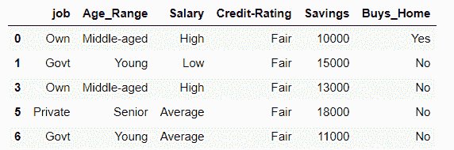
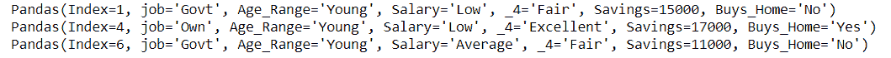
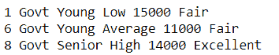
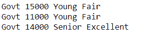

# 使用熊猫

选择包含特定文本的行

> 原文:[https://www . geesforgeks . org/select-rows-包含特定文本的行-使用-pandas/](https://www.geeksforgeeks.org/select-rows-that-contain-specific-text-using-pandas/)

在使用 pandas dataframe 预处理数据时，可能需要找到包含特定文本的行。在本文中，我们将讨论在 pandas 的数据框的列或行中查找包含特定文本的行的方法。

**使用中的数据集:**

<figure class="table">

| 工作 | 年龄范围 | 薪水 | 信用评级 | 储蓄 | Buys_Hone |
| --- | --- | --- | --- | --- | --- |
| 自己的 | 中年人 | 高的 | 公平的 | ten thousand | 是 |
| 政府 | 年纪轻的 | 低的 | 公平的 | Fifteen thousand | 不 |
| 私人的 | 年长的 | 平均的 | 优秀的 | Twenty thousand | 是 |
| 自己的 | 中年人 | 高的 | 公平的 | Thirteen thousand | 不 |
| 自己的 | 年纪轻的 | 低的 | 优秀的 | Seventeen thousand | 是 |
| 私人的 | 年长的 | 平均的 | 公平的 | Eighteen thousand | 不 |
| 政府 | 年纪轻的 | 平均的 | 公平的 | Eleven thousand | 不 |
| 私人的 | 中年人 | 低的 | 优秀的 | Nine thousand | 不 |
| 政府 | 年长的 | 高的 | 优秀的 | Fourteen thousand | 是 |

</figure>

### **方法 1:使用 contains()**

使用字符串的[包含()](https://www.geeksforgeeks.org/python-pandas-series-str-contains/)函数来过滤行。我们根据数据框的“信用评级”列过滤行，方法是将其转换为字符串，后跟字符串类的 contains 方法。contains()方法接受一个参数，并在调用它的对象中找到模式。

**示例:**

## 蟒蛇 3

```py
# importing pandas as pd
import pandas as pd

# reading csv file
df = pd.read_csv("Assignment.csv")

# filtering the rows where Credit-Rating is Fair
df = df[df['Credit-Rating'].str.contains('Fair')]
print(df)
```

**输出:**



包含公平储蓄的行

### **方法 2:使用 itertuples()**

使用 ITER 元组()使用 find 迭代行，以获取包含所需文本的行。itertuple 方法返回一个迭代器，为 DataFrame 中的每一行生成一个命名元组。它比熊猫的 iterrows()方法更快。

**示例:**

## 蟒蛇 3

```py
# importing pandas as pd
import pandas as pd

# reading csv file
df = pd.read_csv("Assignment.csv")

# filtering the rows where Age_Range contains Young
for x in df.itertuples():
    if x[2].find('Young') != -1:
        print(x)
```

**输出:**



年龄范围为年轻的行

### **方法 3:使用 ITER row()**

使用 iterrows()使用 find 循环访问行，以获取包含所需文本的行。iterrows()函数返回迭代器，该迭代器产生每个索引值以及包含每行数据的序列。它比 ITER 元组慢，因为它进行了大量的类型检查。

**示例:**

## 蟒蛇 3

```py
# importing pandas as pd
import pandas as pd

# reading csv file
df = pd.read_csv("Assignment.csv")

# filtering the rows where job is Govt
for index, row in df.iterrows():
    if 'Govt' in row['job']:
        print(index, row['job'], row['Age_Range'],
              row['Salary'], row['Savings'], row['Credit-Rating'])
```

**输出:**



职务为政府的行

### **方法 4:使用正则表达式**

使用正则表达式查找包含所需文本的行。 [search()](https://www.geeksforgeeks.org/python-re-search-vs-re-match/) 是模块 re 的一种方法。re.search(pattern，string):它与 re.match()类似，但它并不限制我们只在字符串的开头查找匹配项。我们对每一行进行迭代，并将每个索引处的作业与“Govt”进行比较，以便只选择那些行。

**示例:**

## 蟒蛇 3

```py
# using regular expressions
from re import search

# import pandas as pd
import pandas as pd

# reading CSV file
df = pd.read_csv("Assignment.csv")

# iterating over rows with job as Govt and printing
for ind in df.index:
    if search('Govt', df['job'][ind]):
        print(df['job'][ind], df['Savings'][ind],
              df['Age_Range'][ind], df['Credit-Rating'][ind])
```

**输出:**



工作是政府的行