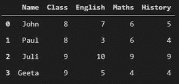
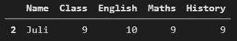
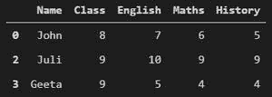
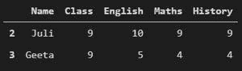
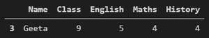

# 选择熊猫中带有多个过滤器的行

> 原文:[https://www . geesforgeks . org/select-rows-with-multi-filters-in-pandas/](https://www.geeksforgeeks.org/select-rows-with-multiple-filters-in-pandas/)

在本文中，我们将使用熊猫中的多个过滤器来选择行。我们将使用多个条件、逻辑运算符和使用 *loc()* 函数来选择熊猫中的多行。

使用逻辑运算符(即“与”和“或”)选择行可以很容易地通过组合>、 =和==来提取具有多个过滤器的行。 *loc()* 主要基于标签，但也可以与布尔数组一起使用，通过标签或布尔数组访问一组行和列。

**使用的数据集:**

创建包含列“名称”、“类别”、“英语成绩”、“数学成绩”和“历史成绩”的数据框。我们将在所有操作中使用以下数据集:

## 计算机编程语言

```py
import pandas as pd

# initialize list of lists
data = [['John', 8, 7, 6, 5], ['Paul', 8, 3, 6, 4],
        ['Juli', 9, 10, 9, 9], ['Geeta', 9, 5, 4, 4]]

# Create the pandas DataFrame
df = pd.DataFrame(
    data, columns=['Name', 'Class', 'English', 
                   'Maths', 'History'])

# print dataframe.
print(df)
```

**输出**



**下面是用多个过滤器实现行选择的各种操作:**

*   选择学生分数大于 6 的行，分数大于 8 的行。

## 计算机编程语言

```py
df1 = df[(df.English>6) & (df.Maths>8)]
print(df1)
```

**输出:**



*   选择学生英语成绩大于等于 5 或成绩大于 7 的行为历史。

## 计算机编程语言

```py
df1 = df[(df.English>=5) | (df.History>7)]
print(df1)
```

**输出**



*   选择 9 班学生英语成绩大于等于 5 分或历史成绩大于 7 分的行。

## 计算机编程语言

```py
df1 = df[(df.Class == 9) & ((df.English>=5) | (df.History>7))]
print(df1)
```

**输出:**



*   选择学生英语成绩小于等于 5，数学成绩小于等于 5，历史成绩小于等于 5 的行。

## 计算机编程语言

```py
df1 = df[(df.English<=5) & (df.Maths<=5) & (df.History<=5)]
print(df1)
```

**输出:**



*   选择 8 班学生英语成绩小于等于 5 或数学成绩大于 5 或历史成绩小于等于 5 的行。

## 计算机编程语言

```py
df1 = df[(df.Class == 8) & ((df.English<=5) | (df.Maths>5) | (df.History<=5))]
print(df1)
```