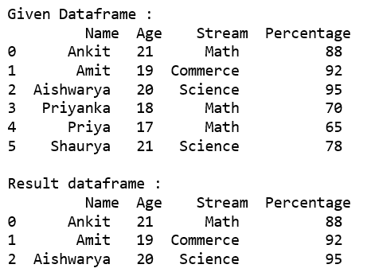
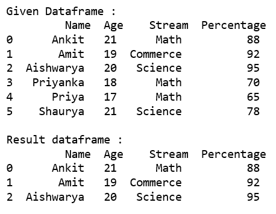
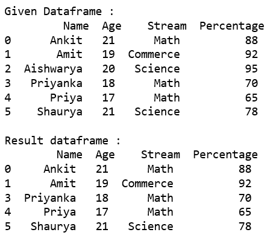
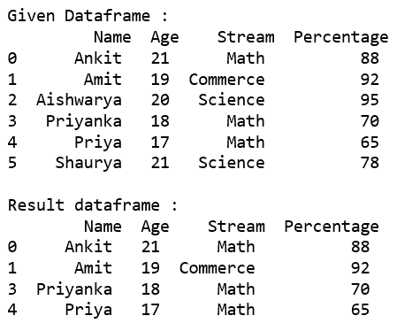
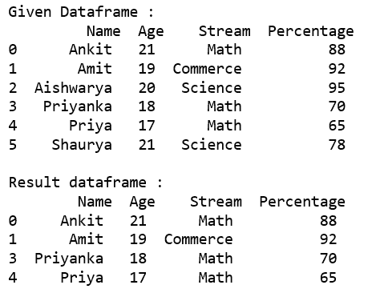
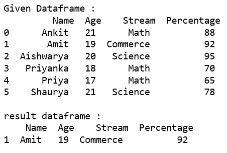
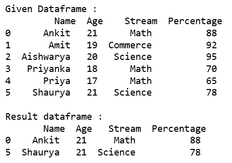

# 根据条件选择熊猫数据框中的行

> 原文:[https://www . geesforgeks . org/select-row-in-pandas-data frame-基于条件/](https://www.geeksforgeeks.org/selecting-rows-in-pandas-dataframe-based-on-conditions/)

让我们看看如何根据熊猫数据框中的一些条件选择行。

### 使用`'>', '=', '=', '<=', '!='` 运算符基于特定的列值选择行。

**代码#1 :** 使用基本方法从给定数据框中选择“百分比”大于 80 的所有行。

```py
# importing pandas
import pandas as pd

record = {

 'Name': ['Ankit', 'Amit', 'Aishwarya', 'Priyanka', 'Priya', 'Shaurya' ],
 'Age': [21, 19, 20, 18, 17, 21],
 'Stream': ['Math', 'Commerce', 'Science', 'Math', 'Math', 'Science'],
 'Percentage': [88, 92, 95, 70, 65, 78] }

# create a dataframe
dataframe = pd.DataFrame(record, columns = ['Name', 'Age', 'Stream', 'Percentage'])

print("Given Dataframe :\n", dataframe) 

# selecting rows based on condition
rslt_df = dataframe[dataframe['Percentage'] > 80]

print('\nResult dataframe :\n', rslt_df)
```

**输出:**


**代码#2 :** 使用`[loc[]](https://www.geeksforgeeks.org/python-pandas-extracting-rows-using-loc/)`从给定数据框中选择“百分比”大于 80 的所有行。

```py
# importing pandas
import pandas as pd

record = {
  'Name': ['Ankit', 'Amit', 'Aishwarya', 'Priyanka', 'Priya', 'Shaurya' ],
  'Age': [21, 19, 20, 18, 17, 21],
  'Stream': ['Math', 'Commerce', 'Science', 'Math', 'Math', 'Science'],
  'Percentage': [88, 92, 95, 70, 65, 78]}

# create a dataframe
dataframe = pd.DataFrame(record, columns = ['Name', 'Age', 'Stream', 'Percentage'])

print("Given Dataframe :\n", dataframe) 

# selecting rows based on condition
rslt_df = dataframe.loc[dataframe['Percentage'] > 80]

print('\nResult dataframe :\n', rslt_df)
```

**输出:**


**代码#3 :** 使用`[loc[]](https://www.geeksforgeeks.org/python-pandas-extracting-rows-using-loc/)`从给定数据框中选择“百分比”不等于 95 的所有行。

```py
# importing pandas
import pandas as pd

record = {
  'Name': ['Ankit', 'Amit', 'Aishwarya', 'Priyanka', 'Priya', 'Shaurya' ],
  'Age': [21, 19, 20, 18, 17, 21],
  'Stream': ['Math', 'Commerce', 'Science', 'Math', 'Math', 'Science'],
  'Percentage': [88, 92, 95, 70, 65, 78]}

# create a dataframe
dataframe = pd.DataFrame(record, columns = ['Name', 'Age', 'Stream', 'Percentage'])

print("Given Dataframe :\n", dataframe) 

# selecting rows based on condition
rslt_df = dataframe.loc[dataframe['Percentage'] != 95]

print('\nResult dataframe :\n', rslt_df)
```

**输出:**


### 使用数据框的`[isin()](https://www.geeksforgeeks.org/python-pandas-dataframe-isin/)`方法选择那些列值出现在列表中的行。

**代码#1 :** 使用基本方法从给定数据帧中选择选项列表中出现“流”的所有行。

```py
# importing pandas
import pandas as pd

record = {
  'Name': ['Ankit', 'Amit', 'Aishwarya', 'Priyanka', 'Priya', 'Shaurya' ],
  'Age': [21, 19, 20, 18, 17, 21],
  'Stream': ['Math', 'Commerce', 'Science', 'Math', 'Math', 'Science'],
  'Percentage': [88, 92, 95, 70, 65, 78]}

# create a dataframe
dataframe = pd.DataFrame(record, columns = ['Name', 'Age', 'Stream', 'Percentage'])

print("Given Dataframe :\n", dataframe) 

options = ['Math', 'Commerce']

# selecting rows based on condition
rslt_df = dataframe[dataframe['Stream'].isin(options)]

print('\nResult dataframe :\n', rslt_df)
```

**输出:**


**代码#2 :** 使用`[loc[]](https://www.geeksforgeeks.org/python-pandas-extracting-rows-using-loc/)`从给定数据帧中选择选项列表中出现“流”的所有行。

```py
# importing pandas
import pandas as pd

record = {
  'Name': ['Ankit', 'Amit', 'Aishwarya', 'Priyanka', 'Priya', 'Shaurya' ],
  'Age': [21, 19, 20, 18, 17, 21],
  'Stream': ['Math', 'Commerce', 'Science', 'Math', 'Math', 'Science'],
  'Percentage': [88, 92, 95, 70, 65, 78]}

# create a dataframe
dataframe = pd.DataFrame(record, columns = ['Name', 'Age', 'Stream', 'Percentage'])

print("Given Dataframe :\n", dataframe) 

options = ['Math', 'Commerce']

# selecting rows based on condition
rslt_df = dataframe.loc[dataframe['Stream'].isin(options)]

print('\nResult dataframe :\n', rslt_df)
```

**输出:**


**代码#3 :** 使用`.loc[]`从给定数据帧中选择选项列表中不存在“流”的所有行。

```py
# importing pandas
import pandas as pd

record = {
  'Name': ['Ankit', 'Amit', 'Aishwarya', 'Priyanka', 'Priya', 'Shaurya' ],
  'Age': [21, 19, 20, 18, 17, 21],
  'Stream': ['Math', 'Commerce', 'Science', 'Math', 'Math', 'Science'],
  'Percentage': [88, 92, 95, 70, 65, 78]}

# create a dataframe
dataframe = pd.DataFrame(record, columns = ['Name', 'Age', 'Stream', 'Percentage'])

print("Given Dataframe :\n", dataframe) 

options = ['Math', 'Science']

# selecting rows based on condition
rslt_df = dataframe.loc[~dataframe['Stream'].isin(options)]

print('\nresult dataframe :\n', rslt_df)
```

**输出:**


### 使用`'&'`运算符基于多列条件选择行。

**代码#1 :** 使用基本方法从给定数据框中选择“年龄”等于 21 且“流”出现在选项列表中的所有行。

```py
# importing pandas
import pandas as pd

record = {
  'Name': ['Ankit', 'Amit', 'Aishwarya', 'Priyanka', 'Priya', 'Shaurya' ],
  'Age': [21, 19, 20, 18, 17, 21],
  'Stream': ['Math', 'Commerce', 'Science', 'Math', 'Math', 'Science'],
  'Percentage': [88, 92, 95, 70, 65, 78]}

# create a dataframe
dataframe = pd.DataFrame(record, columns = ['Name', 'Age', 'Stream', 'Percentage'])

print("Given Dataframe :\n", dataframe) 

options = ['Math', 'Science']

# selecting rows based on condition
rslt_df = dataframe[(dataframe['Age'] == 21) &
          dataframe['Stream'].isin(options)]

print('\nResult dataframe :\n', rslt_df)
```

**输出:**


**代码#2 :** 使用`从给定数据框中选择“年龄”等于 21 且“流”出现在选项列表中的所有行。loc[]。`

```py
# importing pandas
import pandas as pd

record = {
  'Name': ['Ankit', 'Amit', 'Aishwarya', 'Priyanka', 'Priya', 'Shaurya' ],
  'Age': [21, 19, 20, 18, 17, 21],
  'Stream': ['Math', 'Commerce', 'Science', 'Math', 'Math', 'Science'],
  'Percentage': [88, 92, 95, 70, 65, 78]}

# create a dataframe
dataframe = pd.DataFrame(record, columns = ['Name', 'Age', 'Stream', 'Percentage'])

print("Given Dataframe :\n", dataframe) 

options = ['Math', 'Science']

# selecting rows based on condition
rslt_df = dataframe.loc[(dataframe['Age'] == 21) &
              dataframe['Stream'].isin(options)]

print('\nResult dataframe :\n', rslt_df)
```

`**输出:**
`