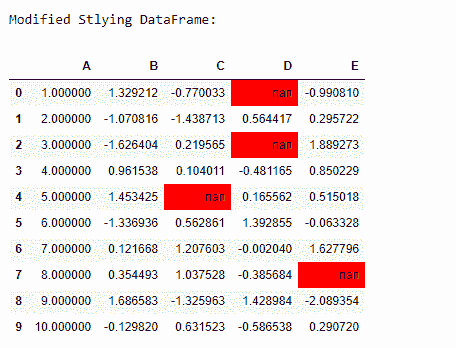
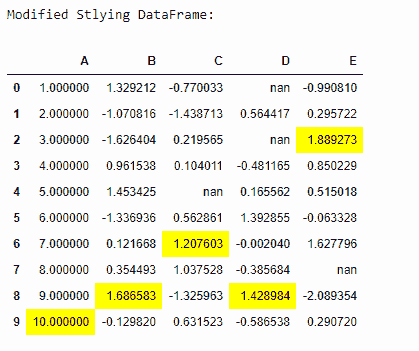
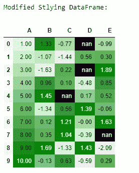
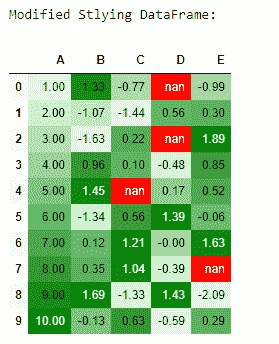
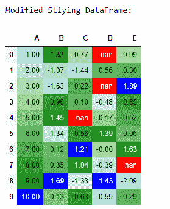

# 在 Python 中设置熊猫数据框背景色和字体颜色

> 原文:[https://www . geesforgeks . org/set-pandas-data frame-background-color-font-color-in-python/](https://www.geeksforgeeks.org/set-pandas-dataframe-background-color-and-font-color-in-python/)

正如我们所知，样式背后的基本思想是让最终用户可读性更有影响力。我们可以对可视化数据的颜色和格式进行更改，以便更有效地交流见解。为了对熊猫数据框进行更有效的可视化，我们通常使用 DataFrame.style 属性，该属性返回 styler 对象，该对象具有许多用于格式化和可视化数据框的有用方法。

## **使用数据框样式属性**

*   **df.style.set_properties:** 通过使用这个，我们可以使用内置的功能来操纵从字体颜色到背景颜色的数据框样式。

## 蟒蛇 3

```
# Importing the necessary libraries -->
import pandas as pd
import numpy as np

# Seeding random data from numpy
np.random.seed(24)

# Making the DataFrame
df = pd.DataFrame({'A': np.linspace(1, 10, 10)})
df = pd.concat([df, pd.DataFrame(np.random.randn(10, 4),
                                 columns=list('BCDE'))], axis=1)

# DataFrame without any styling
print("Original DataFrame:\n")
print(df)
print("\nModified Stlying DataFrame:")
df.style.set_properties(**{'background-color': 'black',
                           'color': 'green'})
```

**输出:**


**df.style.set_properties**

*   **df.style.highlight_null :** 借助于此，我们可以突出显示数据框内部缺失或为 null 的值。

## 蟒蛇 3

```
# Replacing the locating value by NaN (Not a Number)
df.iloc[0, 3] = np.nan
df.iloc[2, 3] = np.nan
df.iloc[4, 2] = np.nan
df.iloc[7, 4] = np.nan

# Highlight the NaN values in DataFrame
print("\nModified Stlying DataFrame:")
df.style.highlight_null(null_color='red')
```

**输出:**



**df.style.highlight_null**

*   **df.style.highlight_min :** 用于突出显示整个数据框中每列的最小值。

## 蟒蛇 3

```
# Highlight the Min values in each column
print("\nModified Stlying DataFrame:")
df.style.highlight_min(axis=0)
```

**输出:**


**df.style.highlight_min**

*   **df.style.highlight_max :** 用于突出显示整个数据框中每列的最大值。

## 蟒蛇 3

```
# Highlight the Max values in each column
print("\nModified Stlying DataFrame:")
df.style.highlight_max(axis=0)
```

**输出:**



**df.style.highlight_max**

## 使用用户定义的函数

*   **我们可以使用一个用户定义的函数来修改 data frame:**借助这个函数，我们可以自定义数据帧内部正数据值的字体颜色。

## 蟒蛇 3

```
# function for set text color of positive
# values in Dataframes
def color_positive_green(val):
    """
    Takes a scalar and returns a string with
    the css property `'color: green'` for positive
    strings, black otherwise.
    """
    if val > 0:
        color = 'green'
    else:
        color = 'black'
    return 'color: %s' % color

df.style.applymap(color_positive_green)
```

**输出:**


**用户自定义功能**

## 使用海底图书馆

*   **在数据框中使用调色板进行渐变填充:**通过从 seaborn 库中导入浅色调色板，我们可以为数据框的背景映射颜色渐变。

## 蟒蛇 3

```
# Import seaborn library
import seaborn as sns

# Declaring the cm variable by the
# color palette from seaborn
cm = sns.light_palette("green", as_cmap=True)

# Visualizing the DataFrame with set precision
print("\nModified Stlying DataFrame:")
df.style.background_gradient(cmap=cm).set_precision(2)
```

**输出:**



**Seaborn Color Palette**

*   **使用带有高光空值或缺失值的调色板:**这里，我们用 seaborn 的渐变调色板突出红色中的 NaN 值。

## 蟒蛇 3

```
# Highlight the NaN values in DataFrame
# using seaborn color palette
print("\nModified Stlying DataFrame:")
df.style.background_gradient(cmap=cm).set_precision(2).highlight_null('red')
```

**输出:**



**带有高光 _ 空值的海鸟调色板**

*   **将 seaborn 属性与 DataFrame.style 属性组合在一起:**使用数据框的高亮属性自定义 Seaborn 调色板，以实现更有影响力的数据可视化。

## 蟒蛇 3

```
# Highlight the NaN values in DataFrame
# using seaborn color palette as well as
# min('lighblue') and max('blue') values
# in each column
print("\nModified Stlying DataFrame:")
df.style.background_gradient(cmap=cm).set_precision(2).highlight_null('red').highlight_min(axis=0, color='lightblue').highlight_max(axis=0, color='blue')
```

**输出:**



**带有差异的海伯恩调色板。突出显示属性**