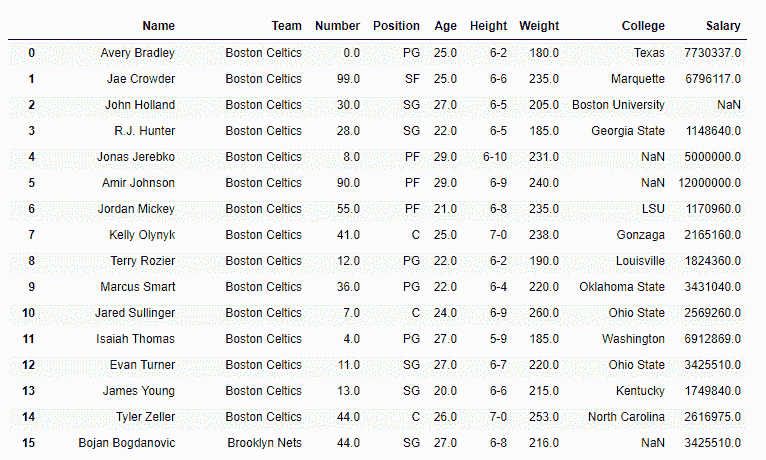
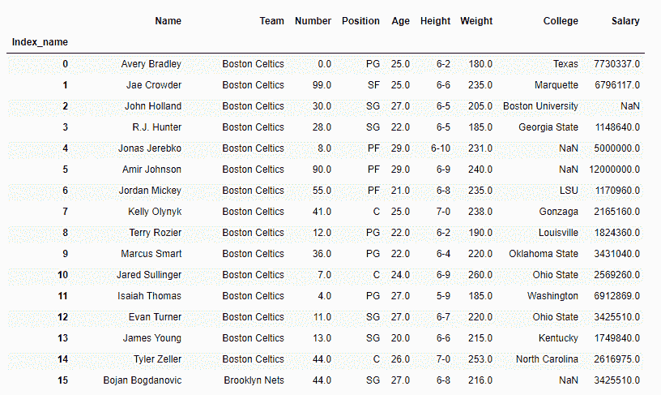
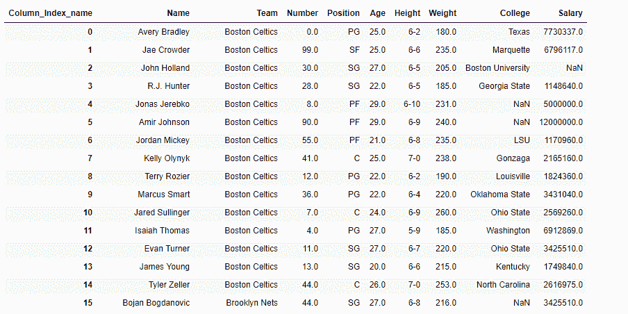

# 在熊猫数据框中设置轴的名称

> 原文:[https://www . geesforgeks . org/setting-熊猫中轴线名称-dataframe/](https://www.geeksforgeeks.org/setting-the-name-of-the-axes-in-pandas-dataframe/)

在熊猫中有多种操作可以在前任身上执行。让我们看看如何操作行和列索引的例子。

有关代码中使用的 CSV 文件的链接，请单击此处的。

### 重置行索引的名称。

**代码#1 :** 我们可以使用`df.index.name`属性重置数据框索引的名称。

```
# importing pandas as pd
import pandas as pd

# read the csv file and create DataFrame
df = pd.read_csv('nba.csv')

# Visualize the dataframe
print(df)
```

**输出:**


```
# set the index name
df.index.name = 'Index_name'

# Print the DataFrame
print(df)
```

**输出:**


**代码#2 :** 我们可以使用`df.rename_axis()`功能重置数据框索引的名称。

```
# importing pandas as pd
import pandas as pd

# read the csv file and create DataFrame
df = pd.read_csv('nba.csv')

# reset the index name
df.rename_axis('Index_name', axis = 'rows')

# Print the DataFrame
print(df)
```

**输出:**


### 重置列轴的名称

**代码#1 :** 我们可以使用`df.rename_axis()`功能重置数据框列轴的名称。

```
# importing pandas as pd
import pandas as pd

# read the csv file and create DataFrame
df = pd.read_csv('nba.csv')

# Visualize the dataframe
print(df)
```

**输出:**


正如我们在输出中看到的，df DataFrame 的列轴没有任何名称。所以，我们将使用`df.rename_axis()`功能设置名称。

```
# set the name of column axes
df.rename_axis('Column_Index_name', axis = 'columns')

# Print the DataFrame
print(df)
```

**输出:**
