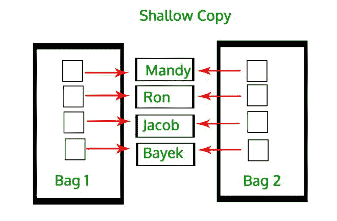
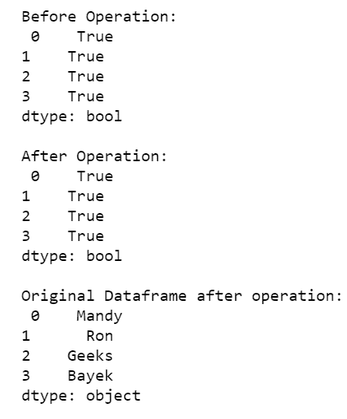
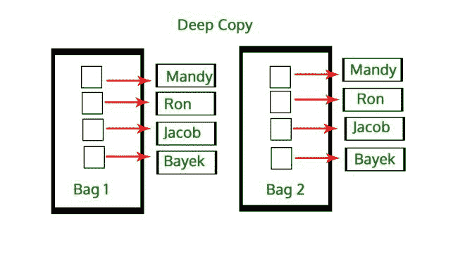
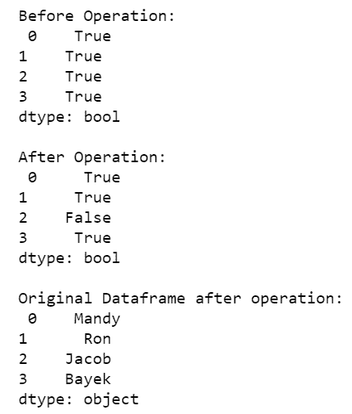

# 熊猫系列

浅拷贝 vs 深拷贝

> 原文:[https://www . geesforgeks . org/浅拷贝对深拷贝熊猫系列/](https://www.geeksforgeeks.org/shallow-copy-vs-deep-copy-in-pandas-series/)

[熊猫](https://www.geeksforgeeks.org/pandas-tutorial/)库主要有两个数据结构[数据帧](https://www.geeksforgeeks.org/python-pandas-dataframe/)和[系列](https://www.geeksforgeeks.org/python-pandas-series/)。这些数据结构在内部用标记数据的索引数组和包含实际数据的数据数组来表示。现在，当我们试图复制这些数据结构(数据帧和系列)时，我们实际上复制了对象的索引和数据，有两种方法可以做到这一点，即浅拷贝和深拷贝。

这些操作是在库函数*熊猫的帮助下完成的。浅拷贝和 T2 熊猫的系列拷贝(深=假)。系列.副本(深度=真)*适用于系列中的深度副本。

现在，让我们来理解什么是浅层复制。

## 浅拷贝

创建系列或系列对象的浅拷贝时，它不会拷贝原始对象的索引和数据，而只是拷贝对其索引和数据的引用。因此，对其中一个所做的更改会反映在另一个中。

它指的是构造一个新的集合对象，然后用在原始集合中找到的子对象的引用填充它。复制过程不会重复，因此不会创建子对象本身的副本。

**示例:**



## 蟒蛇 3

```
# program to depict shallow copy
# in pandas series

# import module
import pandas as pd

# assign series
ser = pd.Series(['Mandy', 'Ron', 'Jacob', 'Bayek'])

# shallow copy
copyser = ser.copy(deep=False)

# comparing shallow copied series
# and original series
print('\nBefore Operation:\n', copyser == ser)

# assignment operation
copyser[2] = 'Geeks'

# comparing shallow copied series
# and original series
print('\nAfter Operation:\n', copyser == ser)

print('\nOriginal Dataframe after operation:\n', ser)
```

**输出:**



从上面程序的输出中我们可以看到，应用于浅拷贝数据帧的更改会自动应用于原始系列。

## 深度复制

系列或系列对象的深层副本有自己的索引和数据副本。这是一个复制过程递归发生的过程。这意味着首先构造一个新的集合对象，然后递归地用在原始集合中找到的子对象的副本填充它。在深度复制的情况下，一个对象的副本被复制到另一个对象中。这意味着对对象副本所做的任何更改都不会反映在原始对象中。

**示例:**



## 蟒蛇 3

```
# program to depict deep copy
# in pandas series

# import module
import pandas as pd

# assign series
ser = pd.Series(['Mandy', 'Ron', 'Jacob', 'Bayek'])

# shallow copy
copyser = ser.copy(deep=True)

# comparing deep copied series
# and original series
print('\nBefore Operation:\n', copyser == ser)

# assignment operation
copyser[2] = 'Geeks'

# comparing deep copied series
# and original series
print('\nAfter Operation:\n', copyser == ser)

print('\nOriginal Dataframe after operation:\n', ser)
```

**输出:**



这里，原始对象内部的数据不会被递归复制。也就是说，原始对象的数据内部的数据仍然指向同一个存储单元。例如，如果 Series 对象中的数据包含任何可变数据，那么它将在它和它的深层副本之间共享，并且对其中一个的任何修改都将反映在另一个中。

## 浅拷贝和深拷贝之间的差异表

<figure class="table">

| 不，先生。 | 浅拷贝 | 深度复制 |
| --- | --- | --- |
| one | 它是集合结构的副本，而不是元素。 | 它是集合的副本，原始集合中的所有元素都是重复的。 |
| Two | 影响初始系列。 | 不影响初始系列。 |
| three | 浅层复制不会复制子对象。 | 深度复制递归复制子对象。 |
| four | 与深度拷贝相比，创建浅拷贝速度更快。 | 与浅拷贝相比，创建深拷贝比较慢。 |
| five | 副本依赖于原件 | 副本并不完全依赖于原件。 |

</figure>