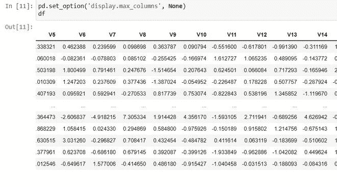
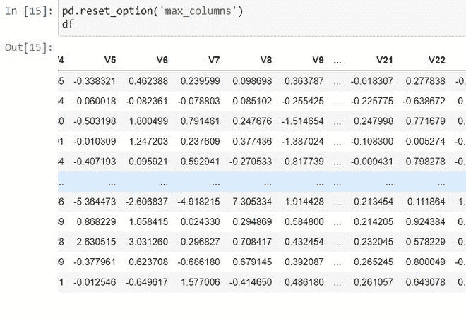
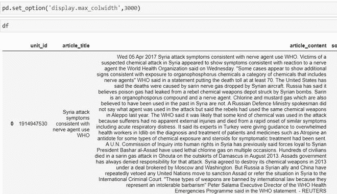

# 在 Jupyter 笔记本中显示熊猫数据框的所有列

> 原文:[https://www . geeksforgeeks . org/show-全栏熊猫-data frame-in-jupyter-notebook/](https://www.geeksforgeeks.org/show-all-columns-of-pandas-dataframe-in-jupyter-notebook/)

在本文中，我们将讨论如何在 jupyter 笔记本中显示熊猫数据框的所有列。

熊猫有一个非常方便的方法叫做 get option()，通过这个方法，我们可以自定义输出屏幕，工作时没有任何不方便的输出形式。 **set_option()** 用于设置数值。这用于通过将 max_columns 设置为无或指定的列数来设置应显示的最大列数和行数

**语法:**

> **语法:**PD . set _ option(' display . max _ columns '，无)

#### 例 1:

## 蟒蛇 3

```py
# importing pandas
import pandas as pd

# reading csv
df = pd.read_csv('data.csv')

# set the max columns to none
pd.set_option('display.max_columns', None)
```

**输出:**



如果我们想变回正常，使用 reset_option()。它用于将一个或多个选项重置为默认值。

> **语法:**PD . reset _ option(' max _ columns ')

**输出:**



#### 例 2:

使用分类数据时出现的另一个常见问题是，我们看不到整个分类值。因为最大列宽较小，所以显示覆盖列宽的数据。休息不显示


在上例中，您可以看到数据显示不够。要解决这个问题，我们可以将最大列宽设置得更高。

> 语法:PD . set _ option(' display . max _ col width '，3000)

## 蟒蛇 3

```py
#import pandas
import pandas as pd

# read csv
df = pd.read_csv('data.csv')

# set max_colwidth to 3000
pd.set_option('display.max_colwidth', 3000)
```

**输出:**



通过应用函数，最大列宽被设置为 3000。所有数据都会显示出来。

#### 例 3:

当我们处理具有更多列或行的数据集时，我们可能会发现很难看到熊猫中的所有列和行。默认情况下，熊猫打印前几行和最后几行。中间会省略数据。当我们处理行数和列数较少的数据集时，不会影响我们。但是如果不在一个时间内看到所有的行和列，就很难分析数据。

## 蟒蛇 3

```py
# importing pandas
import pandas as pd
df = pd.read_csv('data.csv')

# printing dataframe
print(df)
```