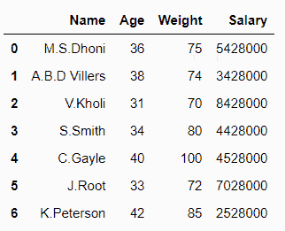
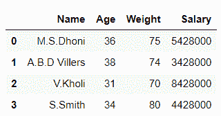
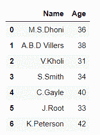
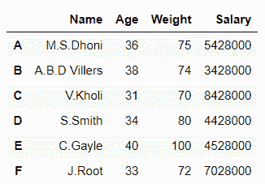
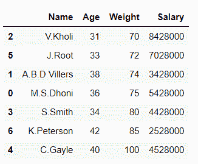
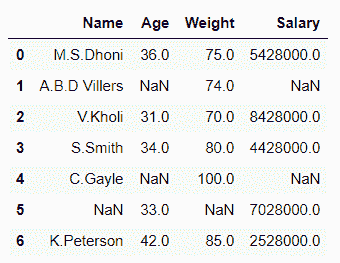
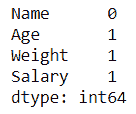
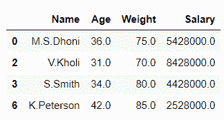

# 熊猫数据帧的切片、索引、操作和清洗

> 原文:[https://www . geesforgeks . org/slicing-indexing-operating-and-cleaning-pandas-data frame/](https://www.geeksforgeeks.org/slicing-indexing-manipulating-and-cleaning-pandas-dataframe/)

在 Pandas 的帮助下，我们可以对数据集执行许多功能，如切片、索引、操作和清理数据框。

**案例 1:** 使用 [**数据框对熊猫数据框进行切片**](https://www.geeksforgeeks.org/python-extracting-rows-using-pandas-iloc/)

**示例 1:** 切片行

## 蟒蛇 3

```py
# importing pandas library
import pandas as pd

# Initializing the nested list with Data set
player_list = [['M.S.Dhoni', 36, 75, 5428000], 
               ['A.B.D Villers', 38, 74, 3428000], 
               ['V.Kholi', 31, 70, 8428000],
               ['S.Smith', 34, 80, 4428000], 
               ['C.Gayle', 40, 100, 4528000],
               ['J.Root', 33, 72, 7028000],
               ['K.Peterson', 42, 85, 2528000]]

# creating a pandas dataframe
df = pd.DataFrame(player_list, columns=['Name', 'Age', 'Weight', 'Salary'])

# data frame before slicing
df
```

**输出:**



## 蟒蛇 3

```py
# Slicing rows in data frame
df1 = df.iloc[0:4]

# data frame after slicing
df1
```

**输出:**



在上面的例子中，我们从数据帧中分割了行。

**示例 2** :切片列

## 蟒蛇 3

```py
# importing pandas library
import pandas as pd

# Initializing the nested list with Data set
player_list = [['M.S.Dhoni', 36, 75, 5428000],
               ['A.B.D Villers', 38, 74, 3428000],
               ['V.Kholi', 31, 70, 8428000],
               ['S.Smith', 34, 80, 4428000],
               ['C.Gayle', 40, 100, 4528000],
               ['J.Root', 33, 72, 7028000], 
               ['K.Peterson', 42, 85, 2528000]]

# creating a pandas dataframe
df = pd.DataFrame(player_list, columns=['Name', 'Age', 'Weight', 'Salary'])

# data frame before slicing
df
```

**输出:**


## 蟒蛇 3

```py
# Slicing columnss in data frame
df1 = df.iloc[:,0:2]

# data frame after slicing
df1
```

**输出:**



在上面的例子中，我们从数据框中分割了列。

**情况 2:** 索引熊猫数据帧

## 蟒蛇 3

```py
# importing pandas library
import pandas as pd

# Initializing the nested list with Data set
player_list = [['M.S.Dhoni', 36, 75, 5428000], 
               ['A.B.D Villers', 38, 74, 3428000],
               ['V.Kholi', 31, 70, 8428000],
               ['S.Smith', 34, 80, 4428000], 
               ['C.Gayle', 40, 100, 4528000],
               ['J.Root', 33, 72, 7028000], 
               ['K.Peterson', 42, 85, 2528000]]

# creating a pandas dataframe and indexing it using Aplhabets
df = pd.DataFrame(player_list, columns=['Name', 'Age', 'Weight', 'Salary'],
                  index=['A', 'B', 'C', 'D', 'E', 'F', 'G'])

# Displaying data frame
df
```

**输出:**



在上面的例子中，我们对数据帧进行索引。

**案例 3:** 操纵熊猫数据帧

数据框的操作可以通过多种方式完成，如应用函数、更改列的数据类型、拆分、向数据框添加行和列等。

**示例 1:** 使用[**data frame . assign()**](https://www.geeksforgeeks.org/python-pandas-dataframe-assign/)将λ函数应用于列

## 蟒蛇 3

```py
# importing pandas library
import pandas as pd

# creating and initializing a list
values = [['Rohan', 455], ['Elvish', 250], ['Deepak', 495],
          ['Sai', 400], ['Radha', 350], ['Vansh', 450]]

# creating a pandas dataframe
df = pd.DataFrame(values, columns=['Name', 'Univ_Marks'])

# Applying lambda function to find percentage of
# 'Univ_Marks' column using df.assign()
df = df.assign(Percentage=lambda x: (x['Univ_Marks'] / 500 * 100))

# displaying the data frame
df
```

**输出:**


在上面的例子中，lambda 函数被应用于“Univ_Marks”列，并且在它的帮助下形成了一个新的列“Percentage”。

**例 2:** 按照**升序**对数据帧进行排序

## 蟒蛇 3

```py
# importing pandas library
import pandas as pd

# Initializing the nested list with Data set
player_list = [['M.S.Dhoni', 36, 75, 5428000],
               ['A.B.D Villers', 38, 74, 3428000],
               ['V.Kholi', 31, 70, 8428000],
               ['S.Smith', 34, 80, 4428000], 
               ['C.Gayle', 40, 100, 4528000],
               ['J.Root', 33, 72, 7028000],
               ['K.Peterson', 42, 85, 2528000]]

# creating a pandas dataframe
df = pd.DataFrame(player_list, columns=['Name', 'Age', 'Weight', 'Salary'])

# Sorting by column 'Weight'
df.sort_values(by=['Weight'])
```

**输出:**



在上面的示例中，我们按照“权重”列对数据框进行排序。

**案例 4:** 清理熊猫数据框

## 蟒蛇 3

```py
# importing pandas and Numpy libraries
import pandas as pd
import numpy as np

# Initializing the nested list with Data set
player_list = [['M.S.Dhoni', 36, 75, 5428000],
               ['A.B.D Villers', np.nan, 74, np.nan],
               ['V.Kholi', 31, 70, 8428000],
               ['S.Smith', 34, 80, 4428000],
               ['C.Gayle', np.nan, 100, np.nan],
               [np.nan, 33, np.nan, 7028000], 
               ['K.Peterson', 42, 85, 2528000]]

# creating a pandas dataframe
df = pd.DataFrame(player_list, columns=['Name', 'Age', 'Weight', 'Salary'])

df
```

**输出:**



## 蟒蛇 3

```py
# Checking for missing values
df.isnull().sum()
```

**输出:**



## 蟒蛇 3

```py
# dropping or cleaning the missing data 
df= df.dropna() 
df
```

**输出:**



在上面的例子中，我们清除了数据集中所有缺失的值。