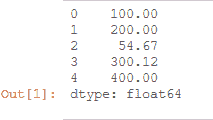
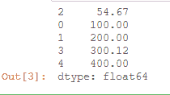

# 用 Python 排序熊猫系列

> 原文:[https://www . geesforgeks . org/sort-a-pandas-in-series-python/](https://www.geeksforgeeks.org/sort-a-pandas-series-in-python/)

[**系列**](https://www.geeksforgeeks.org/python-pandas-series/) 是一维标记数组，能够保存整数、字符串、浮点、python 对象等类型的数据。轴标签统称为索引。

现在，让我们来看一个对熊猫系列进行分类的程序。

对熊猫系列进行排序时，使用 [**系列. sort_values()**](https://www.geeksforgeeks.org/python-pandas-series-sort_values/) 方法。

> **语法:** Series.sort_values(axis=0，升序=True，inplace=False，kind='quicksort '，na_position='last')Sorted
> 
> **返回:**排序序列

**示例 1:** 按升序对数值序列进行排序。

## 蟒蛇 3

```
# importing pandas as pd
import pandas as pd

# define a numeric series
s = pd.Series([100, 200, 54.67,
               300.12, 400])

# print the unsorted series
s
```

**输出**:



现在我们使用 *Series.sort_values()* 方法对一个数值序列进行升序排序。

## 蟒蛇 3

```
# sorting series s with
# s.sort_value() method in
# ascending order
sorted_series = s.sort_values(ascending
                              = True)
# print the sorted series
sorted_series
```

**输出:**



从输出中，我们可以看到数字序列是按升序排序的。

**例 2:** 按降序对数值序列进行排序。

## 蟒蛇 3

```
# importing pandas as pd
import pandas as pd

# define a numeric series
s = pd.Series([100, 200, 54.67,
               300.12, 400])

# print the unsorted series
s
```