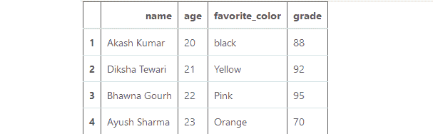

# 按两列或多列对熊猫数据框进行排序

> 原文:[https://www . geeksforgeeks . org/按两列或更多列对熊猫数据框进行排序/](https://www.geeksforgeeks.org/sort-the-pandas-dataframe-by-two-or-more-columns/)

在本文中，我们的基本任务是基于两列或多列对数据框进行排序。为此，使用 [Dataframe.sort_values()](https://www.geeksforgeeks.org/python-pandas-dataframe-sort_values-set-1/) 方法。此方法根据函数内部传递的列，以升序或降序对数据框进行排序。

首先，让我们创建一个数据框架:

## 蟒蛇 3

```
#import python library
import pandas as pd

# dictionary
data_frame = {
       'name': ['Akash Kumar', 'Diksha Tewari',
                'Bhawna Gourh', 'Ayush Sharma'],
        'age': [20, 21, 22, 23],
        'favorite_color': ['black', 'Yellow', 
                           'Pink', "Orange"],
        'grade': [88, 92, 95, 70]
}

# create data frame with indexing
df = pd.DataFrame(data_frame, 
                  index = [1, 2, 3, 4])

# printing the dataframe
df
```

**输出:**



**示例 1:** 根据“年龄”(降序)和“年级”(升序)列对数据框进行排序。

## 蟒蛇 3

```
# sort the dataframe
# based on age and grade
df.sort_values(['age', 'grade'],
              ascending = [False, True])
```

**输出:**


**示例 2:** 根据“名称”和“收藏夹 _ 颜色”列按升序对数据框进行排序。

## 蟒蛇 3

```
# sort the dataframe based 
# on name and favorite_colr
df.sort_values(['name', 'favorite_color'], 
               ascending=[True,
                          True])
```

**输出:**


**示例 3:** 基于“等级”和“收藏夹 _ 颜色”列的数据框就地排序。在就地排序的情况下，Dataframe.sort_values()方法在实际数据帧中执行更改时不返回任何内容。

## 蟒蛇 3

```
df.sort_values(["grade", "favorite_color"], 
               axis = 0, ascending = True, 
               inplace = True,
               na_position ='first')

# printing the dataframe
df
```

**输出:**

