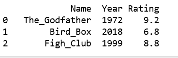
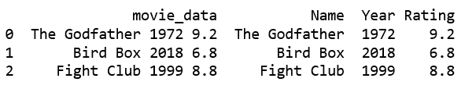

# 在熊猫数据框中使用正则表达式将字符串拆分成列

> 原文:[https://www . geesforgeks . org/split-a-string-in-columns-using-regex-in-pandas-data frame/](https://www.geeksforgeeks.org/split-a-string-into-columns-using-regex-in-pandas-dataframe/)

给定一些包含多个值作为字符串的混合数据，让我们看看如何使用正则表达式划分字符串，并在熊猫数据框中创建多个列。

**方法#1** :
在这个方法中我们将使用`re.search(pattern, string, flags=0)`。这里的模式是指我们要搜索的模式。它接受具有以下值的字符串:

*   **\w** 匹配字母数字字符
*   **\d** 匹配数字，表示 0-9
*   **\s** 匹配空白字符
*   **\S** 匹配非空白字符
*   **。**匹配除新行字符之外的任何字符\n
*   ***** 匹配 0 个或多个模式实例

```
# import the regex library
import pandas as pd
import re

# Create a list with all the strings
movie_data = ["Name: The_Godfather Year: 1972 Rating: 9.2",
            "Name: Bird_Box Year: 2018 Rating: 6.8",
            "Name: Fight_Club Year: 1999 Rating: 8.8"]

# Create a dictionary with the required columns 
# Used later to convert to DataFrame
movies = {"Name":[], "Year":[], "Rating":[]}

for item in movie_data:

    # For Name field
    name_field = re.search("Name: .*",item)

    if name_field is not None:
        name = re.search('\w*\s\w*',name_field.group())
    else:
        name = None
    movies["Name"].append(name.group())

    # For Year field
    year_field = re.search("Year: .*",item)
    if year_field is not None:
        year = re.search('\s\d\d\d\d',year_field.group())
    else:
        year = None
    movies["Year"].append(year.group().strip())

    # For rating field
    rating_field = re.search("Rating: .*",item)
    if rating_field is not None: 
        rating = re.search('\s\d.\d',rating_field.group())
    else: 
        rating - None
    movies["Rating"].append(rating.group().strip())

# Creating DataFrame
df = pd.DataFrame(movies)
print(df)
```

**输出:**


**说明:**

*   在上面的代码中，我们使用 for 循环来遍历电影数据，这样我们就可以依次处理每部电影。我们创建了一个字典，电影，它将保存每个细节的所有细节，如评级和名称。
*   然后我们使用`re.search()`函数找到整个名称字段。**。**表示除了\n 以外的任何字符，并且*将其扩展到行尾。将其分配给变量*名称字段*。
*   但是，数据并不总是简单的。它可以包含惊喜。例如，如果没有名称:字段会怎样？脚本会抛出一个错误并中断。我们从这个场景中预先排除错误，并检查非*无*情况。
*   我们再次使用 re.search()函数从 name_field 中提取最终所需的字符串。对于名称，我们用\w*表示第一个单词，用\s 表示第二个单词和\w*之间的空格。
*   对年份和等级做同样的操作，得到最终所需的字典。

**方法 2:**
要分解字符串，我们将使用`Series.str.extract(pat, flags=0, expand=True)`功能。这里*拍*指的是我们要搜索的图案。

```
import pandas as pd

dict = {'movie_data':['The Godfather 1972 9.2',
                    'Bird Box 2018 6.8',
                    'Fight Club 1999 8.8'] }

# Convert the dictionary to a dataframe
df = pd.DataFrame(dict)

# Extract name from the string 
df['Name'] = df['movie_data'].str.extract('(\w*\s\w*)', expand=True)

# Extract year from the string 
df['Year'] = df['movie_data'].str.extract('(\d\d\d\d)', expand=True)

# Extract rating from the string 
df['Rating'] = df['movie_data'].str.extract('(\d\.\d)', expand=True)
print(df)
```

**输出:**
