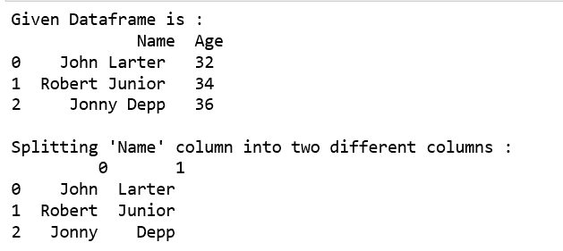
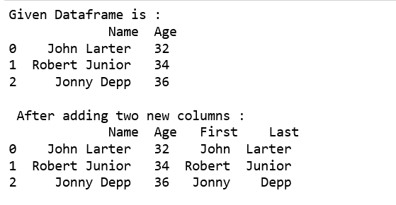
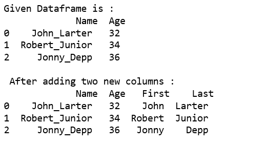
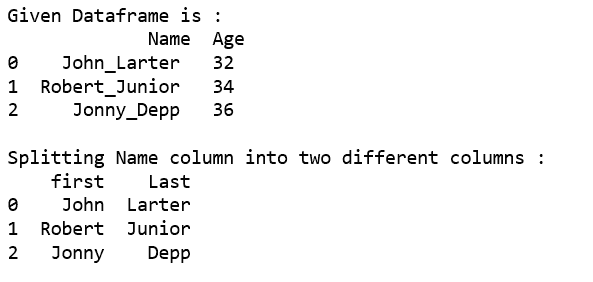
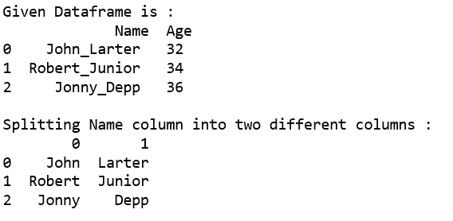
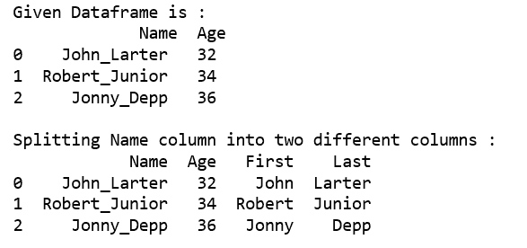

# 在熊猫数据框中将一个文本列拆分为两列

> 原文:[https://www . geesforgeks . org/split-a-text-column-in-pandas-data frame/](https://www.geeksforgeeks.org/split-a-text-column-into-two-columns-in-pandas-dataframe/)

让我们看看如何在熊猫数据框中将一个文本列分成两列。

**方法#1 :** 使用`[Series.str.split()](https://www.geeksforgeeks.org/python-pandas-split-strings-into-two-list-columns-using-str-split/)`功能。

将*名称*列拆分为两个不同的列。默认情况下，通过`str.split()`功能在单个空间的基础上进行拆分。

```py
# import Pandas as pd
import pandas as pd

# create a new data frame
df = pd.DataFrame({'Name': ['John Larter', 'Robert Junior', 'Jonny Depp'],
                   'Age':[32, 34, 36]})

print("Given Dataframe is :\n",df)

# bydefault splitting is done on the basis of single space.
print("\nSplitting 'Name' column into two different columns :\n",
                                  df.Name.str.split(expand=True))
```

**输出:**


将*名称*列分别拆分为“第一个”和“最后一个”列，并将其添加到现有的数据框中。

```py
# import Pandas as pd
import pandas as pd

# create a new data frame
df = pd.DataFrame({'Name': ['John Larter', 'Robert Junior', 'Jonny Depp'],
                    'Age':[32, 34, 36]})

print("Given Dataframe is :\n",df)

# Adding two new columns to the existing dataframe.
# bydefault splitting is done on the basis of single space.
df[['First','Last']] = df.Name.str.split(expand=True)

print("\n After adding two new columns : \n", df)
```

**输出:**


使用*下划线*作为分隔符，将列拆分为两列。

```py
# import Pandas as pd
import pandas as pd

# create a new data frame
df = pd.DataFrame({'Name': ['John_Larter', 'Robert_Junior', 'Jonny_Depp'],
                    'Age':[32, 34, 36]})

print("Given Dataframe is :\n",df)

# Adding two new columns to the existing dataframe.
# splitting is done on the basis of underscore.
df[['First','Last']] = df.Name.str.split("_",expand=True)

print("\n After adding two new columns : \n",df)
```

**输出:**


一起使用`str.split()`、`tolist()`功能。

```py
# import Pandas as pd
import pandas as pd

# create a new data frame
df = pd.DataFrame({'Name': ['John_Larter', 'Robert_Junior', 'Jonny_Depp'],
                    'Age':[32, 34, 36]})

print("Given Dataframe is :\n",df)

print("\nSplitting Name column into two different columns :") 
print(pd.DataFrame(df.Name.str.split('_',1).tolist(),
                         columns = ['first','Last']))
```

**输出:**


**方法 2 :** 使用`apply()`功能。

将*名称*列拆分为两个不同的列。

```py
# import Pandas as pd
import pandas as pd

# create a new data frame
df = pd.DataFrame({'Name': ['John_Larter', 'Robert_Junior', 'Jonny_Depp'],
                    'Age':[32, 34, 36]})

print("Given Dataframe is :\n",df)

print("\nSplitting Name column into two different columns :") 
print(df.Name.apply(lambda x: pd.Series(str(x).split("_"))))
```

**输出:**


将*名称*列拆分为两个不同的列，分别命名为“第一个”和“最后一个”，然后将其添加到现有的数据框中。

```py
# import Pandas as pd
import pandas as pd

# create a new data frame
df = pd.DataFrame({'Name': ['John_Larter', 'Robert_Junior', 'Jonny_Depp'],
                    'Age':[32, 34, 36]})

print("Given Dataframe is :\n",df)

print("\nSplitting Name column into two different columns :") 

# splitting 'Name' column into Two columns 
# i.e. 'First' and 'Last'respectively and 
# Adding these columns to the existing dataframe.
df[['First','Last']] = df.Name.apply(
   lambda x: pd.Series(str(x).split("_")))

print(df)
```

**输出:**
