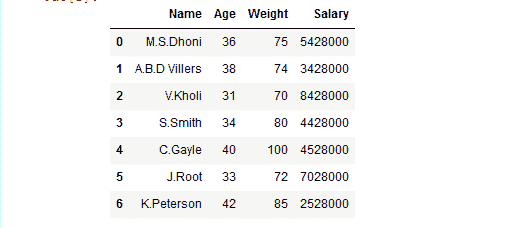
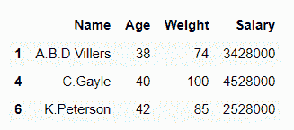
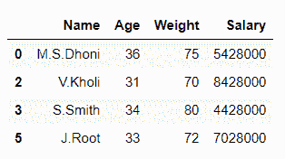
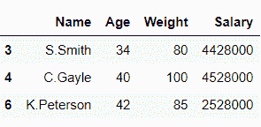
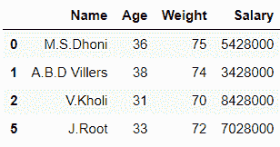
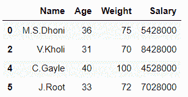
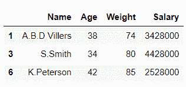

# 按列值分割熊猫数据框

> 原文:[https://www . geesforgeks . org/split-pandas-data frame-by-column-value/](https://www.geeksforgeeks.org/split-pandas-dataframe-by-column-value/)

有时，为了更准确地分析数据帧，我们需要将其分成 2 个或更多部分。熊猫提供了根据列索引、行索引和列值等拆分数据帧的功能。

让我们看看如何在 Python 中按列值拆分[熊猫数据帧](https://www.geeksforgeeks.org/python-pandas-dataframe/)？

现在，让我们创建一个数据帧:

## 蟒蛇 3

```
# importing pandas library
import pandas as pd

# Initializing the nested list with Data-set
player_list = [['M.S.Dhoni', 36, 75, 5428000],
               ['A.B.D Villers', 38, 74, 3428000],
               ['V.Kholi', 31, 70, 8428000],
               ['S.Smith', 34, 80, 4428000],
               ['C.Gayle', 40, 100, 4528000],
               ['J.Root', 33, 72, 7028000],
               ['K.Peterson', 42, 85, 2528000]]

# creating a pandas dataframe
df = pd.DataFrame(player_list, 
                  columns = ['Name', 'Age', 
                             'Weight', 'Salary'])

# show the dataframe
df
```

**输出:**



**方法一:**采用 [**布尔掩蔽**](https://www.geeksforgeeks.org/boolean-indexing-in-pandas/) 的方法。

此方法仅用于打印数据帧中我们传递布尔值“真”的部分。

**例 1:**

## 蟒蛇 3

```
# importing pandas library
import pandas as pd

# Initializing the nested list with Data-set
player_list = [['M.S.Dhoni', 36, 75, 5428000],
               ['A.B.D Villers', 38, 74, 3428000],
               ['V.Kholi', 31, 70, 8428000],
               ['S.Smith', 34, 80, 4428000],
               ['C.Gayle', 40, 100, 4528000],
               ['J.Root', 33, 72, 7028000],
               ['K.Peterson', 42, 85, 2528000]]

# creating a pandas dataframe
df = pd.DataFrame(player_list, 
                  columns = ['Name', 'Age', 
                             'Weight', 'Salary'])

# splitting the dataframe into 2 parts
# on basis of 'Age' column values
# using Relational operator
df1 = df[df['Age'] >= 37]

# printing df1
df1
```

**输出:**



## 蟒蛇 3

```
df2 = df[df['Age'] < 37]

# printing df2
df2
```

**输出:**



在上面的例子中，基于列“ **Age** 的值，数据帧“df”被分成 2 个部分“df1”和“df2”。

**例 2:**

## 蟒蛇 3

```
# importing pandas library
import pandas as pd

# Initializing the nested list with Data-set
player_list = [['M.S.Dhoni', 36, 75, 5428000],
               ['A.B.D Villers', 38, 74, 3428000],
               ['V.Kholi', 31, 70, 8428000],
               ['S.Smith', 34, 80, 4428000],
               ['C.Gayle', 40, 100, 4528000],
               ['J.Root', 33, 72, 7028000],
               ['K.Peterson', 42, 85, 2528000]]

# creating a pandas dataframe
df = pd.DataFrame(player_list, 
                  columns = ['Name', 'Age', 
                             'Weight', 'Salary'])

# splitting the dataframe into 2 parts
# on basis of 'Weight' column values
mask = df['Weight'] >= 80

df1 = df[mask]

# invert the boolean values
df2 = df[~mask]

# printing df1
df1
```

**输出:**



## 蟒蛇 3

```
# printing df2
df2
```

**输出:**



在上面的例子中，基于列“**权重**的值，数据帧“df”被分成 2 个部分“df1”和“df2”。

**方法二:**使用[**data frame . group by()**](https://www.geeksforgeeks.org/python-pandas-dataframe-groupby/)。

此方法用于根据某些标准将数据分成组。

**示例:**

## 蟒蛇 3

```
# importing pandas library
import pandas as pd

# Initializing the nested list with Data-set
player_list = [['M.S.Dhoni', 36, 75, 5428000],
               ['A.B.D Villers', 38, 74, 3428000],
               ['V.Kholi', 31, 70, 8428000],
               ['S.Smith', 34, 80, 4428000],
               ['C.Gayle', 40, 100, 4528000],
               ['J.Root', 33, 72, 7028000],
               ['K.Peterson', 42, 85, 2528000]]

# creating a pandas dataframe
df = pd.DataFrame(player_list, 
                  columns = ['Name', 'Age', 
                             'Weight', 'Salary'])

# splitting the dataframe into 2 parts
# on basis of 'Salary' column values
# using dataframe.groupby() function
df1, df2 = [x for _, x in df.groupby(df['Salary'] < 4528000)]

# printing df1
df1
```

**输出:**



## 蟒蛇 3

```
# printing df2
df2
```

**输出:**



在上面的例子中，数据帧“df”根据列“**工资**的值被分成两部分“df1”和“df2”。