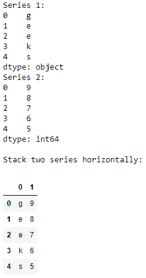
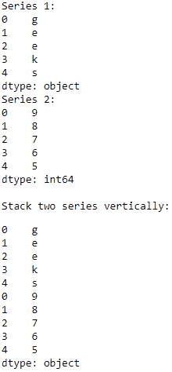

# 纵横叠放两只熊猫系列

> 原文:[https://www . geesforgeks . org/stack-two-pandas-series-纵横/](https://www.geeksforgeeks.org/stack-two-pandas-series-vertically-and-horizontally/)

在本文中，我们将看到如何垂直和水平堆叠两个熊猫系列。我们将这些列表堆叠在一起，将一些数据组合在一个数据框架中，以便更好地可视化数据，组合不同的数据，等等。现在让我们借助例子来看看如何做到这一点。

**水平堆叠:**我们可以将 2 个熊猫系列水平堆叠，方法是将它们放入参数为`axis = 1`的[熊猫. concat()](https://www.geeksforgeeks.org/python-merge-join-and-concatenate-dataframes-using-panda/) 。
**例:**

```py
# importing the module
import pandas as pd

# creating the series
series1 = pd.Series(['g', 'e', 'e', 'k', 's'])
print("Series 1:")
print(series1)
series2 = pd.Series([9, 8, 7, 6, 5])
print("Series 2:")
print(series2)

# stacking the series horizontally
df = pd.concat([series1, series2], axis = 1)
print("\nStack two series horizontally:")
display(df)
```

**输出:**


**垂直堆叠:**我们可以通过参数`axis = 0`将 2 只熊猫系列通过`pandas.concat()`垂直堆叠。
**例:**

```py
# importing the module
import pandas as pd

# creating the series
series1 = pd.Series(['g', 'e', 'e', 'k', 's'])
print("Series 1:")
print(series1)
series2 = pd.Series([9, 8, 7, 6, 5])
print("Series 2:")
print(series2)

# stacking the series vertically
df = pd.concat([series1, series2], axis = 0)
print("\nStack two series vertically:")
display(df)
```

**输出:**
