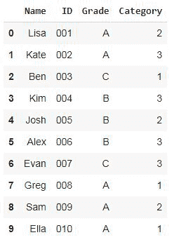
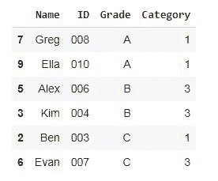
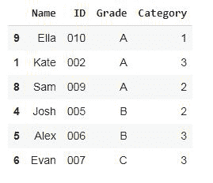
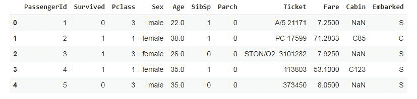
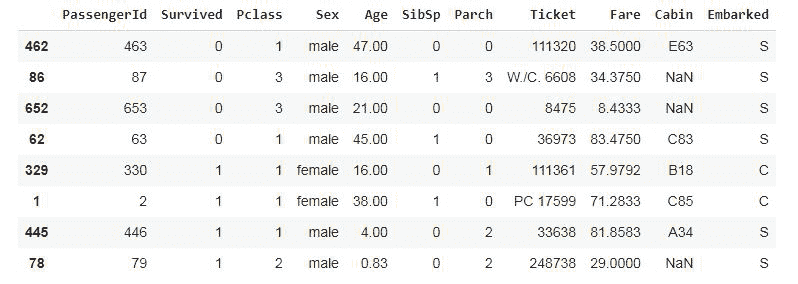
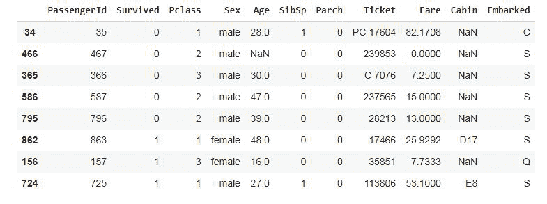

# 大熊猫分层抽样

> 原文:[https://www . geesforgeks . org/熊猫分层取样/](https://www.geeksforgeeks.org/stratified-sampling-in-pandas/)

分层抽样是一种用于获得最能代表总体的样本的抽样技术。它通过将人群划分为称为**地层**的同质亚组，并从每个地层(地层的奇异形式)随机取样数据，来减少选择样本时的偏差。

在统计学中，当每个阶层的平均值不同时，使用分层抽样。在机器学习中，分层抽样通常用于创建测试数据集来评估模型，尤其是当数据集非常大且不平衡时。


## 分层抽样涉及的步骤

*   **将人口划分为阶层:**在这一步中，根据相似的特征将人口划分为阶层，人口中的每个成员必须恰好属于一个阶层(阶层的单数)。
*   **确定样本量:**决定样本应该多小或多大。
*   **随机抽样每一个层:**从每一个层中选择随机样本，使用**不成比例抽样**或**成比例抽样**，其中每一个层的样本大小与该层的人口大小成比例。

### 例 1:

在这个例子中，我们有一个 10 名学生的虚拟数据集，我们将根据他们的成绩，使用不成比例和成比例的分层抽样抽取 6 名学生。

**步骤 1:** 使用 pandas DataFrame 从 python 字典创建虚拟数据集

## 蟒蛇 3

```
import pandas as pd

# Create a dictionary of students
students = {
    'Name': ['Lisa', 'Kate', 'Ben', 'Kim', 'Josh',
             'Alex', 'Evan', 'Greg', 'Sam', 'Ella'],
    'ID': ['001', '002', '003', '004', '005', '006', 
           '007', '008', '009', '010'],
    'Grade': ['A', 'A', 'C', 'B', 'B', 'B', 'C', 
              'A', 'A', 'A'],

    'Category': [2, 3, 1, 3, 2, 3, 3, 1, 2, 1]
}

# Create dataframe from students dictionary
df = pd.DataFrame(students)

# view the dataframe
df
```

**输出:**



注意有 **50%的 A 级**学生， **30%的 B 级**学生， **20%的 C 级**学生。

**步骤 2:** 不成比例地创建 6 名学生的样本(每个年级层次的学生人数相等)

**不成比例抽样:**使用熊猫分组法，根据学生的年级将他们分成 A、B、C 组，并使用抽样函数从每个年级组中随机抽取 2 名学生

## 蟒蛇 3

```
df.groupby('Grade', group_keys=False).apply(lambda x: x.sample(2))
```

**输出:**



**第三步:**按比例抽取 60%的学生(根据每个阶层在人口中的比例创建比例样本)

**比例抽样:**采用熊猫分组法，根据学生的年级将学生分成 A、B、C 组，并根据人口比例从每组中随机抽取样本。总样本量为总体的 60%(0.6)

## 蟒蛇 3

```
df.groupby('Grade', group_keys=False).apply(lambda x: x.sample(frac=0.6))
```

**输出:**



注意，即使在样本中，也有 **50%的 A 级**学生、 **30%的 B 级**学生、 **20%的 C 级**学生。

### **例 2:**

在本例中**、**我们将从[训练](https://media.geeksforgeeks.org/wp-content/cdn-uploads/20210924200234/train.csv)数据集创建样本数据。泰坦尼克号是一艘英国客轮，撞上冰山后沉入北大西洋。该数据集包含所有登上泰坦尼克号的乘客的信息，一名乘客要么死亡，要么在事故中幸存，因此我们将使用幸存列作为我们的分层列。

**步骤 1:** 从 CSV 文件读入数据集

## 蟒蛇 3

```
import pandas as pd

# read the dataset as csv file
data = pd.read_csv('Titanic.csv')

# drop the name column as it is of no importance here
data.drop('Name', axis=1, inplace=True)

# view the first 5 rows of the titanic dataset
data.head()
```

**输出:**



**第二步:**检查死亡/幸存乘客的百分比

检查死亡或幸存乘客的比例/百分比这是死亡或存活乘客的数量/乘客总数* 100

## 蟒蛇 3

```
(data['Survived'].value_counts()) / len(data) * 100
```

**输出:**

```
0    61.616162
1    38.383838
```

其中 **0** 代表**死亡的乘客** (61.6%)，而 **1** 代表**幸存的乘客** (38.4%)

**第三步:**不成比例地抽取 8 名乘客(4 人死亡，4 人幸存)

## 蟒蛇 3

```
# Disproportionate sampling:
# randomly select 4 samples from each stratum

data.groupby('Survived', group_keys=False).apply(lambda x: x.sample(4))
```

**输出:**



**第 4 步:**按比例抽取 1%(0.01)的乘客(0.6%死亡，0.4%存活)

## 蟒蛇 3

```
data.groupby('Survived', group_keys=False).
apply(lambda x: x.sample(frac=0.01))
```

**输出:**

