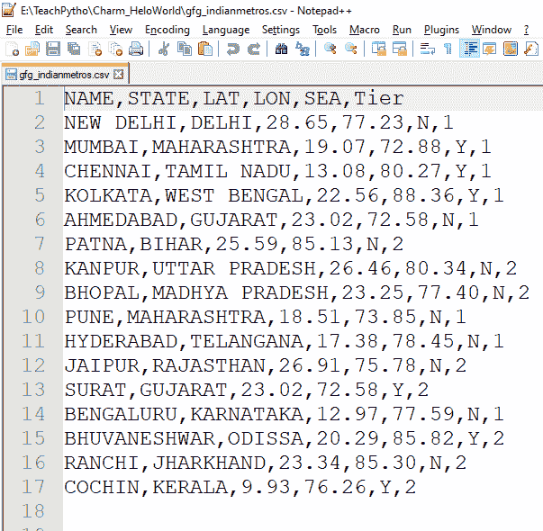
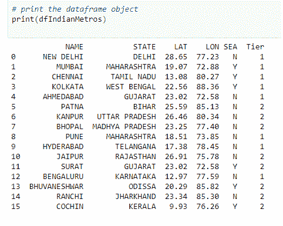
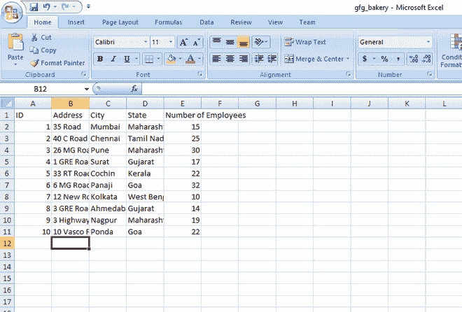
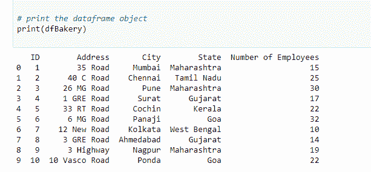
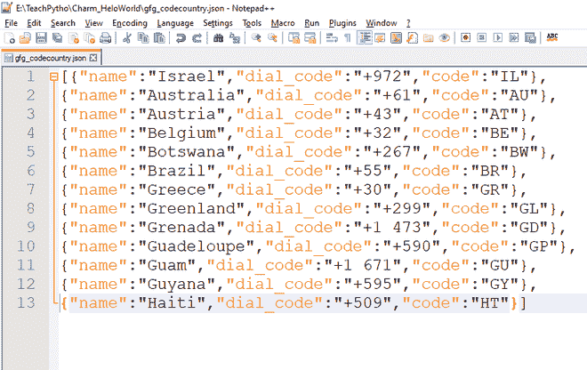
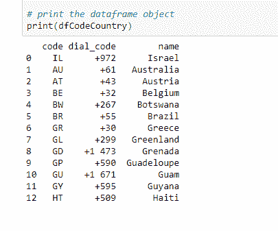
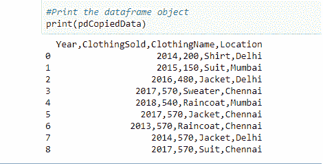
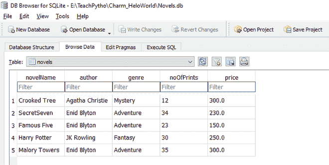

# 熊猫简化数据摄取

> 原文:[https://www . geeksforgeeks . org/streamlined-data-摄取-with-pandas/](https://www.geeksforgeeks.org/streamlined-data-ingestion-with-pandas/)

数据接收是将数据从各种来源传输到一种方法的过程，在这种方法中，数据可以被机构分析、归档或利用。在这个过程中，通常的步骤是从当前位置提取数据，转换数据，最后将数据加载到一个位置，以便进行有效的研究。Python 为数据摄取提供了许多这样的工具和框架。这些包括倭黑猩猩，美丽的汤 4，气流，熊猫等。在本文中，我们将了解熊猫库的数据摄取。

### **大熊猫的数据摄取:**

熊猫数据摄取是将数据从各种来源转移到熊猫数据框架结构中的过程。数据源可以是不同的文件格式，如逗号分隔数据、JSON、HTML 网页表格、Excel。在本文中，我们将了解如何将数据从这种格式传输到目的地，即 Pandas dataframe 对象。

**进场:**

将任何此类数据传输到 dataframe 对象的基本方法如下

*   准备您的源数据。
    *   数据可以存在于任何远程服务器或本地机器上。我们需要知道文件的网址，如果它在远程服务器上的话。如果数据存在于本地，则需要本地计算机上的文件路径。
*   使用熊猫' read_x '方法
    *   熊猫提供了“read_x”方法，用于将数据加载和转换为 Dataframe 对象。
    *   根据数据格式，使用“read”方法。
*   从数据框对象打印数据。
    *   打印 dataframe 对象，以验证转换是否顺利。

### **摄取的文件格式:**

在本文中，我们将把以下文件中的数据转换为数据帧结构–

1.  从 CSV 文件中读取数据
2.  从 Excel 文件中读取数据
3.  从 JSON 文件中读取数据
4.  从剪贴板读取数据
5.  从网页的 HTML 表格中读取数据
6.  从 SQLite 表中读取数据

### **从 CSV 文件中读取数据**

要加载逗号分隔文件(CSV)中的数据，我们将执行以下步骤:

*   准备您的样本数据集。这里，我们有一个 CSV 文件，包含关于印度地铁城市的信息。它描述了城市是第一层还是第二层城市、它们的地理位置、它们所属的州，以及它是否是一个沿海城市。
*   使用熊猫方法' read_csv '
    *   使用的方法–*读取 _csv(文件 _ 路径)*
    *   参数–字符串格式，包含文件的路径及其名称，或远程服务器上的网址。它读取文件数据，并将其转换为有效的二维 dataframe 对象。此方法可用于读取数据，如中所示。csv“以及”。txt "文件格式。

文件内容如下:



“gfg_indianmetros.csv”文件的内容

在熊猫数据框中获取数据的代码是:

## 计算机编程语言

```
# Import the Pandas library
import pandas

# Load data from Comma separated file
# Use method - read_csv(filepath)
# Parameter - the path/URL of the CSV/TXT file
dfIndianMetros = pandas.read_csv("gfg_indianmetros.csv")

# print the dataframe object
print(dfIndianMetros)
```

**输出:**



数据框对象中的 CSV 数据

### **从 Excel 文件中读取数据**

加载 Excel 文件中的数据(。xlsx，。xls)我们将遵循以下步骤-

*   准备您的样本数据集。这里，我们有一个 Excel 文件，包含关于面包店及其分支机构的信息。它描述了员工的数量，面包店分支机构的地址。
*   使用熊猫方法' read_excel '。
    *   使用的方法–*read _ excel(file _ path)*
    *   参数–该方法接受字符串格式的文件路径及其名称作为参数。文件可以在远程服务器上，也可以在本地计算机上。它读取文件数据，并将其转换为有效的二维数据框对象。此方法可用于读取中的数据。xlsx“以及”。xls "文件格式。

文件内容如下:



“gfg_bakery.xlsx”文件的内容

获取熊猫数据框中数据的代码是:

## 计算机编程语言

```
# Import the Pandas library
import pandas

# Load data from an Excel file
# Use method - read_excel(filepath)
# Method parameter - The file location(URL/path) and name
dfBakery = pandas.read_excel("gfg_bakery.xlsx")

# print the dataframe object
print(dfBakery)
```

**输出:**



数据框对象中的 Excel 数据

### **从** a **JSON 文件**读取数据

加载 JavaScript 对象符号文件中的数据。json)我们将遵循以下步骤:

*   准备您的样本数据集。这里，我们有一个 JSON 文件，包含关于国家及其拨号代码的信息。
*   使用熊猫方法' read_json '。
    *   使用的方法–*read _ JSON(file _ path)*
    *   参数–此方法接受字符串格式的文件路径及其名称作为参数。它读取文件数据，并将其转换为有效的二维数据框对象。

文件内容如下:



“gfg_codecountry.json”文件的内容

获取熊猫数据框中数据的代码是:

## 计算机编程语言

```
# Import the Pandas library
import pandas

# Load data from a JSON file
# Use method - read_json(filepath)
# Method parameter - The file location(URL/path) and name
dfCodeCountry = pandas.read_json("gfg_codecountry.json")

# print the dataframe object
print(dfCodeCountry)
```

**输出:**



数据框对象中的 JSON 数据

### **从剪贴板读取数据**

我们还可以将剪贴板中的数据传输到数据框对象。剪贴板是随机存取存储器的一部分，复制的数据就在这里。每当我们使用“复制”命令复制任何文件、文本、图像或任何类型的数据时，它都会存储在剪贴板中。要转换此处显示的数据，请遵循下面提到的步骤–

*   选择文件的所有内容。文件应该是一个 CSV 文件。它可以是一个。txt '文件，包含逗号分隔的值，如示例所示。请注意，如果文件内容的格式不合适，那么在运行时会出现解析错误。
*   右键单击，然后说复制。现在，这些数据被传输到计算机剪贴板。
*   使用熊猫方法'读取剪贴板'。
    *   使用的方法–read _ clipboard
    *   参数–方法不接受任何参数。它读取剪贴板中的最新复制数据，并将其转换为有效的二维 dataframe 对象。

选择的文件内容如下:


“gfg _ coat . txt”文件的内容

获取熊猫数据框中数据的代码是:

## 计算机编程语言

```
# Import the required library
import pandas

# Copy file contents which are in proper format
# Whatever data you have copied will
# get transferred to dataframe object
# Method does not accept any parameter
pdCopiedData = pd.read_clipboard()

# Print the data frame object
print(pdCopiedData)
```

**输出:**



dataframe 对象中的剪贴板数据

### **从 HTML 文件中读取数据**

网页通常由 HTML 元素组成。根据数据显示的目的，在浏览器上有不同的 HTML 标签，如、<title>、<table>、<div>。我们可以将呈现在网页中的<table>元素之间的内容转移到熊猫数据框对象。遵循以下步骤–</table></div></table></title>

*   选择在开始和结束标签之间的中存在的所有元素。将其赋给一个 Python 变量。

*   使用熊猫方法' read_html '。
    *   使用的方法–read _ html(在标记内的字符串)

    *   参数–该方法接受字符串变量，包含出现在标记之间的元素。它读取元素，遍历表、和

        | 标签，并将其转换为列表对象。列表对象的第一个元素是所需的 dataframe 对象。 |

使用的 HTML 网页如下:

## 超文本标记语言

```
<!DOCTYPE html>
<html>
<head>
<title>Data Ingestion with Pandas Example</title>
</head>
<body>
<h2>Welcome To GFG</h2>
<table>
  <thead>
    <tr>
      <th>Date</th>
      <th>Empname</th>
      <th>Year</th>
      <th>Rating</th>
      <th>Region</th>
    </tr>
  </thead>
  <tbody>
    <tr>
      <td>2020-01-01</td>
      <td>Savio</td>
      <td>2004</td>
      <td>0.5</td>
      <td>South</td>
    </tr>
    <tr>
      <td>2020-01-02</td>
      <td>Rahul</td>
      <td>1998</td>
      <td>1.34</td>
      <td>East</td>
    </tr>
    <tr>
      <td>2020-01-03</td>
      <td>Tina</td>
      <td>1988</td>
      <td>1.00023</td>
      <td>West</td>
    </tr>
     <tr>
      <td>2021-01-03</td>
      <td>Sonia</td>
      <td>2001</td>
      <td>2.23</td>
      <td>North</td>
    </tr>    
  </tbody>
</table>
</body>
</html>
```

编写以下代码来转换熊猫数据框对象中的 HTML 表内容:

## 计算机编程语言

```
# Import the Pandas library
import pandas

# Variable containing the elements
# between <table> tag from webpage
html_string = """
<table>
  <thead>
    <tr>
      <th>Date</th>
      <th>Empname</th>
      <th>Year</th>
      <th>Rating</th>
      <th>Region</th>
    </tr>
  </thead>
  <tbody>
    <tr>
      <td>2020-01-01</td>
      <td>Savio</td>
      <td>2004</td>
      <td>0.5</td>
      <td>South</td>
    </tr>
    <tr>
      <td>2020-01-02</td>
      <td>Rahul</td>
      <td>1998</td>
      <td>1.34</td>
      <td>East</td>
    </tr>
    <tr>
      <td>2020-01-03</td>
      <td>Tina</td>
      <td>1988</td>
      <td>1.00023</td>
      <td>West</td>
    </tr>
     <tr>
      <td>2021-01-03</td>
      <td>Sonia</td>
      <td>2001</td>
      <td>2.23</td>
      <td>North</td>
    </tr>
    <tr>
      <td>2008-01-03</td>
      <td>Milo</td>
      <td>2008</td>
      <td>3.23</td>
      <td>East</td>
    </tr>
    <tr>
      <td>2006-01-03</td>
      <td>Edward</td>
      <td>2005</td>
      <td>0.43</td>
      <td>West</td>
    </tr>
  </tbody>
</table>"""

# Pass the string containing html table element
df = pandas.read_html(html_string)

# Since read_html, returns a list object,
# extract first element of the list
dfHtml = df[0]

# Print the data frame object
print(dfHtml)
```

**输出:**


数据框对象中的 HTML 数据，

### **从 SQL 表中读取数据**

我们也可以将数据库表中的数据转换为有效的数据框架对象。Python 允许轻松的界面，与各种数据库，如 SQLite、MySQL、MongoDB 等。SQLite 是一个轻量级数据库，可以嵌入到任何程序中。SQLite 数据库保存所有相关的 SQL 表。我们可以将 SQLite 表数据加载到熊猫数据框架对象中。按照以下步骤操作–

*   使用“SQLite 数据库浏览器工具”或任何类似工具准备一个示例 SQLite 表。这些工具允许轻松创建与 SQLite 兼容的数据库文件。数据库文件有一个“”。“db”文件扩展名。在这个例子中，我们有*‘小说. db’*文件，包含一个名为“小说”的表。此表包含有关小说的信息，如小说名称、价格、流派等。
*   在这里，为了连接到数据库，我们将在代码中导入“sqlite3”模块。sqlite3 模块是一个接口，用于连接到 sqlite 数据库。sqlite3 库包含在 Python 中，因为 Python 版本为 2.5。因此，不需要单独安装。为了连接到数据库，我们将使用 SQLite 方法“connect”，它返回一个连接对象。connect 方法接受以下参数:
    *   *数据库名称*–表所在数据库的名称。这是一个. db 扩展名文件。如果文件存在，将返回一个打开的连接对象。如果文件不存在，则首先创建它，然后返回一个连接对象。
*   使用熊猫方法' read_sql_query '。
    *   使用的方法–*read _ SQL _ query*
    *   参数–该方法接受以下参数
        *   SQL 查询–选择查询，从表中获取所需的行。
        *   连接对象–由“连接”方法返回的连接对象。 *read_sql_query* 方法将查询的结果行转换为 dataframe 对象。
*   使用打印方法打印 dataframe 对象。

数据库文件如下–



小说表，如图所示，使用数据库浏览器的 SQLite 工具

编写以下代码来转换熊猫数据框对象中的小说表:

## 计算机编程语言

```
# Import the required libraries
import sqlite3
import pandas

# Prepare a connection object
# Pass the Database name as a parameter
conn = sqlite3.connect("Novels.db")

# Use read_sql_query method
# Pass SELECT query and connection object as parameter
pdSql = pd.read_sql_query("SELECT * FROM novels", conn)

# Print the dataframe object
print(pdSql)

# Close the connection object
conn.close()
```

**输出:**


数据框对象中的小说表数据