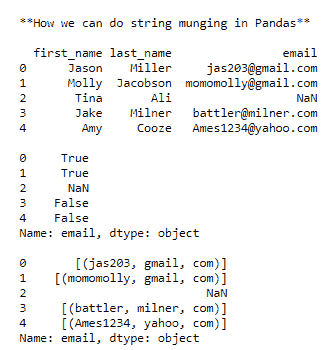

# 熊猫数据框中的串珠

> 原文:[https://www . geesforgeks . org/string-munging-in-pandas-data frame/](https://www.geeksforgeeks.org/string-munging-in-pandas-dataframe/)

在这篇文章中，我们将学习熊猫数据框中的字符串蒙宁。芒格被认为是通过改造来清理任何乱七八糟的东西。用技术术语来说，我们可以说将数据库中的数据转换成一种有用的形式。

**例:“**无人@example.com”，变成“在 example.com 无人”

**进场:**

**第一步:导入库**

## 蟒蛇 3

```py
import pandas as pd
import numpy as np
import re as re
```

**步骤 2:创建数据框**

现在创建一个字典并通过 pd。创建数据框。

## 蟒蛇 3

```py
raw_data = {"first_name": ["Jason", "Molly", "Tina", "Jake", "Amy"],
            "last_name": ["Miller", "Jacobson", "Ali", "Milner", "Cooze"],
            "email": ["jas203@gmail.com", "momomolly@gmail.com", np.NAN,
                      "battler@milner.com", "Ames1234@yahoo.com"]}

df = pd.DataFrame(raw_data, columns=["first_name", "last_name", "email"])
print()
print(df)
```

**第三步:应用不同的定位操作**

首先，在功能“电子邮件”中检查哪个字符串包含“Gmail”。

## 蟒蛇 3

```py
print(df["email"].str.contains("gmail"))
```

现在我们想把电子邮件分成几部分，这样“@”前面的字符就变成了一个字符串，后面的和前面的。成为一体。最后，剩下的成为一个字符串。

## 蟒蛇 3

```py
pattern = "([A-Z0-9._%+-]+)@([A-Z0-9.-]+)\.([A-Z]{2,4})"
print(df["email"].str.findall(pattern, flags=re.IGNORECASE))
```

**下面是实现:**

## 蟒蛇 3

```py
def ProjectPro_Ex_136():

    print()
    print('**How we can do string munging in Pandas**')

    # loading libraries
    import pandas as pd
    import numpy as np
    import re as re

    # Creating dataframe
    raw_data = {'first_name': ['Jason', 'Molly', 'Tina', 'Jake', 'Amy'],
                'last_name': ['Miller', 'Jacobson', 'Ali', 'Milner', 'Cooze'],
                'email': ['jas203@gmail.com', 'momomolly@gmail.com', np.NAN,
                          'battler@milner.com', 'Ames1234@yahoo.com']}

    df = pd.DataFrame(raw_data, columns=['first_name', 'last_name', 'email'])
    print()
    print(df)

    # Let us find Which string within the 
    # email column contains ‘gmail’
    print()
    print(df['email'].str.contains('gmail'))

    # Create a daily expression pattern that
    # breaks apart emails
    pattern = '([A-Z0-9._%+-]+)@([A-Z0-9.-]+)\\.([A-Z]{2,4})'

    # Find everything in df.email that contains
    # that pattern
    print()
    print(df['email'].str.findall(pattern, flags=re.IGNORECASE))

ProjectPro_Ex_136()
```

**输出:**

