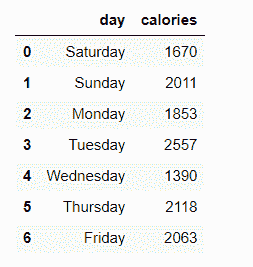
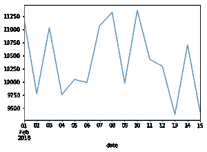
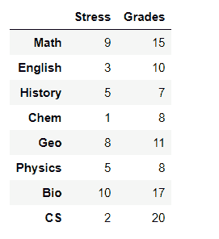
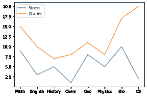

# 熊猫的时间序列图或线图

> 原文:[https://www . geeksforgeeks . org/时间序列-带熊猫的情节或线情节/](https://www.geeksforgeeks.org/time-series-plot-or-line-plot-with-pandas/)

**先决条件:** [从列表](https://www.geeksforgeeks.org/create-a-pandas-dataframe-from-lists/)创建熊猫数据框

**Pandas** 是 Python 中用于数据操作和分析的开源库。它是一个快速而强大的工具，提供数据结构和操作来操作数值表和时间序列。这些数据操作的例子包括合并、整形、选择、数据清理和数据争论。该库允许从各种文件格式导入数据，如 SQL、JSON、微软 Excel 和逗号分隔值。本文解释了如何使用 pandas 库为给定的数据集生成时间序列图或线图。

一个**线图**是一个图形显示，它使用几个点直观地表示某些变量之间的相关性或数据随时间的变化，这些点通常按它们的 x 轴值排序，由直线段连接。独立变量用 x 轴表示，而 y 轴表示根据 x 轴变量(也称为因变量)而变化的数据。

为了生成带有熊猫的线图，我们通常用要绘制的数据集创建一个数据框*。然后，在数据帧上调用 plot.line()方法。

**语法:**

> 数据框线(x，y)

下表解释了该方法的主要参数:

<figure class="table">

| 参数 | 价值 | 缺省值 | 使用 |
| x | Int 或 string | 数据帧索引 | 设置要在 x 轴上表示的值。 |
| y | Int 或 string | 数据框中的剩余列 | 设置要在 y 轴上表示的值。 |

</figure>

其他参数包括颜色(指定线条的颜色)、标题(指定绘图的标题)和种类(指定要使用的绘图类型)。此方法的“kind”参数的默认变量是“line”。因此，您不必为了创建线图而设置它。

**例 1:**

该示例说明了如何使用一个 y 轴变量生成数据框的基本线图。用 Python3 中的熊猫来绘制一周内某人卡路里摄入量的以下数据，这是我们的数据框架。

**代码:**

## 蟒蛇 3

```
import pandas as pd

# Create a list of data to be represented in x-axis
days = [ 'Saturday' , 'Sunday' , 'Monday' , 'Tuesday' ,
        'Wednesday' , 'Thursday' , 'Friday' ]

# Create a list of data to be 
# represented in y-axis
calories = [ 1670 , 2011 , 1853 , 2557 ,
            1390 , 2118 , 2063 ]

# Create a dataframe using the two lists
df_days_calories = pd.DataFrame(
    { 'day' : days , 'calories' : calories })

df_days_calories
```

**输出:**



现在，绘制变量。

## 蟒蛇 3

```
# use plot() method on the dataframe
df_days_calories.plot( 'day' , 'calories' )

# Alternatively, you can use .set_index 
# to set the data of each axis as follows:
# df_days_calories.set_index('day')['calories'].plot();
```

**输出:**



**例 2:**

本示例说明如何创建 y 轴上有两个变量的线图。
一名学生被要求在 1-10 (10 为最高)的范围内对每门学校科目的期中考试周压力水平进行评分。他还被问到每次期中考试的分数(满分 20 分)。

**代码:**

## 蟒蛇 3

```
import pandas as pd

# Create a list of data to
# be represented in x-axis
subjects = [ 'Math' , 'English' , 'History' ,
            'Chem' , 'Geo' , 'Physics' , 'Bio' , 'CS' ]

# Create a list of data to be 
# represented in y-axis
stress = [ 9 , 3 , 5 , 1 , 8 , 5 , 10 , 2 ]

# Create second list of data
# to be represented in y-axis
grades = [ 15 , 10 , 7 , 8 , 11 , 8 , 17 , 20 ]

# Create a dataframe using the three lists
df = pd.DataFrame(list(zip( stress , grades )),
                  index = subjects , 
                  columns = [ 'Stress' , 'Grades' ])
df
```

**输出:**



创建一个线图，显示这三个变量之间的关系。

**代码:**

## 蟒蛇 3

```
# use plot() method on the dataframe. 
# No parameters are passed so it uses
# variables given in the dataframe
df.plot()
```

**输出:**



另一种方法是使用 matplotlib.pyplot 库中的 gca()方法，如下所示:

## 蟒蛇 3

```
import pandas as pd
import matplotlib.pyplot as plt

# Create a list of data
# to be represented in x-axis
subjects = [ 'Math' , 'English' , 'History ',
            'Chem' , 'Geo' , 'Physics' , 'Bio' , 'CS' ]

# Create a list of data
# to be represented in y-axis
stress = [ 9, 3 , 5 , 1 , 8 , 5 , 10 , 2 ]

# Create second list of data to be represented in y-axis
grades = [ 15, 10 , 7 , 8 , 11 , 8 , 17 , 20 ]

# Create a dataframe using the two lists
df_days_calories = pd.DataFrame(
    { 'Subject' : subjects , 
     'Stress': stress , 
     'Grade': grades})

ax = plt.gca()

#use plot() method on the dataframe
df_days_calories.plot( x = 'Subject' , y = 'Stress', ax = ax )
df_days_calories.plot( x = 'Subject' , y = 'Grade' , ax = ax )
```