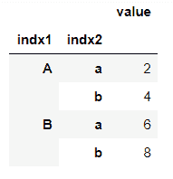

# 把熊猫多索引变成列

> 原文:[https://www . geesforgeks . org/turn-pandas-多索引-成列/](https://www.geeksforgeeks.org/turn-pandas-multi-index-into-column/)

熊猫[数据框架](https://www.geeksforgeeks.org/python-pandas-dataframe/)是一个二维可变大小的、潜在异构的表格数据结构，带有标记轴(行和列)。多索引数据框具有多级或分层索引。我们可以通过**reset _ index()**[](https://pandas.pydata.org/pandas-docs/stable/reference/api/pandas.DataFrame.reset_index.html)**方法轻松地将多级索引转换到列中。**

**[**DataFrame . reset _ index()**](https://pandas.pydata.org/pandas-docs/stable/reference/api/pandas.DataFrame.reset_index.html)**用于将索引重置为默认值，并使索引成为 data frame 的一列。****

******步骤 1:** 创建多索引数据帧。****

****让我们先看一个多索引数据帧的例子。****

******代码:******

## ****蟒蛇 3****

```
**import pandas as pd

# Creating index for multi-index dataframe
tuples = [('A', 'a'), ('A', 'b'), ('B', 'a'), ('B', 'b')]
index = pd.MultiIndex.from_tuples(tuples)

# Value corresponding to the index
data = [2, 4, 6, 8]

# Creating dataframe using 'data' and 'index'
df = pd.DataFrame(data = data, index = index, columns = ['value'])
print(df)**
```

******输出:******

********

******步骤 2:** 将索引转换为列。****

****这里我们可以看到分层索引，我们将使用 reset_index()方法将其转换为一个列。****

## ****蟒蛇 3****

```
**reset_df = df.reset_index()
print(reset_df)**
```