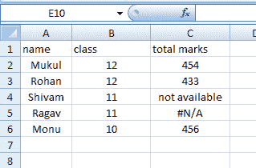
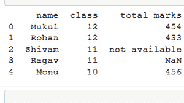
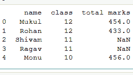

# Python 中熊猫 read_csv()函数中 na_values 参数的使用

> 原文:[https://www . geesforgeks . org/use-of-na _ values-parameter-in-read _ CSV-function-of-pandas-in-python/](https://www.geeksforgeeks.org/use-of-na_values-parameter-in-read_csv-function-of-pandas-in-python/)

[**read_csv()**](https://www.geeksforgeeks.org/python-read-csv-using-pandas-read_csv/) 是熊猫读取 csv 文件的重要功能。但是通过这个函数还可以做很多其他的事情，只不过是完全改变返回的对象。在这篇文章中，我们将看到 na_values 参数的使用。

**na_values:** 这用于创建一个字符串，该字符串将熊猫视为 NaN(不是数字)。默认情况下，熊猫会将#N/A、-NaN、-n/a、N/A、NULL 等视为 NaN 值。让我们看看例子，以便更好地理解。



这是我们的数据框，它有三个列名、类和总分。现在用 python 熊猫导入数据帧。

请参考此处 从 [**使用的数据集的链接。**](https://drive.google.com/file/d/18uXZefzLvbKjwh8LikCDy2jAL4B3J88S/view?usp=sharing)

**例 1:** 见熊猫认为#N/A 为 NaN。

## 蟒蛇 3

```py
# import pandas library
import pandas as pd

# read a csv file
df = pd.read_csv('Example.csv')

# show the dataframe
print(df)
```

**输出:**



**例 2:** 现在 **na_values** 参数用来告诉熊猫它们认为“不可用”为 NaN 值，并在“不可用”处打印 NaN。

## 蟒蛇 3

```py
# import pandas library
import pandas as pd

# read a csv file
df = pd.read_csv('Example.csv', 
                 na_values = "not available")

# show the dataframe
print(df)
```

**输出:**

