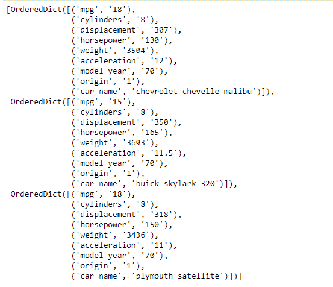
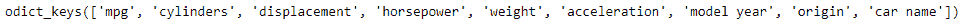
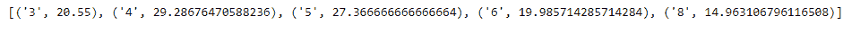

# 使用 csv 模块读取熊猫

中的数据

> 原文:[https://www . geesforgeks . org/using-CSV-module-to-read-in-data-pandas/](https://www.geeksforgeeks.org/using-csv-module-to-read-the-data-in-pandas/)

所谓的 CSV(逗号分隔值)格式是电子表格和数据库最常见的导入和导出格式。CSV 在标准化之前有各种格式。缺乏定义明确的标准意味着不同应用程序产生和使用的数据之间往往存在细微的差异。这些差异会使处理来自多个来源的 CSV 文件变得令人讨厌。为此，我们将使用 Python 的 **csv 库**来读写 csv 格式的表格数据。
要链接到代码中使用的 CSV 文件，请单击此处的。
**代码#1:** 我们将使用 csv。函数将数据文件导入 Python 的环境中。

## 蟒蛇 3

```py
# importing the csv module
import csv

# Now let's read the file named 'auto-mpg.csv'
# After reading as a dictionary convert
# it to Python's list
with open('auto-mpg.csv') as csvfile:
    mpg_data = list(csv.DictReader(csvfile))

# Let's visualize the data
# We are printing only first three elements
print(mpg_data[:3])
```

**输出:**



正如我们所看到的，数据被存储为有序字典的列表。为了更好地理解，让我们对数据执行一些操作。
**代码#2:**

## 蟒蛇 3

```py
# Let's find all the keys in the dictionary
print(mpg_data[0].keys)

# Now we would like to find out the number of
# unique values of cylinders in the car in our dataset
# We create a set containing the cylinders value
unique_cyl = set(data['cylinders'] for data in mpg_data)

# Let's print the values
print(unique_cyl)
```

**输出:**




正如我们在输出中看到的，我们的数据集中有 5 个唯一的柱面值。
**代码#3:** 现在让我们找出每个气缸值的平均 mpg 值。

## 蟒蛇 3

```py
# Let's create an empty list to store the values
# of average mpg for each cylinder
avg_mpg = []

# c is the current cylinder size
for c in unique_cyl:
    # for storing the sum of mpg
    mpgbycyl = 0
    # for storing the sum of cylinder
    # in each category
    cylcount = 0

    # iterate over all the data in mpg
    for x in mpg_data:
        # Check if current value matches c
        if x['cylinders']== c:
            # Add the mpg values for c
            mpgbycyl += float(x['mpg'])
            # increment the count of cylinder
            cylcount += 1

    # Find the average mpg for size c
    avg = mpgbycyl/cylcount
    # Append the average mpg to list
    avg_mpg.append((c, avg))

# Sort the list
avg_mpg.sort(key = lambda x : x[0])

# Print the list
print(avg_mpg)
```

**输出:**



正如我们在输出中看到的，程序已经成功地返回了一个元组列表，其中包含了我们数据集中每个唯一圆柱体类型的平均 mpg。