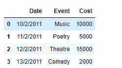
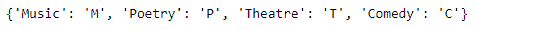
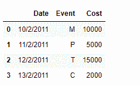

# 使用字典重新映射熊猫数据框列中的值

> 原文:[https://www . geesforgeks . org/using-dictionary-to-remap-values-in-pandas-data frame-columns/](https://www.geeksforgeeks.org/using-dictionary-to-remap-values-in-pandas-dataframe-columns/)

在 Pandas 中处理数据时，我们对数据执行大量操作，以获得所需形式的数据。其中一个操作可能是我们想要重新映射数据框中特定列的值。让我们讨论几个可以做到这一点的方法。

给定包含事件数据的数据框，将特定列的值重新映射到新值。

**代码#1:** 我们可以使用`DataFrame.replace()`功能来实现这个任务。让我们看看如何做到这一点。

```py
# importing pandas as pd
import pandas as pd

# Creating the DataFrame
df = pd.DataFrame({'Date':['10/2/2011', '11/2/2011', '12/2/2011', '13/2/2011'],
                    'Event':['Music', 'Poetry', 'Theatre', 'Comedy'],
                    'Cost':[10000, 5000, 15000, 2000]})

# Print the dataframe
print(df)
```

**输出:**


现在，我们将通过它们各自的代码重新映射“事件”列的值。

```py
# Create a dictionary using which we
# will remap the values
dict = {'Music' : 'M', 'Poetry' : 'P', 'Theatre' : 'T', 'Comedy' : 'C'}

# Print the dictionary
print(dict)

# Remap the values of the dataframe
df.replace({"Event": dict})
```

**输出:**



**代码#2:** 我们可以使用`map()`功能来实现这个任务。

```py
# importing pandas as pd
import pandas as pd

# Creating the DataFrame
df = pd.DataFrame({'Date':['10/2/2011', '11/2/2011', '12/2/2011', '13/2/2011'],
                    'Event':['Music', 'Poetry', 'Theatre', 'Comedy'],
                    'Cost':[10000, 5000, 15000, 2000]})

# Print the dataframe
print(df)
```

**输出:**


现在，我们将通过它们各自的代码重新映射“事件”列的值。

```py
# Create a dictionary using which we
# will remap the values
dict = {'Music' : 'M', 'Poetry' : 'P', 'Theatre' : 'T', 'Comedy' : 'C'}

# Print the dictionary
print(dict)

# Remap the values of the dataframe
df['Event']= df['Event'].map(dict)

# Print the DataFrame after modification
print(df)
```

**输出:**

