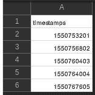
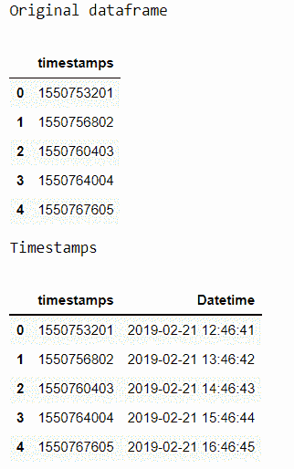
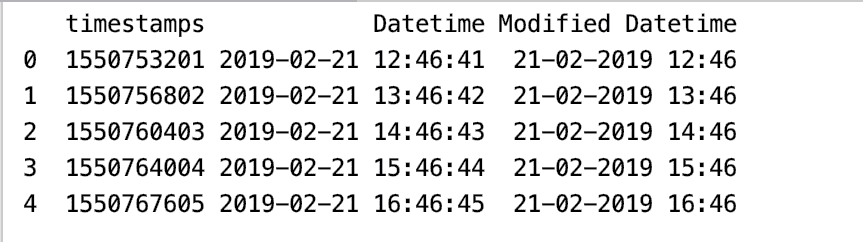

# 使用带有时间戳的熊猫 to _ datetime】

> 原文:[https://www . geesforgeks . org/using-pandas-to _ datetime-with-timestamp/](https://www.geeksforgeeks.org/using-pandas-to_datetime-with-timestamps/)

在本文中，我们将使用[熊猫](https://www.geeksforgeeks.org/python-pandas-dataframe/)包中的[到 _datetime()](https://www.geeksforgeeks.org/python-pandas-to_datetime/) 方法将时间戳转换为日期时间。时间戳是一种编码信息或一组字符，用于识别某个事件发生的时间，给出日期和时间，精确到一秒钟的一小部分。

> **语法:**
> 
> pandas.to_datetime(arg，errors='raise '，dayfirst=False，yearfirst=False，utc=None，box=True，format=None，exact=True，unit=None，infer _ datetime _ format = False，origin='unix '，cache=False)
> 
> **参数:**
> 
> *   **参数:**要转换为日期时间对象的整数、字符串、浮点、列表或字典对象。
> *   **第一天:**布尔值，如果为真，则将第一天置于第一位。
> *   **第一年:**布尔值，如果为真，则将第一年放在第一位。
> *   **世界协调时:**布尔值，如果为真，则返回以世界协调时表示的时间。
> *   **格式:**字符串输入，告诉日、月、年的位置。

**示例 1:** 带有 to_datetime 的时间戳。

这里我们使用[熊猫将 CSV 文件转换成数据帧。DataFrame()](https://www.geeksforgeeks.org/python-pandas-dataframe/) 方法使用 [pandas.read_csv()](https://www.geeksforgeeks.org/python-read-csv-using-pandas-read_csv/) 读取文件内容后，数据 DataFrame 中的时间戳列在 [to_datetime()](https://www.geeksforgeeks.org/python-pandas-to_datetime/) 中作为参数给出，以便将其转换为 datetime。unit='s '用于将时间戳列的值转换为纪元时间在将值转换为 Datetime 后，它存储在 Dataframe 中名为“DateTime”的列中。

**使用的文件:**



**代码:**

## 蟒蛇 3

```
# import packages
import pandas as pd

# creating a dataframe from the csv file
data = pd.DataFrame(pd.read_csv('timestamps.csv'))

# viewing our dataframe
print("Original dataframe")
display(data)

# unit='s' to convert it into epoch time
data['Datetime'] = pd.to_datetime(data['timestamps'], 
                                  unit='s')

# checking our dataframe once again
print("Timestamps")
display(data)
```

**输出:**



**示例 2:** 格式化日期时间列。

代码与上一个示例相同，附加组件正在格式化“DateTime”列。上例中的 Datetime 列可以使用[str time()](https://www.geeksforgeeks.org/python-strftime-function/)进一步修改，后者以字符串作为参数。strftime()返回由 date_format 指定的格式化字符串的 Index，它支持与 python 标准库相同的字符串格式。

> **语法：** strftime（格式）

**代码:**

## 蟒蛇 3

```
# import packages
import pandas as pd
import datetime

# creating a dataframe from the csv file
data = pd.DataFrame(pd.read_csv('timestamps.csv'))

# unit='s' to convert it into epoch time
data['Datetime'] = pd.to_datetime(data['timestamps'],
                                  unit='s')

data['Modified Datetime'] = data['Datetime'].dt.strftime('%d-%m-%Y %H:%M')

# checking our dataframe once again
display(data)
```

**输出:**



**示例 3:** 在 to_datetime()方法中使用单位='ms '。

pd.to_datetime()方法，以时间戳为参数，单位为“ms”，计算到 Unix 纪元开始的毫秒数。

## 蟒蛇 3

```
# import packages
import pandas as pd

# unit='ms' to calculate the number 
# of milliseconds
date = pd.to_datetime(1550767605,
                      unit = 'ms')

# checking our dataframe once again
print(date)
```

**输出:**

```
1970-01-18 22:46:07.605000
```