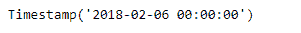
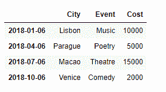
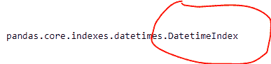
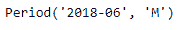
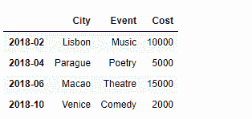
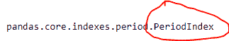

# 使用时间增量和周期在熊猫中创建基于日期时间的索引

> 原文:[https://www . geeksforgeeks . org/使用基于时间增量和周期的索引创建熊猫/](https://www.geeksforgeeks.org/using-timedelta-and-period-to-create-datetime-based-indexes-in-pandas/)

现实生活中的数据通常由基于日期和时间的记录组成。从天气数据到测量大型组织中的一些其他指标，他们通常依赖于将观察到的数据与一些时间戳相关联来评估一段时间内的性能。

我们已经讨论了如何在熊猫中操作日期和时间，现在让我们看看时间戳、周期和使用这些创建的索引的概念。

**使用时间戳:**
时间戳相当于 Python 的 Datetime，在大多数情况下可以互换。它表示一个特定的时间点。让我们看看如何创建时间戳。

```
# importing pandas as pd
import pandas as pd

# Creating the timestamp
ts = pd.Timestamp('02-06-2018')

# Print the timestamp
print(ts)
```

**输出:**


只有时间戳不是很有用，除非我们用它创建一个索引。我们使用时间戳创建的索引属于`**DatetimeIndex**`类型。

```
# importing pandas as pd
import pandas as pd

# Let's create a dataframe
df = pd.DataFrame({'City':['Lisbon', 'Parague', 'Macao', 'Venice'],
                    'Event':['Music', 'Poetry', 'Theatre', 'Comedy'],
                    'Cost':[10000, 5000, 15000, 2000]})

# Let's create an index using Timestamps
index_ = [pd.Timestamp('01-06-2018'), pd.Timestamp('04-06-2018'),
          pd.Timestamp('07-06-2018'), pd.Timestamp('10-06-2018')]

# Let's set the index of the dataframe
df.index = index_

# Let's visualize the dataframe
print(df)
```

**输出:**


现在我们将看到由各个时间戳组成的数据帧索引的类型。

```
# Check the type
print(type(df.index))
```

**输出:**

正如我们在输出中可以清楚地看到的，我们的数据帧的索引类型是‘datetime index’。

**使用周期:**与代表时间点的时间戳不同，周期代表一段时间。可能是一个月、一天、一年、一小时等等..让我们看看如何在熊猫中创建周期。

```
# importing pandas as pd
import pandas as pd

# Let's create the Period
# We have created a period
# of a month
pr = pd.Period('06-2018')

# Let's print the period
print(pr)
```

**输出:**


输出中的“M”代表月份。

只有周期对象在用作数据框或系列中的索引时才非常有用。由句点组成的索引称为`**PeriodIndex**`。

```
# importing pandas as pd
import pandas as pd

# Let's create a dataframe
df = pd.DataFrame({'City':['Lisbon', 'Parague', 'Macao', 'Venice'],
                    'Event':['Music', 'Poetry', 'Theatre', 'Comedy'],
                    'Cost':[10000, 5000, 15000, 2000]})

# Let's create an index using Periods
index_ = [pd.Period('02-2018'), pd.Period('04-2018'),
          pd.Period('06-2018'), pd.Period('10-2018')]

# Let's set the index of the dataframe
df.index = index_

# Let's visualize the dataframe
print(df)
```

**输出:**


现在，我们将看到由单个句点组成的数据框索引的类型。

```
# Check the type
print(type(df.index))
```

**输出:**

正如我们在输出中看到的，使用句点创建的索引称为 PeriodIndex。