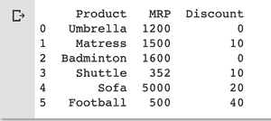
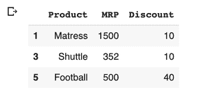
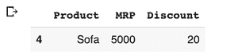
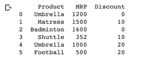
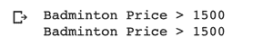

# 在熊猫数据框中应用 if 条件的方法

> 原文:[https://www . geeksforgeeks . org/应用熊猫 if 条件的方法-dataframe-2/](https://www.geeksforgeeks.org/ways-to-apply-an-if-condition-in-pandas-dataframe-2/)

一般来说，在熊猫数据帧中，if 条件可以按列、行或单个单元格应用。进一步的文件举例说明了其中的每一个。

首先，我们将创建以下数据帧:

```
# importing pandas as pd
import pandas as pd

# create the DataFrame
df = pd.DataFrame({
    'Product': ['Umbrella', 'Matress', 'Badminton', 
                'Shuttle', 'Sofa', 'Football'],
    'MRP': [1200, 1500, 1600, 352, 5000, 500],
    'Discount': [0, 10, 0, 10, 20, 40]
})

# display the DataFrame
print(df)
```

**输出:**

[](https://media.geeksforgeeks.org/wp-content/uploads/20200725235153/Screenshot20200725at115127PM-300x134.png)

**示例 1 :** 列值(元组)上的 if 条件:if 条件可以应用于列值，就像当有人用 MRP < =2000 和折扣> 0 要求所有项目时，下面的代码会这样做。同样，任何数量的条件都可以应用于数据框的任何数量的属性。

```
# if condition with column conditions given
# the condition is if MRP of the product <= 2000 
# and discount > 0 show me those items
df[(df['MRP'] <= 2000) & (df['Discount'] > 0)]
```

**输出:**



**例 2 :** if 条件对行值(元组) :这可以作为条件对列值的特例。如果给定了一个元组(Sofa，5000，20)，并在数据框中找到它，可以这样完成:

```
# if condition with row tuple given
df[(df['Product'] == 'Sofa') & (df['MRP'] == 5000) & (df['Discount']== 20)]
```

**输出:**

[](https://media.geeksforgeeks.org/wp-content/uploads/20200726144311/Screenshot20200726at24250PM-300x69.png)

**示例 3 :** 使用 Lambda 函数:Lambda 函数接受输入并根据某个条件返回结果。它可以用来对熊猫数据框中的每个列元素应用特定的函数。以下示例使用 Lambda 函数设置折扣值的上限为 20，即如果任何单元格中的折扣值>为 20，则将其设置为 20。

```
# importing pandas as pd 
import pandas as pd 

# Create the dataframe 
df = pd.DataFrame({
    'Product': ['Umbrella', 'Matress', 'Badminton', 
                'Shuttle', 'Sofa', 'Football'],
    'MRP': [1200, 1500, 1600, 352, 5000, 500],
    'Discount': [0, 10, 0, 10, 20, 40]
})

# Print the dataframe 
print(df) 

# If condition on column values using Lambda function 
df['Discount'] = df['Discount'].apply(lambda x : 20 if x > 20 else x)
print(df)
```

**输出:**


[](https://media.geeksforgeeks.org/wp-content/uploads/20200726160233/Screenshot20200726at35951PM-300x120.png)

**示例 4 :** 使用`iloc()`或`loc()` 功能:`iloc()`和 `loc()` 功能都用于从数据帧中提取子数据帧。子数据框可以是从单个单元格到整个表格的任何内容。`iloc()`通常在我们知道行和列的索引范围时使用，而`loc()`用于标签搜索。

以下示例显示了这两个函数在数据框上传递条件的用法。这里取一个索引为[2，1]的单元格，这是羽毛球产品的物料需求计划。

```
# If condition on a cell value using iloc() or loc() functions
# iloc() is based on index search and loc() based on label search

# using iloc()
if df.iloc[2, 1] > 1500:
  print("Badminton Price > 1500")
else:
  print("Badminton Price < 1500")

# using loc()
print(df.loc[2, 'MRP'])
if df.iloc[2, 'MRP'] > 1500:         
  print("Badminton Price > 1500")
else:
  print("Badminton Price < 1500")
```

**输出:**

[](https://media.geeksforgeeks.org/wp-content/uploads/20200726161724/Screenshot20200726at41708PM-300x51.png)