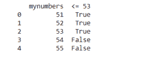
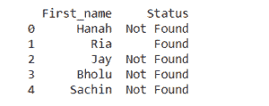
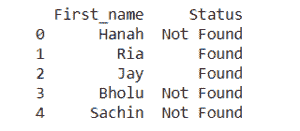

# 在熊猫数据框中应用 if 条件的方法

> 原文:[https://www . geeksforgeeks . org/应用熊猫 if 条件的方法-数据框/](https://www.geeksforgeeks.org/ways-to-apply-an-if-condition-in-pandas-dataframe/)

让我们讨论对熊猫的数据帧应用 If 条件的不同方法。

**1)对数字应用 IF 条件**
让我们创建一个包含 5 个数字(比如从 51 到 55)的熊猫数据框。让我们为以下情况应用 IF 条件。如果特定数字等于或小于 53，则赋值为“真”。否则，如果数字大于 53，则赋值为“假”。

**语法:**

> df.loc[df['列名']条件，'新列名'] = '满足条件时的值'

**示例:**

## 蟒蛇 3

```py
from pandas import DataFrame

numbers = {'mynumbers': [51, 52, 53, 54, 55]}
df = DataFrame(numbers, columns =['mynumbers'])

df.loc[df['mynumbers'] <= 53, '<= 53'] = 'True'
df.loc[df['mynumbers'] > 53, '<= 53'] = 'False'

df
```

**输出:**



**2)用λ应用 IF 条件**
让我们创建一个熊猫数据帧，它有 5 个数字(比如从 51 到 55)。让我们为以下情况应用 IF 条件。如果特定数字等于或小于 53，则赋值为“真”。否则，如果数字大于 53，则赋值为“假”。

**语法:**

> df['新列名'] = df['列名']。应用(λx:“满足条件时的值”如果满足条件时的值“不满足条件时的值”)

**示例:**

## 蟒蛇 3

```py
from pandas import DataFrame

numbers = {'mynumbers': [51, 52, 53, 54, 55]}
df = DataFrame(numbers, columns =['mynumbers'])

df['<= 53'] = df['mynumbers'].apply(lambda x: 'True' if x <= 53 else 'False')

print (df)
```

**输出:**


**3)对字符串应用 IF 条件**
我们将处理只包含 5 个名称的字符串的数据帧:Hanah、Ria、Jay、Bholu、Sachin。条件是:如果名称等于“Ria”，则赋值为“Found”。否则，如果名称不是“Ria”，则赋值为“未找到”。

**示例:**

## 蟒蛇 3

```py
from pandas import DataFrame

names = {'First_name': ['Hanah', 'Ria', 'Jay', 'Bholu', 'Sachin']}
df = DataFrame(names, columns =['First_name'])

df.loc[df['First_name'] == 'Ria', 'Status'] = 'Found' 
df.loc[df['First_name'] != 'Ria', 'Status'] = 'Not Found'

print (df)
```

**输出:**



**4)使用λ**
对字符串应用 IF 条件我们将处理只包含 5 个名称的字符串的数据帧:Hanah、Ria、Jay、Bholu、Sachin。条件是:如果名称等于“Ria”，则赋值为“Found”。否则，如果名称不是“Ria”，则赋值为“未找到”。但是这次我们将使用 lambdas 来处理它。

**例**

## 蟒蛇 3

```py
from pandas import DataFrame

names = {'First_name': ['Hanah', 'Ria', 'Jay', 'Bholu', 'Sachin']}
df = DataFrame(names, columns =['First_name'])

df['Status'] = df['First_name'].apply(lambda x: 'Found' if x == 'Ria' else 'Not Found')

print (df)
```

**输出:**


**5)用 OR 应用 IF 条件**
我们将处理只包含 5 个名称的字符串的数据帧:Hanah，Ria，Jay，Bholu，Sachin。条件是:如果名称等于“Ria”或“Jay”，则赋值为“Found”。否则，如果名字不是“Ria”或“Jay”，则赋值为“未找到”。

**例**

## 蟒蛇 3

```py
from pandas import DataFrame

names = {'First_name': ['Hanah', 'Ria', 'Jay', 'Bholu', 'Sachin']}
df = DataFrame(names, columns =['First_name'])

df.loc[(df['First_name'] == 'Ria') | (df['First_name'] == 'Jay'), 'Status'] = 'Found' 
df.loc[(df['First_name'] != 'Ria') & (df['First_name'] != 'Jay'), 'Status'] = 'Not Found' 

print (df)
```

**输出:**

