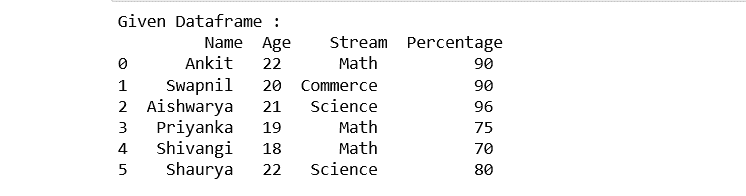
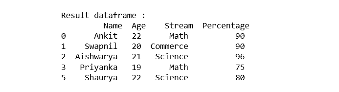

# 通过列值过滤熊猫数据帧的方法

> 原文:[https://www . geeksforgeeks . org/过滤方式-pandas-按列数据框-值/](https://www.geeksforgeeks.org/ways-to-filter-pandas-dataframe-by-column-values/)

在这篇文章中，我们将看到通过列值过滤熊猫数据帧的不同方法。首先，让我们创建一个数据框架:

## 蟒蛇 3

```py
# importing pandas 
import pandas as pd 

# declare a dictionary
record = { 

 'Name' : ['Ankit', 'Swapnil', 'Aishwarya', 
          'Priyanka', 'Shivangi', 'Shaurya' ],

 'Age' : [22, 20, 21, 19, 18, 22], 

 'Stream' : ['Math', 'Commerce', 'Science', 
            'Math', 'Math', 'Science'], 

 'Percentage' : [90, 90, 96, 75, 70, 80] } 

# create a dataframe 
dataframe = pd.DataFrame(record,
                         columns = ['Name', 'Age', 
                                    'Stream', 'Percentage']) 
# show the Dataframe
print("Given Dataframe :\n", dataframe)
```

**输出:**



**方法 1:** 使用“>”、“=”、“=”、“< =”、“！= '运算符。

**示例 1:** 使用 **[ ]** 从给定数据框中选择“百分比”大于 75 的所有行。

## 蟒蛇 3

```py
# selecting rows based on condition 
rslt_df = dataframe[dataframe['Percentage'] > 70] 

print('\nResult dataframe :\n', rslt_df)
```

**输出:**



**示例 2:** 使用[**loc[ ]**](https://www.geeksforgeeks.org/python-pandas-extracting-rows-using-loc/) 从给定数据框中选择“百分比”大于 70 的所有行。

## 蟒蛇 3

```py
# selecting rows based on condition 
rslt_df = dataframe.loc[dataframe['Percentage'] > 70] 

print('\nResult dataframe :\n', 
      rslt_df)
```