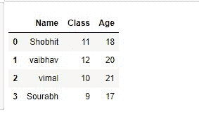
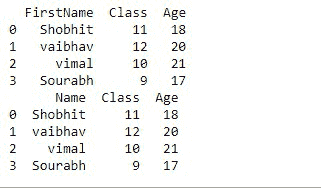
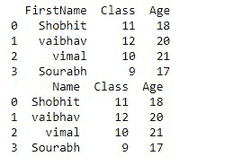
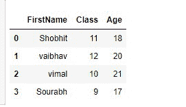
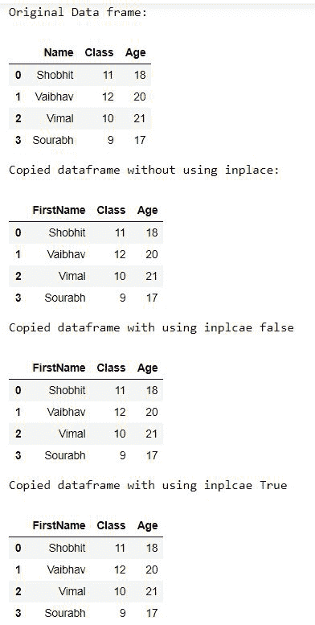

# 熊猫中的“原地”是什么意思？

> 原文:[https://www . geesforgeks . org/in-place-in-pandas 是什么意思/](https://www.geeksforgeeks.org/what-does-inplace-mean-in-pandas/)

在这篇文章中，我们将看到熊猫的出现。Inplace 是用于不同函数的参数。将 inplace 用作属性的一些函数，例如， **set_index()，** [**dropna()**](https://www.geeksforgeeks.org/python-pandas-dataframe-dropna/) **，**[**fill na()**](https://www.geeksforgeeks.org/python-pandas-dataframe-fillna-to-replace-null-values-in-dataframe/)**，**[**reset _ index()**](https://www.geeksforgeeks.org/python-pandas-dataframe-reset_index/)**，drop()，replace()等等。**该属性的默认值为 **False** ，返回对象的副本。

这里我们使用的是 **fillna()** 方法。

> **语法:**data frame . fillna(data frame . mean()、inlcae = false)

**让我们通过分步实现来理解这个方法:**

**第一步。**首先，我们导入所有需要的库。

## 蟒蛇 3

```
# import required module
import pandas as pd
```

**第二步**。正在创建数据框。

## 蟒蛇 3

```
# creating dataframe
dataframe = pd.DataFrame({'Name':['Shobhit','vaibhav',
                                'vimal','Sourabh'],

                        'Class':[11,12,10,9],
                        'Age':[18,20,21,17]})

# Checking created dataframe
display(dataframe)
```

**输出:**



**第三步。**要查看**在**中的使用，我们将使用**重命名功能**，在这里我们将**将“名称”列重命名为“名字”**。

在这一步中，我们不会在代码中使用 inplace。

## 蟒蛇 3

```
# without using inplace renaming the column
new_data = dataframe.rename(columns = {'Name':'FirstName'})

# check new_data
display(new_data)
```

**输出:**



我们可以清楚地看到，原始数据帧没有变化。通过这一点，我们可以得出结论:inplace 的默认值是 False。

现在在这一步中，我们将使用带有 **False** 值的 inplace。

## 蟒蛇 3

```
# putting inplace=False
new_data_2 = dataframe.rename(columns = {'Name':'FirstName'},
                            inplace = False)

#check new_data_2
display(new_data_2)
```

**输出:**



同样，我们可以清楚地看到原始数据集没有变化。

最后，我们将放入等于**真**的值。**T3】**

## 蟒蛇 3

```
# Putting Inplace=True
dataframe.rename(columns = {'Name':'FirstName'},
                 inplace = True)

# check whether dataframe is modidfied or not
print(dataframe)
```

**输出:**



最后，我们可以看到原始数据框列已经从“名称”修改为“名字”。

**以下是基于上述方法的完整程序:**

## 蟒蛇 3

```
# importing pandas
import pandas as pd

# creating dataframe
dataframe=pd.DataFrame({'Name':['Shobhit','Vaibhav',
                                'Vimal','Sourabh'],

                        'Class':[11,12,10,9],
                        'Age':[18,20,21,17]})

# Checking created dataframe
# copied dataframe
display(dataframe)

# without using inplace renaming the column
new_data = dataframe.rename(columns = {'Name':'FirstName'})

# Copied dataframe
display(new_data)  

# checking whether dataframe is modified or not
# Original dataframe
display(dataframe)

# putting inplace=False
new_data_2 = dataframe.rename(columns = {'Name':'FirstName'},
                              inplace = False)

# Copied dataframe
display(new_data_2)

# checking whether dataframe is modified or not
# Original dataframe
display(dataframe)

# Putting Inplace=True
dataframe.rename(columns = {'Name':'FirstName'},
                 inplace = True)

# checking whether dataframe is modified or not
# Original dataframe
display(dataframe)
```

**输出:**

