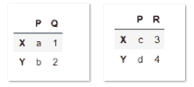
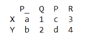
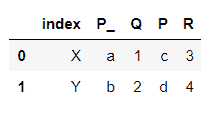
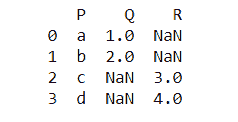
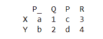

# 熊猫中的加入和合并有什么区别？

> 原文:[https://www . geeksforgeeks . org/熊猫加入和合并的区别是什么/](https://www.geeksforgeeks.org/what-is-the-difference-between-join-and-merge-in-pandas/)

熊猫提供了各种工具，可以在连接/合并类型操作的情况下，轻松地将 Series 或 DataFrame 与各种索引和关系代数功能的集合逻辑相结合。

join 和 merge 都可以用来组合两个数据帧，但是 join 方法根据它们的索引来组合两个数据帧，而 merge 方法更通用，允许我们指定索引旁边的列来连接两个数据帧。

让我们首先创建两个数据帧来展示这两种方法的效果。

## 蟒蛇 3

```py
import pandas as pd

# Creating the two dataframes
left = pd.DataFrame([['a', 1], ['b', 2]], list('XY'), list('PQ'))
right = pd.DataFrame([['c', 3], ['d', 4]], list('XY'), list('PR'))
```

**输出:**



现在让我们一个接一个地看看这两种方法对数据帧的影响。

## **加入**

**连接**方法获取两个数据帧，并在它们的索引上连接它们(从技术上讲，您可以为左边的数据帧选择要连接的列)。如果有重叠的列，联接将希望您从左侧数据框向重叠的列名添加后缀。我们的两个数据帧确实有一个重叠的列名 p。

**示例:**

## 蟒蛇 3

```py
joined_df = left.join(right, lsuffix='_')
print(joined_df)
```

**输出:**



请注意，索引被保留，我们有四列。我们还可以单独指定左侧数据框的特定列，并在 上使用参数 ***作为连接键，但它仍将使用右侧的索引。***

**示例:**

## 蟒蛇 3

```py
joined_df2 = left.reset_index().join(right, on='index', lsuffix='_')
print(joined_df2)
```

**输出:**



## **合并**

在基本层面上，**合并**或多或少做了和 join 一样的事情。这两种方法都用于将两个数据框组合在一起，但是合并功能更为多样，它需要将列指定为合并键。我们可以用 ***on、*** 指定重叠列，也可以分别用 ***left_on*** 和 ***right_on*** 参数指定重叠列。

**示例:**

## 蟒蛇 3

```py
merged_df = left.merge(right, on='P', how='outer')
print(merged_df)
```

**输出:**



这里，请注意 merge 方法破坏了索引。

我们可以用 ***左 _index*** 或 ***右 _index*** 参数明确指定在索引的基础上进行合并。

**示例:**

## 蟒蛇 3

```py
merged_df = left.merge(right, left_index=True,
                       right_index=True, suffixes=['_', ''])
print(merged_df)
```

**输出:**

