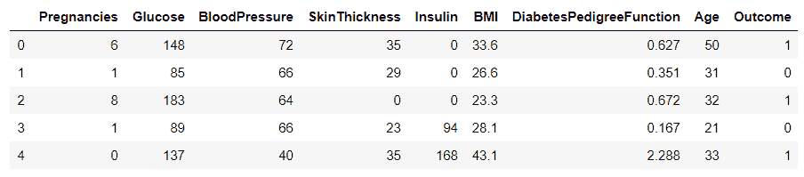
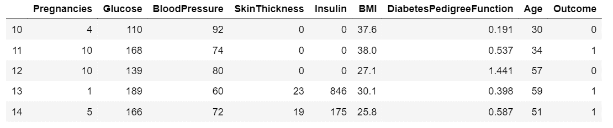
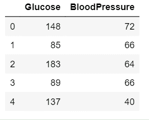
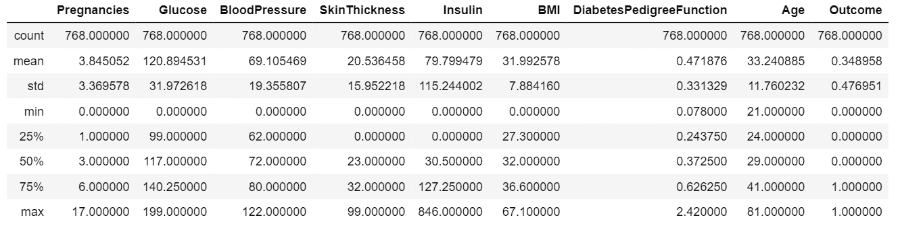
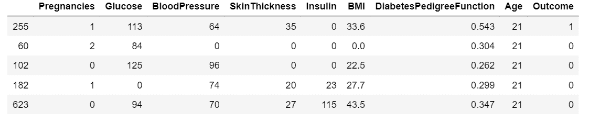

# 使用熊猫处理数据库

> 原文:[https://www . geesforgeks . org/与数据库合作使用熊猫/](https://www.geeksforgeeks.org/working-with-database-using-pandas/)

对保存在 SQL 中的数据执行各种操作可能会导致执行非常复杂的查询，而且不容易编写。因此，为了使这项任务变得更容易，使用熊猫来做这项工作通常是有用的，熊猫是专门为数据预处理而构建的，比 SQL 更简单和用户友好。

有时数据存储在 SQL 中，我们希望用 python 从 SQL 中获取数据，然后使用 pandas 执行操作，这种情况可能会出现。让我们看看如何使用熊猫与 SQL 数据库进行交互。

这是我们将要处理的数据库
[糖尿病 _ 数据](https://contribute.geeksforgeeks.org/wp-content/uploads/diabetes21.csv)

**注:**假设我们把数据存储在 sqlite3 中

**读取数据**

```py
# import the libraries
import sqlite3
import pandas as pd

# create a connection
con = sqlite3.connect('Diabetes.db')

# read data from SQL to pandas dataframe.
data = pd.read_sql_query('Select * from Diabetes;', con)

# show top 5 rows
data.head()
```

**输出**



## 基本操作

***   行切片**

```py
# read the data from sql to pandas dataframe.
data = pd.read_sql_query('Select * from Diabetes;', con)

# slicing the number of rows 
df1 = data[10:15]
df1
```

**输出**


 ***   Selecting specific columns
    To select a particular column or to select number of columns from the dataframe for further processing of data.

    ```py
    # read the data from sql to
    # pandas dataframe.
    data = pd.read_sql_query('Select * from Diabetes;', con)

    # selecting specific columns.
    df2 = data.loc[:, ['Glucose', 'BloodPressure']].head()
    df2
    ```

    **输出:**
    

    *   **Summarize the data
    In order to get insights from data, we must have a statistical summary of data. To display a statistical summary of the data such as mean, median, mode, std etc. We perform the following operation

    ```py
    # read the data from sql 
    # to pandas dataframe.
    data = pd.read_sql_query('Select * from Diabetes;', con)

    # summarize the data
    data.describe()
    ```

    **输出:**
    ** *   ****Sort data with respect to a column
    For sorting the dataframe with respect to a given column values

    ```py
    # read the data from sql 
    # to pandas dataframe.
    data = pd.read_sql_query('Select * from Diabetes;', con)

    # sort data with respect 
    # to particular column.
    data.sort_values(by ='Age').head()
    ```

    **输出:**
    **** *   ******Display mean of each column
    To Display the mean of every column of the dataframe.

    ```py
    # read the data from sql 
    # to pandas dataframe.
    data = pd.read_sql_query('Select * from Diabetes;', con)

    # count number of rows and columns
    data.mean()
    ```

    **输出:**

    ********