# 使用熊猫处理 excel 文件

> 原文:[https://www . geeksforgeeks . org/使用 excel 文件-使用熊猫/](https://www.geeksforgeeks.org/working-with-excel-files-using-pandas/)

Excel 工作表是信息技术行业中最常见的文件形式之一。每个曾经使用过电脑的人都曾接触过 excel 电子表格。excel 之所以如此受欢迎，是因为它在表格和系统形式的数据存储和操作领域有着广泛的应用。此外，excel 工作表是非常本能和用户友好的，这使得它非常适合操作大型数据集，即使对于技术水平较低的人来说。如果你正在寻找学习使用 Python 操作和自动化 excel 文件的地方，那就不要再找了。你来对地方了。

在本文中，您将学习如何使用 Pandas 来处理 Excel 电子表格。在文章的最后，您将了解:

*   这需要必要的模块以及如何在您的系统中设置它们。
*   用 Python 将 excel 文件中的数据读入熊猫。
*   探索熊猫 excel 文件中的数据。
*   使用函数操作和重塑熊猫中的数据。

### 装置

要在 Anaconda 中安装熊猫，我们可以在 Anaconda 终端中使用以下命令:

```
conda install pandas

```

要在普通 Python(非 Anaconda)中安装熊猫，我们可以在命令提示符下使用以下命令:

```
pip install pandas

```

### 入门指南

首先，我们需要导入 pandas 模块，这可以通过运行以下命令来完成:

```
import pandas as pds
```

**输入文件:**假设 excel 文件是这样的

**表 1:**
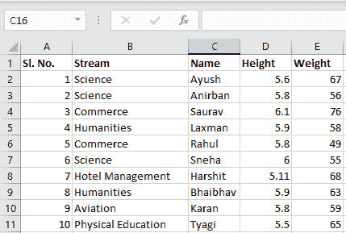

**第 2 页:**

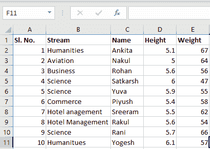

现在我们可以在 pandas 中使用 read_excel 函数导入 excel 文件，如下图所示:

```
file =('path_of_excel_file')
newData = pds.read_excel(file)
newData
```

**输出:**
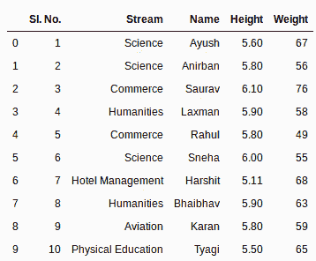

第二条语句从 excel 中读取数据，并将其存储到熊猫数据框中，熊猫数据框由变量`newData`表示。如果 excel 工作簿中有多张工作表，该命令将导入第一张工作表的数据。要制作包含工作簿中所有工作表的数据框，最简单的方法是分别创建不同的数据框，然后将它们连接起来。read_excel 方法采用参数`sheet_name`和`index_col`，在这两个参数中，我们可以指定数据框应该由哪张纸组成，`index_col`指定标题列。

**示例:**

```
sheet1 = pds.read_excel(file, 
                        sheet_name = 0, 
                        index_col = 0)

sheet2 = pds.read_excel(file, 
                        sheet_name = 1, 
                        index_col = 0)

newData = pds.concat([sheet1, sheet2])
```

第三条语句将两个工作表连接起来。现在要检查整个数据帧，我们可以简单地运行以下命令:

```
newData
```

**输出:**
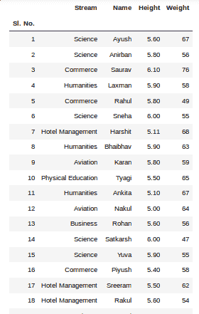

要从数据框的顶部和底部查看 5 列，我们可以运行以下命令:

```
newData.head()
newData.tail()
```

**输出:**

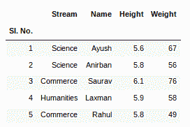

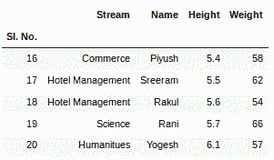

这个`head()`和`tail()`方法也把参数作为要显示的列数的数字。
可以使用`shape()`方法查看数据框中的行数和列数，如下所示:

```
newData.shape
```

**输出:**

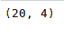

如果任何列包含数字数据，我们可以使用熊猫中的`sort_values()`方法对该列进行排序，如下所示:

```
sorted_column = newData.sort_values(['Height'], ascending = False)
```

现在，假设我们想要排序列的前 5 个值，我们可以在这里使用`head()`方法:

```
sorted_column['Height'].head(5)
```

**输出:**
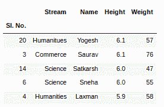

我们可以通过数据框的任意数字列来实现，如下所示:

```
newData['Weight'].head()
```

**输出:**
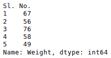

现在，假设我们的数据大部分是数字。我们可以得到平均值、最大值、最小值等统计信息。关于数据框使用`describe()`方法如下所示:

```
newData.describe()
```

**输出:**
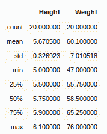

也可以使用以下命令对所有数值列分别执行此操作:

```
newData['Weight'].mean()
```

**输出:**

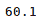

也可以使用相应的方法计算其他统计信息。
和 excel 一样，公式也可以应用，计算列可以如下创建:

```
newData['calculated_column']= newData[“Height”] + newData[“Weight”]
newData['calculated_column'].head()
```

**输出:**
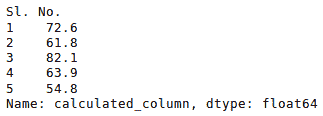

对数据框中的数据进行操作后，我们可以使用`to_excel`方法将数据导出回 excel 文件。为此，我们需要指定一个输出 excel 文件来写入转换后的数据，如下所示:

```
newData.to_excel('Output File.xlsx')
```

**输出:**
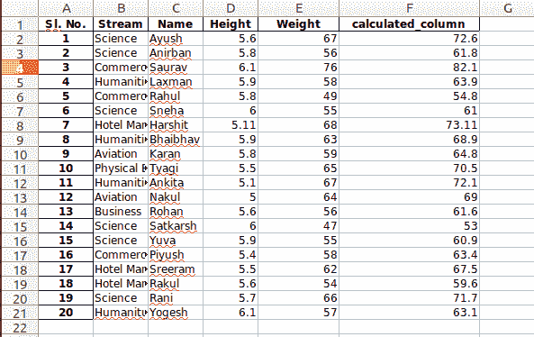