# 处理熊猫丢失的数据

> 原文:[https://www . geeksforgeeks . org/处理熊猫失踪数据/](https://www.geeksforgeeks.org/working-with-missing-data-in-pandas/)

当没有为一个或多个项目或整个单元提供信息时，可能会出现数据丢失。在现实生活场景中，丢失数据是一个非常大的问题。缺失数据也可以指熊猫的`NA`(不可用)值。在数据框中，有时许多数据集只是缺少数据，要么是因为它存在而没有被收集，要么是因为它从未存在过。例如，假设被调查的不同用户可能选择不分享他们的收入，一些用户可能选择不分享地址，这样许多数据集就丢失了。


在熊猫中，缺失的数据由两个值表示:

*   无:无是一个 Python 单例对象，通常用于 Python 代码中缺失的数据。
*   NaN:NaN(Not a Number 的缩写)，是一个特殊的浮点值，被所有使用标准 IEEE 浮点表示的系统所识别

熊猫认为`None`和`NaN`在表示缺失或空值时基本上可以互换。为了促进这种约定，有几个有用的函数可以检测、移除和替换熊猫数据帧中的空值:

*   [isnull()](https://www.geeksforgeeks.org/python-pandas-isnull-and-notnull/)
*   注意 null()
*   滴答声()
*   [fillna()](https://www.geeksforgeeks.org/python-pandas-dataframe-fillna-to-replace-null-values-in-dataframe/)
*   [替换()](https://www.geeksforgeeks.org/python-pandas-dataframe-replace/)
*   [插值()](https://www.geeksforgeeks.org/python-pandas-dataframe-interpolate/)

在本文中我们使用的是 CSV 文件，要下载使用的 CSV 文件，点击[这里](https://media.geeksforgeeks.org/wp-content/uploads/employees.csv)。

### 使用`isnull()`和`notnull()`检查缺失值

为了检查熊猫数据框中的缺失值，我们使用了函数`isnull()`和`notnull()`。这两个函数都有助于检查一个值是否是`NaN`。这些函数也可以在熊猫系列中使用，以便在系列中找到空值。

#### 使用`isnull()`检查缺失值

为了检查熊猫数据框中的空值，我们使用`isnull()`函数，该函数返回布尔值的数据框，对于 NaN 值为真。

**代码#1:**

```
# importing pandas as pd
import pandas as pd

# importing numpy as np
import numpy as np

# dictionary of lists
dict = {'First Score':[100, 90, np.nan, 95],
        'Second Score': [30, 45, 56, np.nan],
        'Third Score':[np.nan, 40, 80, 98]}

# creating a dataframe from list
df = pd.DataFrame(dict)

# using isnull() function  
df.isnull()
```

**输出:**
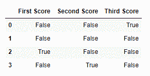

**代码#2:**

```
# importing pandas package 
import pandas as pd 

# making data frame from csv file 
data = pd.read_csv("employees.csv") 

# creating bool series True for NaN values 
bool_series = pd.isnull(data["Gender"]) 

# filtering data 
# displaying data only with Gender = NaN 
data[bool_series] 
```

**输出:**
如输出图像所示，仅显示具有`Gender = NULL`的行。
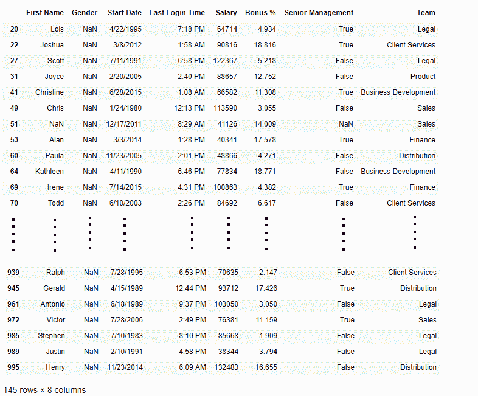

#### 使用`notnull()`检查缺失值

为了检查熊猫数据框中的空值，我们使用 notnull()函数，该函数返回布尔值的数据框，对于 NaN 值，该值为 False。

**代码#3:**

```
# importing pandas as pd
import pandas as pd

# importing numpy as np
import numpy as np

# dictionary of lists
dict = {'First Score':[100, 90, np.nan, 95],
        'Second Score': [30, 45, 56, np.nan],
        'Third Score':[np.nan, 40, 80, 98]}

# creating a dataframe using dictionary
df = pd.DataFrame(dict)

# using notnull() function 
df.notnull()
```

**输出:**
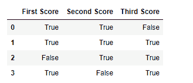

**代码#4:**

```
# importing pandas package 
import pandas as pd 

# making data frame from csv file 
data = pd.read_csv("employees.csv") 

# creating bool series True for NaN values 
bool_series = pd.notnull(data["Gender"]) 

# filtering data 
# displayind data only with Gender = Not NaN 
data[bool_series] 
```

**输出:**
如输出图像所示，仅显示具有`Gender = NOT NULL`的行。
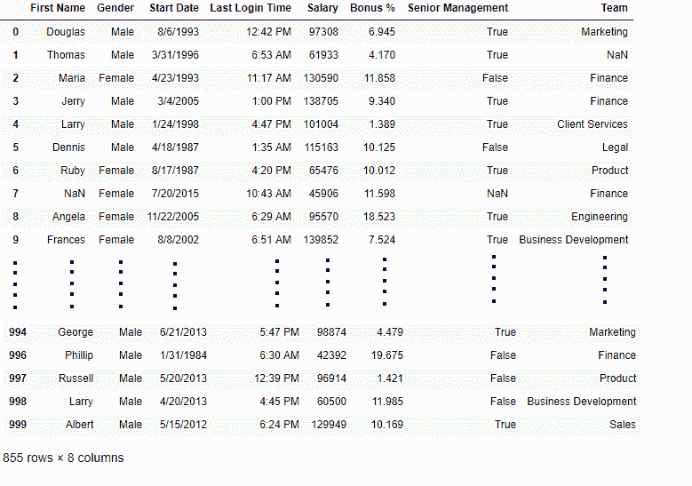

### 使用`fillna()`、`replace()`和`interpolate()`填充缺失值

为了填充数据集中的空值，我们使用`fillna()`、`replace()`和`interpolate()`函数，这些函数用它们自己的值替换 NaN 值。所有这些函数都有助于在数据框的数据集中填充空值。Interpolate()函数主要用于填充数据帧中的`NA`值，但它使用各种插值技术来填充缺失的值，而不是对值进行硬编码。

**代码#1:** 用单个值填充空值

```
# importing pandas as pd
import pandas as pd

# importing numpy as np
import numpy as np

# dictionary of lists
dict = {'First Score':[100, 90, np.nan, 95],
        'Second Score': [30, 45, 56, np.nan],
        'Third Score':[np.nan, 40, 80, 98]}

# creating a dataframe from dictionary
df = pd.DataFrame(dict)

# filling missing value using fillna()  
df.fillna(0)
```

**输出:**
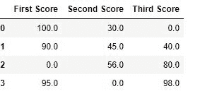

**代码#2:** 用之前的值填充空值

```
# importing pandas as pd
import pandas as pd

# importing numpy as np
import numpy as np

# dictionary of lists
dict = {'First Score':[100, 90, np.nan, 95],
        'Second Score': [30, 45, 56, np.nan],
        'Third Score':[np.nan, 40, 80, 98]}

# creating a dataframe from dictionary
df = pd.DataFrame(dict)

# filling a missing value with
# previous ones  
df.fillna(method ='pad')
```

**输出:**
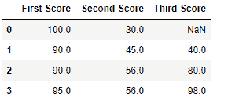

**代码#3:** 用下一个填充空值

```
# importing pandas as pd
import pandas as pd

# importing numpy as np
import numpy as np

# dictionary of lists
dict = {'First Score':[100, 90, np.nan, 95],
        'Second Score': [30, 45, 56, np.nan],
        'Third Score':[np.nan, 40, 80, 98]}

# creating a dataframe from dictionary
df = pd.DataFrame(dict)

# filling  null value using fillna() function  
df.fillna(method ='bfill')
```

**输出:**
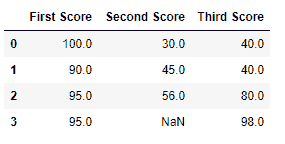

**代码#4:** 在 CSV 文件中填充空值

```
# importing pandas package 
import pandas as pd 

# making data frame from csv file 
data = pd.read_csv("employees.csv")

# Printing the first 10 to 24 rows of
# the data frame for visualization   
data[10:25]
```

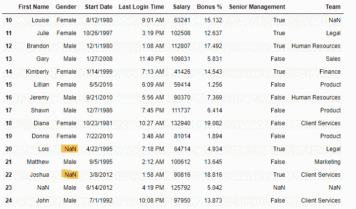
现在我们要用“无性别”填充性别列中的所有空值

```
# importing pandas package 
import pandas as pd 

# making data frame from csv file 
data = pd.read_csv("employees.csv") 

# filling a null values using fillna() 
data["Gender"].fillna("No Gender", inplace = True) 

data
```

**输出:**
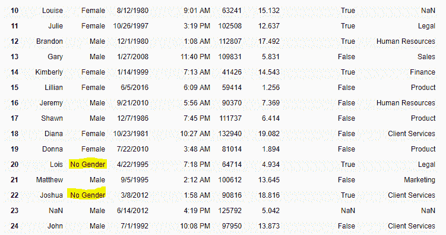
**代码#5:** 使用 replace()方法填充空值

```
# importing pandas package 
import pandas as pd 

# making data frame from csv file 
data = pd.read_csv("employees.csv")

# Printing the first 10 to 24 rows of
# the data frame for visualization   
data[10:25]
```

**输出:**
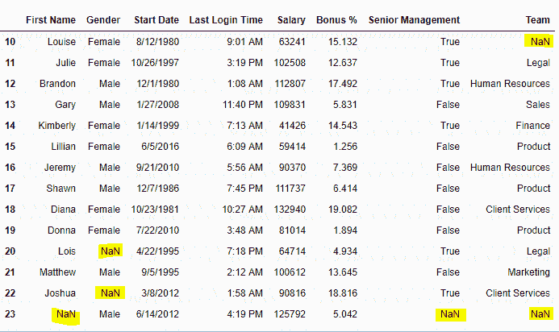
现在我们要用-99 值替换数据框中的所有 Nan 值。

```
# importing pandas package 
import pandas as pd 

# making data frame from csv file 
data = pd.read_csv("employees.csv") 

# will replace  Nan value in dataframe with value -99  
data.replace(to_replace = np.nan, value = -99) 
```

**输出:**
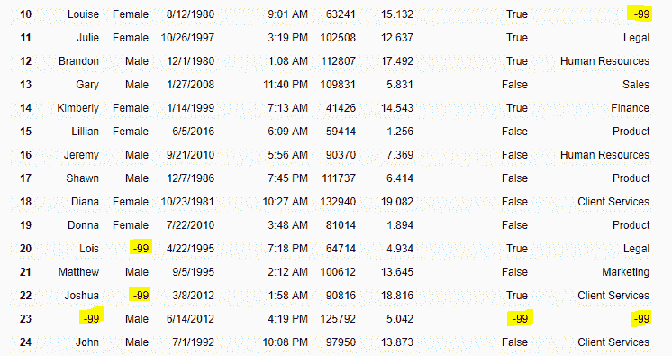

**代码#6:** 使用 interpolate()函数使用线性方法填充缺失值。

```
# importing pandas as pd 
import pandas as pd 

# Creating the dataframe  
df = pd.DataFrame({"A":[12, 4, 5, None, 1], 
                   "B":[None, 2, 54, 3, None], 
                   "C":[20, 16, None, 3, 8], 
                   "D":[14, 3, None, None, 6]}) 

# Print the dataframe 
df 
```

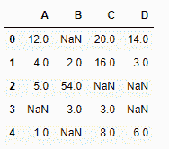
我们用线性方法插值缺失值。请注意，线性方法忽略索引，并将值视为等距。

```
# to interpolate the missing values 
df.interpolate(method ='linear', limit_direction ='forward')
```

**输出:**
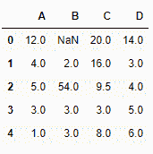
正如我们看到的输出，第一行中的值不能被填充，因为值的填充方向是向前的，并且没有可以在插值中使用的先前值。

### 使用`dropna()`删除缺失值

为了从数据框中删除空值，我们使用了`dropna()`函数该函数以不同的方式删除具有空值的数据集的行/列。

**代码#1:** 删除至少有 1 个空值的行。

```
# importing pandas as pd
import pandas as pd

# importing numpy as np
import numpy as np

# dictionary of lists
dict = {'First Score':[100, 90, np.nan, 95],
        'Second Score': [30, np.nan, 45, 56],
        'Third Score':[52, 40, 80, 98],
        'Fourth Score':[np.nan, np.nan, np.nan, 65]}

# creating a dataframe from dictionary
df = pd.DataFrame(dict)

df
```

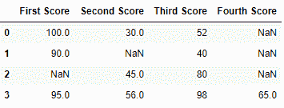
现在我们删除至少有一个 Nan 值(空值)的行

```
# importing pandas as pd
import pandas as pd

# importing numpy as np
import numpy as np

# dictionary of lists
dict = {'First Score':[100, 90, np.nan, 95],
        'Second Score': [30, np.nan, 45, 56],
        'Third Score':[52, 40, 80, 98],
        'Fourth Score':[np.nan, np.nan, np.nan, 65]}

# creating a dataframe from dictionary
df = pd.DataFrame(dict)

# using dropna() function  
df.dropna()
```

**输出:**
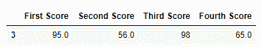
**代码#2:** 如果该行中的所有值都丢失，则丢弃该行。

```
# importing pandas as pd
import pandas as pd

# importing numpy as np
import numpy as np

# dictionary of lists
dict = {'First Score':[100, np.nan, np.nan, 95],
        'Second Score': [30, np.nan, 45, 56],
        'Third Score':[52, np.nan, 80, 98],
        'Fourth Score':[np.nan, np.nan, np.nan, 65]}

# creating a dataframe from dictionary
df = pd.DataFrame(dict)

df
```

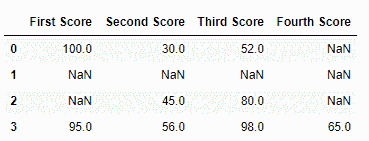
现在我们删除所有数据缺失或包含空值(NaN)的行

```
# importing pandas as pd
import pandas as pd

# importing numpy as np
import numpy as np

# dictionary of lists
dict = {'First Score':[100, np.nan, np.nan, 95],
        'Second Score': [30, np.nan, 45, 56],
        'Third Score':[52, np.nan, 80, 98],
        'Fourth Score':[np.nan, np.nan, np.nan, 65]}

df = pd.DataFrame(dict)

# using dropna() function    
df.dropna(how = 'all')
```

**输出:**
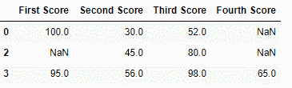

**代码#3:** 删除至少有 1 个空值的列。

```
# importing pandas as pd
import pandas as pd

# importing numpy as np
import numpy as np

# dictionary of lists
dict = {'First Score':[100, np.nan, np.nan, 95],
        'Second Score': [30, np.nan, 45, 56],
        'Third Score':[52, np.nan, 80, 98],
        'Fourth Score':[60, 67, 68, 65]}

# creating a dataframe from dictionary 
df = pd.DataFrame(dict)

df
```

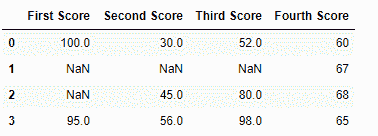
现在我们删除至少有 1 个缺失值的列

```
# importing pandas as pd
import pandas as pd

# importing numpy as np
import numpy as np

# dictionary of lists
dict = {'First Score':[100, np.nan, np.nan, 95],
        'Second Score': [30, np.nan, 45, 56],
        'Third Score':[52, np.nan, 80, 98],
        'Fourth Score':[60, 67, 68, 65]}

# creating a dataframe from dictionary  
df = pd.DataFrame(dict)

# using dropna() function     
df.dropna(axis = 1)
```

**输出:**
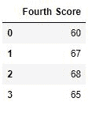

**代码#4:** 删除 CSV 文件中至少有 1 个空值的行

```
# importing pandas module 
import pandas as pd 

# making data frame from csv file 
data = pd.read_csv("employees.csv") 

# making new data frame with dropped NA values 
new_data = data.dropna(axis = 0, how ='any') 

new_data
```

**输出:**
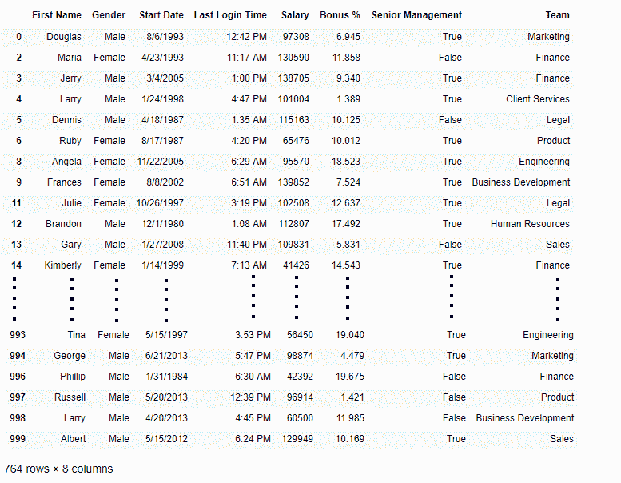
现在我们比较数据帧的大小，这样我们就可以知道有多少行至少有 1 个空值

```
print("Old data frame length:", len(data))
print("New data frame length:", len(new_data)) 
print("Number of rows with at least 1 NA value: ", (len(data)-len(new_data)))
```

**输出:**

```
Old data frame length: 1000
New data frame length: 764
Number of rows with at least 1 NA value:  236

```

由于差异是 236，所以有 236 行在任何列中都至少有 1 个空值。