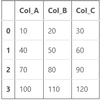
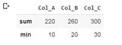
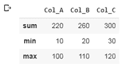

# 在熊猫中编写自定义聚合函数

> 原文:[https://www . geesforgeks . org/write-custom-aggregation-function-in-pandas/](https://www.geeksforgeeks.org/write-custom-aggregation-function-in-pandas/)

python 中的 [**Pandas**](https://www.geeksforgeeks.org/pandas-tutorial/) 广泛用于数据分析目的，它由一些精细的数据结构组成，如[数据帧](https://www.geeksforgeeks.org/python-pandas-dataframe/)和[系列](https://www.geeksforgeeks.org/python-pandas-series/)。熊猫中有几个函数被证明对程序员有很大的帮助，其中之一是聚合函数。该函数从作为输入的多个值中返回一个值，这些值根据特定标准组合在一起。一些聚合函数是平均值、计数、最大值等。

> **语法:** DataFrame.agg(func=None，axis=0，*args，**kwargs)
> 
> **参数:**
> 
> *   坐标轴:{0 或' index '，1 或' columns'} = 0 或' index '表示函数应用于每一列，1 或' columns '表示函数应用于每一行。
> *   func: function、str、list 或 dict =它描述用于聚合的函数。可接受的组合有:函数、字符串函数名(str)、函数列表(list/dict)。
> *   *args:它指定要传递给函数的位置参数。
> *   **kwargs:它指定要传递给函数的关键字参数。
> 
> **返回:**该函数可以返回标量、序列或数据帧。用单个函数调用 Series.agg 时返回的是标量，用单个函数调用 Dataframe.agg 时返回的是 Series，用多个函数调用 Dataframe.agg 时返回的是 Dataframe。

让我们创建一个数据框架:

## 蟒蛇 3

```py
# import pandas library
import pandas as pd

# create a Dataframe
df = pd.DataFrame([[10, 20, 30],
                  [40, 50, 60],
                  [70, 80, 90],
                  [100,110,120]],
                 columns=['Col_A', 'Col_B',
                          'Col_C'])
# show the dataframe
df
```

**输出:**



现在，让我们执行一些操作:

**1。对行执行聚合:**这将对数据帧的行执行聚合功能。正如您在下面的示例中看到的，示例 1 在聚合函数中有两个关键字，sum 和 min。**求和**将每行的第一个(10，40，70，100)、第二个(20，50，80，110)和第三个(30，60，90，120)元素分别相加并打印出来， **min** 求出行元素中的最小数并打印出来。第二个例子也是类似的过程。

**例 1:**

## 蟒蛇 3

```py
df.agg(['sum', 'min'])
```

**输出:**



**例 2:**

## 蟒蛇 3

```py
df.agg(['sum', 'min', 'max'])
```

**输出:**



**2。按列执行聚合:**这将对列执行聚合功能，具体选择列，如示例所示。在第一个示例中，选择了两列“列甲”和“列乙”，并对它们执行操作。对于列 A，计算最小值和求和值，对于列 B，计算最小值和最大值。类似的过程与实施例 2 相同。

**例 1:**

## 蟒蛇 3

```py
df.agg({'Col_A' : ['sum', 'min'], 
        'Col_B' : ['min', 'max']})
```