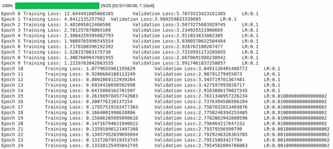

# 调整 PyTorch 中神经网络的学习速率

> 原文:[https://www . geeksforgeeks . org/调整-神经网络学习率-in-pytorch/](https://www.geeksforgeeks.org/adjusting-learning-rate-of-a-neural-network-in-pytorch/)

学习率是梯度下降中的一个重要超参数。它的值决定了神经网络收敛到最小值的速度。通常，我们选择一个学习速率，并根据结果改变其值，以获得 LR 的最佳值。如果学习速率对于神经网络来说太低，则收敛过程会非常慢，如果学习速率太高，则收敛会很快，但是有可能损失会过大。因此，我们通常会调整我们的参数，以找到学习速率的最佳值。但是我们有办法改善这个过程吗？

#### 为什么要调整学习率？

我们可以从较高的 LR 值开始，然后在一定的迭代后定期降低它的值，而不是采用恒定的学习速率。通过这种方式，我们最初可以更快地收敛，同时减少超过损失的机会。为了实现这一点，我们可以在 PyTorch 的 optim 库中使用各种调度器。训练循环的格式如下

```
epochs = 10
scheduler = <Any scheduler>

for epoch in range(epochs):
    # Training Steps

    # Validation Steps

    scheduler.step()
```

#### torch.optim.lr_scheduler 中常用的调度程序

PyTorch 提供了几种方法来根据时代的数量调整学习速度。我们来看几个:**–**

*   **步长 LR:** 每*步长*个时期将学习速率乘以 gamma。例如，如果 *lr* = 0.1、*γ*= 0.1、*步长* = 10，则在 10 个纪元之后，lr 变为***lr *步长*** ，在这种情况下为 0.01，在另外 10 个纪元之后，它变为 0.001。

```
# Code format:-
optimizer = torch.optim.SGD(model.parameters(), lr=0.1)
scheduler = StepLR(optimizer, step_size=10, gamma=0.1)

# Procedure:-
lr = 0.1, gamma = 0.1 and step_size = 10
lr = 0.1               for epoch < 10
lr = 0.01              for epoch >= 10 and epoch < 20
lr = 0.001             for epoch >= 20 and epoch < 30
... and so on
```

*   **多副本:**这是 *StepLR* 的一个更定制的版本，在这个版本中，LR 在到达它的某个时代后被改变。在这里，我们提供了里程碑，即我们想要更新我们的学习速度的时代。

```
# Code format:-
optimizer = torch.optim.SGD(model.parameters(), lr=0.1)
scheduler = MultiStepLR(optimizer, milestones=[10,30], gamma=0.1)

# Procedure:-
lr = 0.1, gamma = 0.1 and milestones=[10,30]
lr = 0.1               for epoch < 10
lr = 0.01              for epoch >= 10 and epoch < 30
lr = 0.001             for epoch >= 30
```

*   **指数 LR:** 这是 LR 中 *StepLR* 的一个激进版本，在每个纪元之后都会改变。你可以把它想象成步长= 1 的 *StepLR* 。

```
# Code format:-
optimizer = torch.optim.SGD(model.parameters(), lr=0.1)
scheduler = ExponentialLR(optimizer, gamma=0.1)

# Procedure:-
lr = 0.1, gamma = 0.1
lr = 0.1               for epoch = 1
lr = 0.01              for epoch = 2
lr = 0.001             for epoch = 3
... and so on
```

*   **减少学习延迟:**当指标停止改善时，减少学习速率。一旦学习停滞，模型通常会受益于将学习速率降低 2-10 倍。这个调度器读取一个度量值，如果对于一个**耐心**数量的时期没有看到任何改进，那么学习速率降低。

```
optimizer = torch.optim.SGD(model.parameters(), lr=0.1)
scheduler = ReduceLROnPlateau(optimizer, 'min', patience = 5)

# In min mode, lr will be reduced when the metric has stopped decreasing. 
# In max mode, lr will be reduced when the metric has stopped increasing. 
```

#### 使用调度器训练神经网络

在本教程中，我们将使用 MNIST 数据集，因此我们将首先加载数据，然后定义模型。建议你知道如何在 PyTorch 中创建和训练神经网络。让我们从加载数据开始。

```
from torchvision import datasets,transforms
from torch.utils.data import DataLoader

transform = transforms.Compose([
    transforms.ToTensor()
])

train = datasets.MNIST('',train = True, download = True, transform=transform)
valid = datasets.MNIST('',train = False, download = True, transform=transform)

trainloader = DataLoader(train, batch_size= 32, shuffle=True)
validloader = DataLoader(test, batch_size= 32, shuffle=True)
```

既然我们已经准备好了*数据加载器*，我们现在可以开始创建我们的模型了。PyTorch 模型遵循以下格式:-

```
from torch import nn

class model(nn.Module):
    def __init__(self):
        # Define Model Here

    def forward(self, x):
        # Define Forward Pass Here
```

有了这一点，让我们来定义我们的模型:-

```
import torch
from torch import nn
import torch.nn.functional as F

class Net(nn.Module):
    def __init__(self):
        super(Net,self).__init__()
        self.fc1 = nn.Linear(28*28,256)
        self.fc2 = nn.Linear(256,128)
        self.out = nn.Linear(128,10)
        self.lr = 0.01
        self.loss = nn.CrossEntropyLoss()

    def forward(self,x):
        batch_size, _, _, _ = x.size()
        x = x.view(batch_size,-1)
        x = F.relu(self.fc1(x))
        x = F.relu(self.fc2(x))
        return self.out(x)

model = Net()

# Send the model to GPU if available
if torch.cuda.is_available():
    model = model.cuda()
```

现在我们有了我们的模型，我们可以指定我们的优化器，损失函数和我们的 *lr_scheduler* 。我们将使用 SGD 优化器，*交叉熵*用于损失函数，*减少 lr 调度器的 LROnPlateau* 。

```
from torch.optim import SGD
from torch.optim.lr_scheduler import ReduceLROnPlateau

optimizer = SGD(model.parameters(), lr = 0.1)
loss = nn.CrossEntropyLoss()
scheduler = ReduceLROnPlateau(optimizer, 'min', patience = 5)
```

让我们定义训练循环。训练循环与之前基本相同，只是这次我们将在循环结束时调用调度器步骤方法。

```
from tqdm.notebook import trange

epoch = 25
for e in trange(epoch):
    train_loss, valid_loss = 0.0, 0.0

    # Set model to training mode
    model.train()
    for data, label in trainloader:
        if torch.cuda.is_available():
            data, label = data.cuda(), label.cuda()

        optimizer.zero_grad()
        target = model(data)
        train_step_loss = loss(target, label)
        train_step_loss.backward()
        optimizer.step()

        train_loss += train_step_loss.item() * data.size(0)

    # Set model to Evaluation mode
    model.eval()
    for data, label in validloader:
        if torch.cuda.is_available():
            data, label = data.cuda(), label.cuda()

        target = model(data)
        valid_step_loss = loss(target, label)

        valid_loss += valid_step_loss.item() * data.size(0)

    curr_lr = optimizer.param_groups[0]['lr']

    print(f'Epoch {e}\t \
            Training Loss: {train_loss/len(trainloader)}\t \
            Validation Loss:{valid_loss/len(validloader)}\t \
            LR:{curr_lr}')
    scheduler.step(valid_loss/len(validloader))
```



正如你所看到的，当验证损失停止减少时，调度程序一直在调整 lr。

**代码:**

```
import torch
from torch import nn
import torch.nn.functional as F
from torchvision import datasets,transforms
from torch.utils.data import DataLoader
from torch.optim import SGD
from torch.optim.lr_scheduler import ReduceLROnPlateau
from tqdm.notebook import trange

# LOADING DATA
transform = transforms.Compose([
    transforms.ToTensor()
])

train = datasets.MNIST('',train = True, download = True, transform=transform)
valid = datasets.MNIST('',train = False, download = True, transform=transform)

trainloader = DataLoader(train, batch_size= 32, shuffle=True)
validloader = DataLoader(test, batch_size= 32, shuffle=True)

# CREATING OUR MODEL
class Net(nn.Module):
    def __init__(self):
        super(Net,self).__init__()
        self.fc1 = nn.Linear(28*28,64)
        self.fc2 = nn.Linear(64,32)
        self.out = nn.Linear(32,10)
        self.lr = 0.01
        self.loss = nn.CrossEntropyLoss()

    def forward(self,x):
        batch_size, _, _, _ = x.size()
        x = x.view(batch_size,-1)
        x = F.relu(self.fc1(x))
        x = F.relu(self.fc2(x))
        return self.out(x)

model = Net()

# Send the model to GPU if available
if torch.cuda.is_available():
    model = model.cuda()

# SETTING OPTIMIZER, LOSS AND SCHEDULER
optimizer = SGD(model.parameters(), lr = 0.1)
loss = nn.CrossEntropyLoss()
scheduler = ReduceLROnPlateau(optimizer, 'min', patience = 5)

# TRAINING THE NEURAL NETWORK
epoch = 25
for e in trange(epoch):
    train_loss, valid_loss = 0.0, 0.0

    # Set model to training mode
    model.train()
    for data, label in trainloader:
        if torch.cuda.is_available():
            data, label = data.cuda(), label.cuda()

        optimizer.zero_grad()
        target = model(data)
        train_step_loss = loss(target, label)
        train_step_loss.backward()
        optimizer.step()

        train_loss += train_step_loss.item() * data.size(0)

    # Set model to Evaluation mode
    model.eval()
    for data, label in validloader:
        if torch.cuda.is_available():
            data, label = data.cuda(), label.cuda()

        target = model(data)
        valid_step_loss = loss(target, label)

        valid_loss += valid_step_loss.item() * data.size(0)

    curr_lr = optimizer.param_groups[0]['lr']

    print(f'Epoch {e}\t \
            Training Loss: {train_loss/len(trainloader)}\t \
            Validation Loss:{valid_loss/len(validloader)}\t \
            LR:{curr_lr}')
    scheduler.step(valid_loss/len(validloader))
```