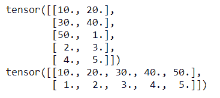
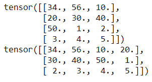

# 改变 Pytorch 中张量的视图

> 原文:[https://www . geesforgeks . org/change-view-of-tensor-in-py torch/](https://www.geeksforgeeks.org/change-view-of-tensor-in-pytorch/)

在本文中，我们将改变 PyTorch 中给定张量的视图。为此，我们将使用 view()函数来更改二维格式 IE 行和列中的张量。我们必须指定要查看的行数和列数。

> **语法:** tensor.view(行数，列数)

**示例 1:** Python 程序创建一个包含 10 个元素的张量，视图包含 5 行 2 列，反之亦然

## 蟒蛇 3

```
# importing torch module
import torch

# create one dimensional tensor 
# 10 elements
a = torch.FloatTensor([10, 20, 30, 40, 50, 1, 2, 3, 4, 5])  

# view tensor in 5 rows and 2
# columns
print(a.view(5, 2))

# view tensor in 2 rows and 5 
# columns
print(a.view(2, 5))
```

**输出:**



**示例 2:** 将张量的视图更改为 4 行 3 列，反之亦然

## 蟒蛇 3

```
# importing torch module
import torch

# create one dimensional tensor 12 elements
a = torch.FloatTensor([34, 56, 10, 20, 30, 40, 50, 1, 2, 3, 4, 5])

# view tensor in 4 rows and 3 columns
print(a.view(4, 3))

# view tensor in 3 rows and 4 columns
print(a.view(3, 4))
```

**输出:**

