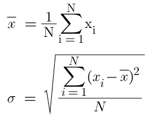

# 计算 Pytorch 中数据集的平均值和标准值

> 原文:[https://www . geeksforgeeks . org/计算 pytorch 中数据集的平均值和标准值/](https://www.geeksforgeeks.org/computing-the-mean-and-std-of-a-dataset-in-pytorch/)

**PyTorch** 提供了各种内置的数学工具来监控手头数据集的描述性统计数据，其中之一是平均值和标准偏差。平均值，由表示，是通过找到给定数据集的平均值来计算的中心趋势的度量之一。标准差，用σ表示，是离差的度量之一，表示值与平均值的接近程度。平均值和标准偏差的公式如下



### 安装 PyTorch:

安装 PyTorch 与 python 中的任何其他库相同。

```py
pip install torch
```

或者，如果您想在 conda 环境中安装它，您可以使用以下命令:-

```py
conda install pytorch cudatoolkit=10.2 -c pytorch
```

### 一维张量的均值和标准差:

在了解如何找到平均值和标准差之前，让我们通过生成随机数组来准备数据集。

```py
import torch
data = torch.rand(10)
```

现在我们有了数据，我们可以通过调用**均值()**和 **std()** 方法来找到均值和标准差。

```py
mean_tensor = data.mean()
std_tensor = data.std()
```

上面的方法工作得很好，但是值是作为张量返回的，如果你想提取张量内部的值，你可以通过索引访问它，或者你可以调用 **item()** 方法。

```py
mean = data.mean().item()
std = data.std().item()
```

**示例:**

## 蟒蛇 3

```py
import torch

# Generate a tensor of 10 numbers
data = torch.rand(10)     

mean_tensor = data.mean()
std_tensor = data.std()

print(mean_tensor)
print(std_tensor)

mean = data.mean().item()
std = data.std().item()

print(mean)
print(std)
```

**输出:**

```py
tensor(0.3901)
tensor(0.2846)
0.39005300402641296
0.2846093773841858
```

### 二维张量的均值和标准差:

在二维张量中，平均值与一维张量的平均值相同，除了这里我们可以通过一个**轴**参数来找到行和列的平均值和标准值。让我们从获取数据开始。

```py
import torch
data = torch.rand(5,3)
```

**mean()** 和 **std()** 方法在按原样调用时将返回整个数据集的总标准差，但是如果我们传递一个轴参数，我们可以找到行和列的平均值和 std。对于**轴= 0** ，我们得到一个张量，它具有每列的平均值或标准值。对于**轴= 1** ，我们得到一个张量，它有每行的平均值或标准值。

```py
total_mean = data.mean()
total_std = data.std()

# Mean and STD of columns
mean_col_wise = data.mean(axis = 0)
std_col_wise = data.std(axis = 0)

# Mean and STD of rows
mean_row_wise = data.mean(axis = 1)
std_row_wise = data.std(axis = 1)
```

**示例:**

## 蟒蛇 3

```py
import torch

# Generate a tensor of shape (5,3)
data = torch.rand(5,3)      

total_mean = data.mean()
total_std = data.std()

print(total_mean)
print(total_std)

# Mean and STD of columns
mean_col_wise = data.mean(axis = 0)
std_col_wise = data.std(axis = 0)

print(mean_col_wise)
print(std_col_wise)

# Mean and STD of rows
mean_row_wise = data.mean(axis = 1)
std_row_wise = data.std(axis = 1)

print(mean_row_wise)
print(std_row_wise)
```

**输出:**

```py
tensor(0.6483)
tensor(0.2797)
tensor([0.6783, 0.5986, 0.6679])
tensor([0.2548, 0.2711, 0.3614])
tensor([0.5315, 0.7770, 0.7785, 0.3403, 0.8142])
tensor([0.3749, 0.2340, 0.1397, 0.2432, 0.1386])
```