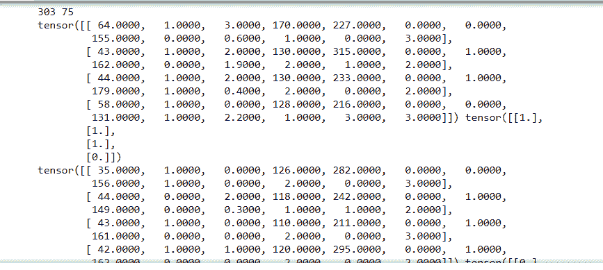
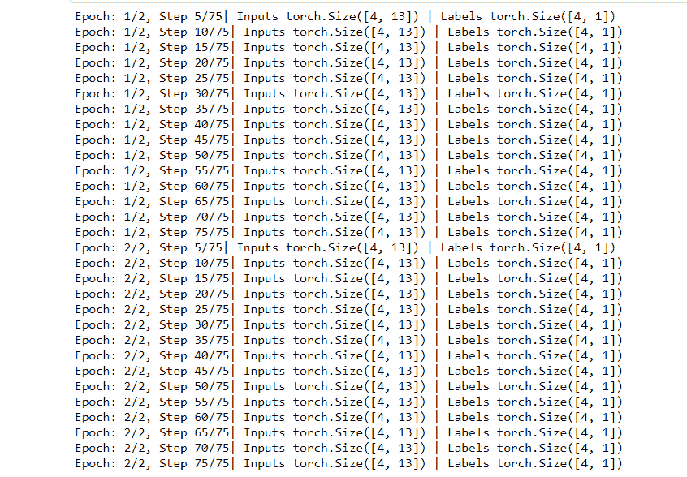

# py torch 中的数据集和数据加载器

> 原文:[https://www . geesforgeks . org/dataset-and-dataloaders-in-py torch/](https://www.geeksforgeeks.org/datasets-and-dataloaders-in-pytorch/)

**PyTorch** 是脸书开发的 Python 库，用于运行和训练机器学习和深度学习模型。训练深度学习模型需要我们将数据转换成模型可以处理的格式。 **PyTorch** 提供 **torch.utils.data** 库，通过**数据集**和**数据加载器**类使数据加载变得容易。

**数据集**本身是**数据加载器**构造函数的参数，该构造函数指示要从中加载的数据集对象。有两种类型的数据集:

*   **地图风格数据集:**这个数据集提供了两个函数 __getitem__()，__len__()分别返回引用的样本数据的索引和样本数。在示例中，我们将使用这种类型的数据集。
*   **可迭代式数据集:**可以在一组可迭代数据样本中表示的数据集，为此我们使用 __iter__()函数。

**Dataloader** 另一方面，不仅允许我们批量迭代数据集，还允许我们访问用于多处理(允许我们并行加载多批数据，而不是一次加载一批)、洗牌等的内置函数。

**语法:**

> DataLoader(数据集，batch_size=1，shuffle=False，采样器=无，batch _ sampler =无，num_workers=0，collate _ fn =无，pin_memory=False，drop_last=False，超时=0，worker _ init _ fn =无，* prefetch _ factor = 2，persistent_workers=False)

**使用的数据集:** [心脏](https://media.geeksforgeeks.org/wp-content/cdn-uploads/20210701144436/heart.csv)

让我们举一个例子来说明这个概念。

首先导入所有需要使用的库和数据集。将数据集加载到 torch 张量中，通过 __getitem__()协议访问该张量，以获取特定数据集的索引。然后我们解包数据并打印相应的特征和标签。

**示例:**

## 蟒蛇 3

```
# importing libraries
import torch
import torchvision
from torch.utils.data import Dataset, DataLoader
import numpy as np
import math

# class to represent dataset
class HeartDataSet():

    def __init__(self):

        # loading the csv file from the folder path
        data1 = np.loadtxt('heart.csv', delimiter=',',
                           dtype=np.float32, skiprows=1)

        # here the 13th column is class label and rest 
        # are features
        self.x = torch.from_numpy(data1[:, :13])
        self.y = torch.from_numpy(data1[:, [13]])
        self.n_samples = data1.shape[0] 

    # support indexing such that dataset[i] can 
    # be used to get i-th sample
    def __getitem__(self, index):
        return self.x[index], self.y[index]

    # we can call len(dataset) to return the size
    def __len__(self):
        return self.n_samples

dataset = HeartDataSet()

# get the first sample and unpack
first_data = dataset[0]
features, labels = first_data
print(features, labels)
```

**输出:**

> 张量([ 63.0000，1.0000，3.0000，145.0000，233.0000，1.0000，0.0000，
> 
> 150.0000，0.0000，2.3000，0.0000，0.0000，1.0000])张量([1。])

torch dataLoader 将此数据集作为输入，与 batch_size、shuffle 等其他参数一起计算每批的 nums_samples，然后分批打印出目标和标签。

**示例:**

## 蟒蛇 3

```
# Loading whole dataset with DataLoader
# shuffle the data, which is good for training
dataloader = DataLoader(dataset=dataset, batch_size=4, shuffle=True)

# total samples of data and number of iterations performed
total_samples = len(dataset)
n_iterations = total_samples//4
print(total_samples, n_iterations)
for i, (targets, labels) in enumerate(dataloader):
    print(targets, labels)
```

**输出:**



我们现在训练数据，首先循环遍历历元，然后遍历样本，然后每次迭代打印出历元数、输入张量和标签张量。

**示例:**

## 蟒蛇 3

```
num_epochs = 2

for epoch in range(num_epochs):
    for i, (inputs, labels) in enumerate(dataloader):

        # here: 303 samples, batch_size = 4, n_iters=303/4=75 iterations
        # Run our training process
        if (i+1) % 5 == 0:
            print(f'Epoch: {epoch+1}/{num_epochs}, Step {i+1}/{n_iterations}|\
                Inputs {inputs.shape} | Labels {labels.shape}')
```

**输出:**

