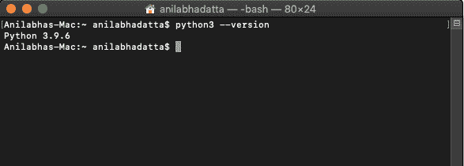
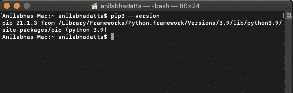
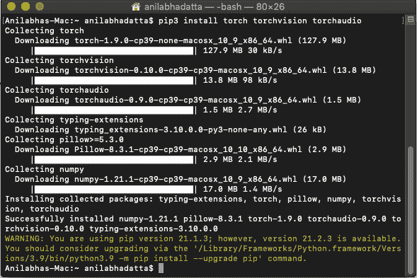
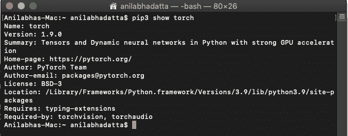
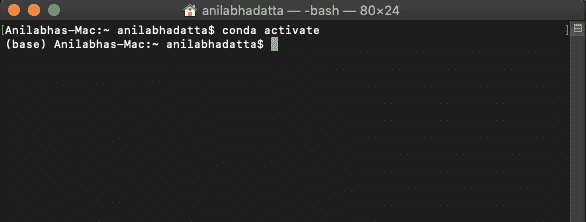
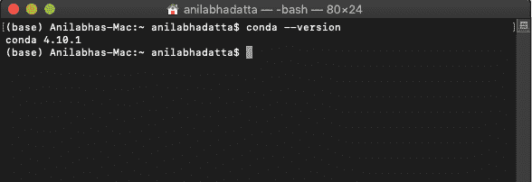
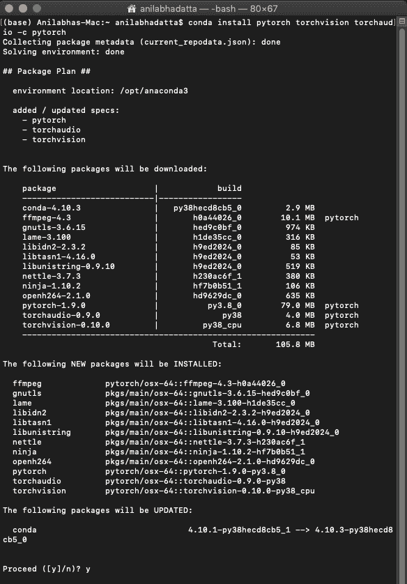
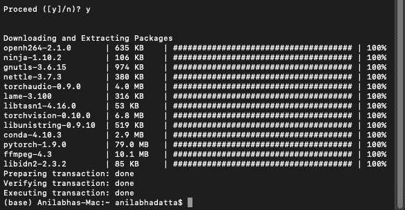
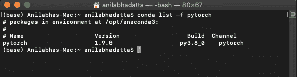

# 如何在 MacOS 上安装 Pytorch？

> 原文:[https://www . geesforgeks . org/how-install-py torch-on-macos/](https://www.geeksforgeeks.org/how-to-install-pytorch-on-macos/)

**PyTorch** 是基于 Torch 库的开源机器学习库，用于计算机视觉和自然语言处理等应用，主要由脸书 AI Research 实验室开发。它是在修改后的 BSD 许可下发布的免费开源软件。

### 先决条件:

*   [蟒蛇](https://www.geeksforgeeks.org/how-to-download-and-install-python-latest-version-on-macos-mac-os-x/)
*   [应安装蟒蛇皮](https://www.geeksforgeeks.org/how-to-install-pip-in-macos/)或[蟒蛇皮](https://www.geeksforgeeks.org/how-to-install-anaconda-on-linux/)。

## 安装程序:

### **方法一:使用 pip 安装需要的依赖项。**

**步骤 1:** 在命令提示符下输入以下命令，检查是否已经安装了 python3。

```
python3 --version
```



如果这个命令运行成功，并且我们能够获得 python3.9+版本，那么我们就可以开始了，或者参考本文[这里](https://www.geeksforgeeks.org/download-and-install-python-3-latest-version/)安装 Python 3。

**步骤 2:** 在命令提示符下输入以下命令，检查 pip3 是否已经安装。

```
pip3 --version
```



如果这个命令运行成功，并且我们能够获得一个 pip 版本，那么我们就可以开始了，或者通过参考本文[这里](https://www.geeksforgeeks.org/download-and-install-python-3-latest-version/)来安装 pip。

**第三步:**输入以下命令安装最新稳定版本的 Pytorch。

**1。计算平台:中央处理器**

```
pip3 install torch torchvision torchaudio
```



**第 4 步:**在命令提示符下输入以下命令，检查 Pytorch 是否安装成功。

```
pip3 show torch
```



如果这个命令成功运行，并且我们能够得到一个火炬版本，那么我们可以走了，否则重新安装它。

### **方法二:使用 conda 安装需要的依赖项。**

**第一步:**如果蟒蛇被停用，激活蟒蛇提示。

```
conda activate
```



**步骤 2:** 通过在 Anaconda 提示符下输入以下命令，检查 conda 是否已安装。

```
conda --version
```



如果这个命令成功运行，并且我们能够获得 conda 版本，那么我们就可以开始了，否则就在 MacOS 上安装 Anaconda。

**第三步:**输入以下命令安装最新稳定版本的 Pytorch。

**1。计算平台:中央处理器**

```
conda install pytorch torchvision torchaudio -c pytorch
```

 

**第 4 步:**在 Anaconda 提示符下输入以下命令，检查 Pytorch 是否安装成功。

```
conda list -f pytorch
```



如果这个命令成功运行，并且我们能够得到一个火炬版本，那么我们可以走了，否则重新安装它。