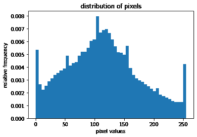
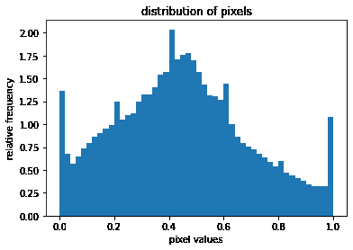
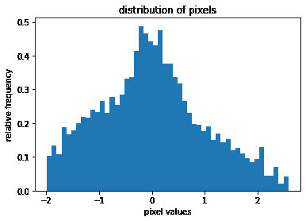
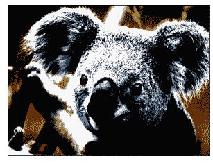
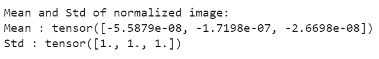

# 如何在 PyTorch 中对图像进行归一化？

> 原文:[https://www . geeksforgeeks . org/how-normalization-in-images-py torch/](https://www.geeksforgeeks.org/how-to-normalize-images-in-pytorch/)

图像变换是将图像像素的原始值改变为一组新值的过程。我们对图像进行的一种转换是将图像转换成 PyTorch 张量。当图像被转换成 PyTorch 张量时，像素值在 0.0 和 1.0 之间缩放。在 PyTorch 中，这个转换可以使用**torch vision . transforms . ToTar()**来完成。它将像素范围为[0，255]的 PIL 图像转换为范围为[0.0，1.0]的形状(C，H，W)的 PyTorch 浮动光标。

当我们使用深度神经网络时，图像的归一化是一个非常好的实践。归一化图像意味着将图像转换成这样的值，即图像的平均值和标准偏差分别变为 0.0 和 1.0。为此，首先从每个输入通道中减去通道平均值，然后将结果除以通道标准偏差。

```
output[channel] = (input[channel] - mean[channel]) / std[channel]
```

## 为什么要把图像规范化？

规范化有助于获得一定范围内的数据，并降低偏斜度，这有助于更快、更好地学习。规范化还可以解决渐变减少和爆炸的问题。

## 在 PyTorch 中规范化图像

PyTorch 中的规范化使用**torch vision . transforms . normalize()**完成。这用平均值和标准偏差来归一化张量图像。

> **语法:**torch vision . transforms . normalize()
> 
> **参数:**
> 
> *   **平均值:**每个通道的平均值序列。
> *   **标准:**每个通道的标准偏差序列。
> *   **就位:** Bool 使该操作就位。
> 
> **返回:**归一化张量图像。

### 方法:

我们将在 PyTorch 中执行以下步骤来标准化图像:

*   加载和可视化图像并绘制像素值。
*   使用 ***将图像转换为张量***
*   计算平均值和标准偏差(标准)
*   使用 ***对图像进行归一化。***
*   可视化标准化图像。
*   标准化并验证后计算平均值和标准值。

**示例:**加载图像

**输入图像:**


使用 PIL 加载上述输入图像。我们在程序中使用了上面的 Koala.jpg 图像。并绘制图像的像素值。

## 蟒蛇 3

```
# python code to load and visualize 
# an image

# import necessary libraries
from PIL import Image
import matplotlib.pyplot as plt
import numpy as np

# load the image
img_path = 'Koala.jpg'
img = Image.open(img_path)

# convert PIL image to numpy array
img_np = np.array(img)

# plot the pixel values
plt.hist(img_np.ravel(), bins=50, density=True)
plt.xlabel("pixel values")
plt.ylabel("relative frequency")
plt.title("distribution of pixels")
```

**输出:**



我们发现 RGB 图像的像素值范围从 0 到 255。

### **使用** ***将图像转换为张量***

使用**到传感器()**将 PIL 图像转换为 PyTorch 张量，并绘制该张量图像的像素值。我们定义了我们的变换函数，将 PIL 图像转换成 PyTorch 张量图像。

## 蟒蛇 3

```
# Python code for converting PIL Image to
# PyTorch Tensor image and plot pixel values

# import necessary libraries
import torchvision.transforms as transforms
import matplotlib.pyplot as plt

# define custom transform function
transform = transforms.Compose([
    transforms.ToTensor()
])

# transform the pIL image to tensor 
# image
img_tr = transform(img)

# Convert tensor image to numpy array
img_np = np.array(img_tr)

# plot the pixel values
plt.hist(img_np.ravel(), bins=50, density=True)
plt.xlabel("pixel values")
plt.ylabel("relative frequency")
plt.title("distribution of pixels")
```

**输出:**



我们发现张量图像的像素值在 0.0 到 1.0 之间。我们注意到 RBG 图像和张量图像的像素分布看起来相同，但是在像素值范围上不同。

### **计算平均值和标准偏差(std)**

我们计算图像的平均值和标准差。

## 蟒蛇 3

```
# Python code to calculate mean and std
# of image

# get tensor image
img_tr = transform(img)

# calculate mean and std
mean, std = img_tr.mean([1,2]), img_tr.std([1,2])

# print mean and std
print("mean and std before normalize:")
print("Mean of the image:", mean)
print("Std of the image:", std)
```

**输出:**


这里，我们计算了所有三个通道红色、绿色和蓝色的图像平均值和标准值。这些值在标准化之前。我们将使用这些值来标准化图像。我们将把这些值与标准化后的值进行比较。

### **使用*****torch vision . transforms . normalize()***对图像进行归一化

为了标准化图像，这里我们使用上面计算的图像的平均值和标准值。如果图像与 ImageNet 图像相似，我们也可以使用 ImageNet 数据集的平均值和标准值。ImageNet 的均值和 std 分别为:均值= [0.485，0.456，0.406]和 std = [0.229，0.224，0.225]。如果图像与 ImageNet 不相似，比如医学图像，那么总是建议计算数据集的平均值和 std，并使用它们来归一化图像。

## 蟒蛇 3

```
# python code to normalize the image

from torchvision import transforms

# define custom transform
# here we are using our calculated
# mean & std
transform_norm = transforms.Compose([
    transforms.ToTensor(),
    transforms.Normalize(mean, std)
])

# get normalized image
img_normalized = transform_norm(img)

# convert normalized image to numpy
# array
img_np = np.array(img_normalized)

# plot the pixel values
plt.hist(img_np.ravel(), bins=50, density=True)
plt.xlabel("pixel values")
plt.ylabel("relative frequency")
plt.title("distribution of pixels")
```

**输出:**



我们已经用计算出的平均值和标准差对图像进行了归一化。上面的输出显示了归一化图像的像素值的分布。我们可以注意到张量图像(归一化前)和归一化图像的像素分布之间的差异。

### **可视化标准化图像**

现在可视化标准化图像。

## 蟒蛇 3

```
# Python Code to visualize normalized image

# get normalized image
img_normalized = transform_norm(img)

# convert tis image to numpy array
img_normalized = np.array(img_normalized)

# transpose from shape of (3,,) to shape of (,,3)
img_normalized = img_normalized.transpose(1, 2, 0)

# display the normalized image
plt.imshow(img_normalized)
plt.xticks([])
plt.yticks([])
```

**输出:**



我们可以注意到，输入图像和归一化图像之间有明显的差异。

### **归一化后计算平均值和标准值**

我们再次计算归一化图像/数据集的平均值和标准值。标准化后，平均值应该是 0.0，标准值应该是 1.0。

## 蟒蛇 3

```
# Python code to calculate mean and std
# of normalized image

# get normalized image
img_nor = transform_norm(img)

# cailculate mean and std
mean, std = img_nor.mean([1,2]), img_nor.std([1,2])

# print mean and std
print("Mean and Std of normalized image:")
print("Mean of the image:", mean)
print("Std of the image:", std)
```

**输出:**



在这里，我们发现标准化后，平均值和标准值分别为 0.0 和 1.0。这验证了在归一化之后，图像平均值和标准偏差分别变为 0 和 1。