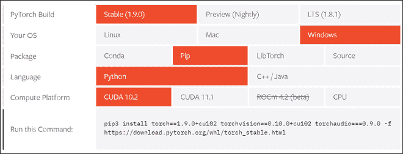
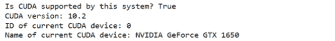

# 如何在 Pytorch 中设置和运行 CUDA 操作？

> 原文:[https://www . geeksforgeeks . org/如何设置和运行 cuda-operations-in-pytorch/](https://www.geeksforgeeks.org/how-to-set-up-and-run-cuda-operations-in-pytorch/)

**CUDA(或计算机统一设备架构)**是来自 NVIDIA 的专有并行计算平台和编程模型。使用 CUDA SDK，开发人员可以利用他们的 NVIDIA 图形处理器(图形处理单元)，从而使他们能够在他们通常的编程工作流中引入基于图形处理器的并行处理能力，而不是通常的基于中央处理器的顺序处理。

随着近年来深度学习的兴起，可以看到模型训练中涉及的各种运算，如矩阵乘法、求逆等。，可以在很大程度上并行化，以获得更好的学习性能和更快的训练周期。因此，许多像 Pytorch 这样的深度学习库使他们的用户能够使用一组接口和实用函数来利用他们的图形处理器。本文将涵盖在任何包含支持 CUDA 的图形处理器的系统中设置 CUDA 环境，并简要介绍使用 Python 在 Pytorch 库中可用的各种 CUDA 操作。

## 装置

首先，您应该通过官方的英伟达 CUDA 兼容性列表检查他们系统的 GPU，以确保他们的 GPU 是否启用了 CUDA。Pytorch 通过提供一个很好的用户友好的界面，让你选择你的操作系统和其他要求，使 CUDA 的安装过程非常简单，如下图所示。根据我们的计算机器，我们将按照下图中给出的规格进行安装。

参考 Pytorch 的[官方链接](https://pytorch.org/get-started/locally/)，根据自己的电脑规格选择规格。我们还建议在安装后完全重启系统，以确保工具包正常工作。



Pytorch 安装页面截图

> pip3 安装 torch = = 1 . 9 . 0+cu102 torch vision = = 0 . 10 . 0+cu102 torch audio = = = 0 . 9 . 0-f https://download.pytorch.org/whl/torch_stable.html

## 在 Pytorch 开始使用 CUDA

安装完成后，我们可以使用 ***torch.cuda*** 界面，使用 Pytorch 与 cuda 进行交互。我们将使用以下函数:

> **语法:**
> 
> 1.  **torch.version.cuda():** 返回当前安装软件包的 cuda 版本
> 2.  **torch . cuda . is _ available():**如果系统支持 CUDA，则返回 True，否则返回 False
> 3.  **torch . cuda . current _ device():**返回当前设备的 ID
> 4.  **torch . cuda . get _ device _ name(device _ ID):**返回 ID = 'device_ID '的 CUDA 设备的名称

**代码:**

## 蟒蛇 3

```
import torch

print(f"Is CUDA supported by this system? 
      {torch.cuda.is_available()}")
print(f"CUDA version: {torch.version.cuda}")

# Storing ID of current CUDA device
cuda_id = torch.cuda.current_device()
print(f"ID of current CUDA device:
      {torch.cuda.current_device()}")

print(f"Name of current CUDA device:
      {torch.cuda.get_device_name(cuda_id)}")
```

**输出:**



CUDA 版本

## 用 CUDA 处理张量

为了通过 CUDA 与 Pytorch 张量进行交互，我们可以使用以下实用函数:

> **语法:**
> 
> *   **Tensor.device:** 返回“Tensor”的设备名称
> *   **Tensor.to(device_name):** 返回由“device_name”指定的设备上“Tensor”的新实例:“cpu”代表 CPU，“cuda”代表启用 CUDA 的 GPU
> *   **Tensor.cpu():** 将“Tensor”从其当前设备传输到 cpu

为了演示上述功能，我们将创建一个测试张量，并执行以下操作:

检查张量的当前设备并应用张量运算(平方)，将张量传输到 GPU 并应用相同的张量运算(平方)，并比较两个设备的结果。

**代码:**

## 蟒蛇 3

```
import torch

# Creating a test tensor
x = torch.randint(1, 100, (100, 100))

# Checking the device name:
# Should return 'cpu' by default
print(x.device)

# Applying tensor operation
res_cpu = x ** 2

# Transferring tensor to GPU
x = x.to(torch.device('cuda'))

# Checking the device name:
# Should return 'cuda:0'
print(x.device)

# Applying same tensor operation
res_gpu = x ** 2

# Checking the equality
# of the two results
assert torch.equal(res_cpu, res_gpu.cpu())
```

**输出:**

```
cpu
cuda : 0
```

## 用 CUDA 处理机器学习模型

Pytorch 的一个很好的做法是生成设备无关的代码，因为有些系统可能无法访问图形处理器，只能依赖中央处理器，反之亦然。完成后，可以使用以下功能将任何机器学习模型转移到选定的设备上

> **语法:**模型到(设备名):
> 
> **返回:**由“device_name”指定的设备上的机器学习“Model”的新实例:“cpu”代表 CPU，“cuda”代表启用 CUDA 的 GPU

在本例中，我们从***torch vision . models***实用程序中导入预训练的 **Resnet-18** 模型，读者可以使用相同的步骤将模型传输到他们选择的设备。

**代码:**

## 蟒蛇 3

```
import torch
import torchvision.models as models

# Making the code device-agnostic
device = 'cuda' if torch.cuda.is_available() else 'cpu'

# Instantiating a pre-trained model
model = models.resnet18(pretrained=True)

# Transferring the model to a CUDA enabled GPU
model = model.to(device)

# Now the reader can continue the rest of the workflow
# including training, cross validation, etc!
```

**输出:**


带 CUDA 的 ML